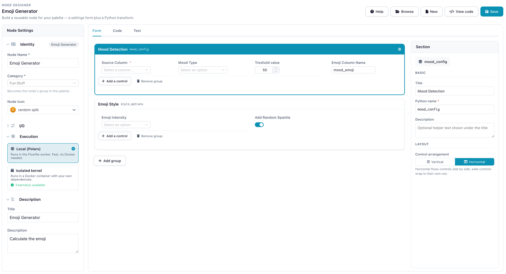
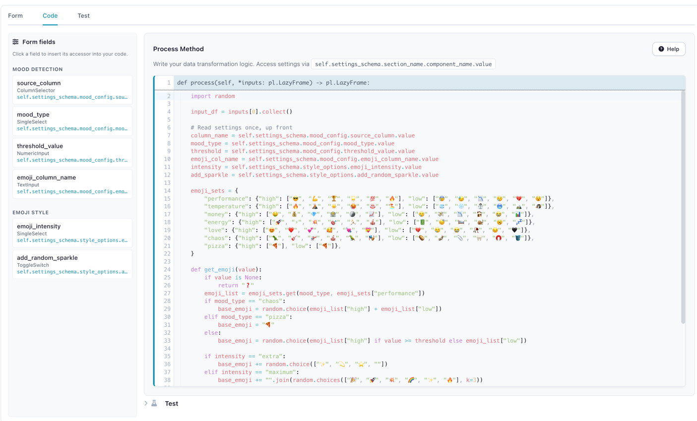
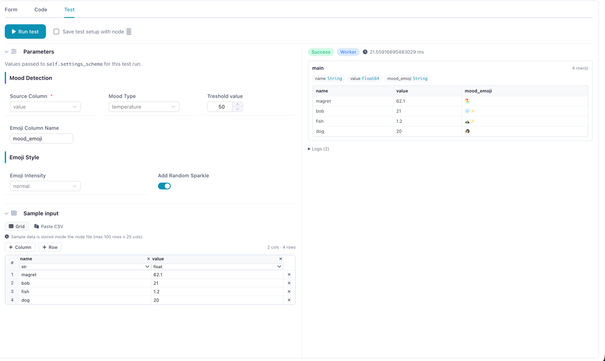
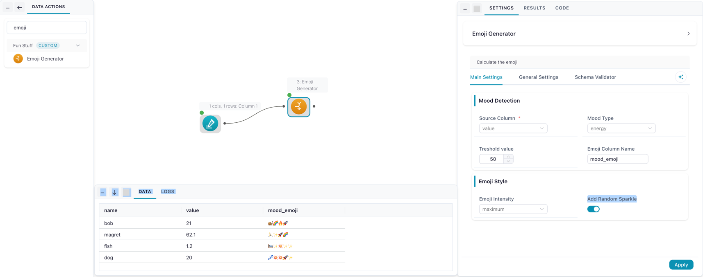

# Tutorial: Build your first custom node

This tutorial builds one custom node end to end, entirely in the **[Node Designer](node-designer.md)** — the visual tool for making your own nodes. No file to write by hand, no terminal: you lay out the settings form, write one small transform, test it, and save. The node then appears in the palette next to the built-in ones.

The example is an **Emoji Generator** that maps a numeric column to mood-based emojis — small and a little silly, but it exercises everything real nodes use: a multi-section settings form, a type-filtered column picker, and a `process` method that transforms the incoming data.

!!! info "What you'll build"
    An "Emoji Generator" node that:

    - Maps a numeric column to mood-based emojis.
    - Offers seven emoji themes (performance, temperature, money, and so on).
    - Includes intensity controls and an optional random sparkle.
    - Has a two-section settings form.

    Prefer working in code? The [same node as a file](#the-same-node-as-a-file) is at the end — the two paths round-trip.

---

## Open the Node Designer

Open **Node Designer** from the sidebar and click **New**. You'll build the node in three tabs — **Form** (the settings your node's users see), **Code** (the transform), and **Test** (run it against sample data) — with a **Node Settings** panel on the left for its name, category, and icon.

## 1. Name it

In the left **Node Settings** panel, under **Identity**:

- **Node Name** → `Emoji Generator`
- **Category** → `Fun Stuff` (type it — this becomes a **Fun Stuff** group in the palette; the default `Custom` would land it under *User Defined Operations*)
- **Node Icon** → pick anything you like.

Leave **Execution** on **Local (Polars)** — this node uses only Polars and the standard library, so it needs no kernel and no Docker. (You'd switch to a kernel only for a node that needs a third-party library — see [K-Means on a Kernel](kmeans-kernel-node.md).)

## 2. Build the form

On the **Form** tab you assemble the settings panel by dragging in controls. Add **two groups**.

**Group one — "Mood Detection"** (Python name `mood_config`). Add four controls:

| Control | Field name | Configure |
|---------|------------|-----------|
| **Column Selector** | `source_column` | Data types → **Numeric**, **Required** on |
| **Single Select** | `mood_type` | Seven options (performance, temperature, money, energy, love, chaos, pizza) — default `performance` |
| **Numeric Input** | `threshold_value` | Label "Mood Threshold", default `50`, min `0`, max `100` |
| **Text Input** | `emoji_column_name` | Label "New Emoji Column Name", default `mood_emoji` |

**Group two — "Emoji Style"** (Python name `style_options`). Add two controls:

| Control | Field name | Configure |
|---------|------------|-----------|
| **Single Select** | `emoji_intensity` | Options: subtle, normal, extra, maximum — default `normal` |
| **Toggle Switch** | `add_random_sparkle` | Label "Add Random Sparkles", default on |

Selecting a control opens the **Control Inspector** on the right, where you set its label, field name, and type-specific options (the option list for a select, min/max for a number, and so on). The **field name** you give each control is exactly what you'll read in the code — `self.settings_schema.mood_config.source_column.value`, and so on.

<details markdown="1">
<summary>The two form groups</summary>



</details>

## 3. Write the transform

Switch to the **Code** tab. The signature header is fixed — you write the **body only**. The **Form fields** panel lists every control with its accessor path; click one to insert it. This node maps each value to an emoji with a per-row Python callback (`map_elements`), which is eager, so it collects the input first:

```python
import random

input_df = inputs[0].collect()

# Read settings once, up front
column_name = self.settings_schema.mood_config.source_column.value
mood_type = self.settings_schema.mood_config.mood_type.value
threshold = self.settings_schema.mood_config.threshold_value.value
emoji_col_name = self.settings_schema.mood_config.emoji_column_name.value
intensity = self.settings_schema.style_options.emoji_intensity.value
add_sparkle = self.settings_schema.style_options.add_random_sparkle.value

emoji_sets = {
    "performance": {"high": ["😎", "💪", "🏆", "🌟", "💯", "🔥"], "low": ["😰", "😓", "📉", "😢", "💔", "😵"]},
    "temperature": {"high": ["🔥", "🌋", "☀️", "🥵", "♨️", "🏖️"], "low": ["🧊", "❄️", "⛄", "🥶", "🏔️", "🐧"]},
    "money": {"high": ["🤑", "💰", "💎", "🏦", "🪙", "📈"], "low": ["😢", "💸", "📉", "🏚️", "😭", "📊"]},
    "energy": {"high": ["🚀", "⚡", "💥", "🎯", "🏃", "🎪"], "low": ["🔋", "😴", "🛌", "🐌", "🥱", "💤"]},
    "love": {"high": ["😍", "❤️", "💕", "🥰", "💘", "💝"], "low": ["💔", "😢", "😭", "🥀", "😔", "🖤"]},
    "chaos": {"high": ["🦖", "🎸", "🚁", "🎪", "🦜", "🎭"], "low": ["🥔", "🧦", "📎", "🦷", "🧲", "🪣"]},
    "pizza": {"high": ["🍕"], "low": ["🍕"]},
}

def get_emoji(value):
    if value is None:
        return "❓"
    emoji_list = emoji_sets.get(mood_type, emoji_sets["performance"])
    if mood_type == "chaos":
        base_emoji = random.choice(emoji_list["high"] + emoji_list["low"])
    elif mood_type == "pizza":
        base_emoji = "🍕"
    else:
        base_emoji = random.choice(emoji_list["high"] if value >= threshold else emoji_list["low"])

    if intensity == "extra":
        base_emoji += random.choice(["✨", "💫", "⭐", ""])
    elif intensity == "maximum":
        base_emoji += "".join(random.choices(["🎉", "🚀", "💥", "🌈", "✨", "🔥"], k=3))

    if add_sparkle and random.random() > 0.7:
        base_emoji += "✨"
    return base_emoji

return input_df.with_columns(
    pl.col(column_name)
    .map_elements(get_emoji, return_dtype=pl.String)
    .alias(emoji_col_name)
)
```

Returning an eager `DataFrame` is fine — the framework normalizes it.

!!! tip "Performance"
    `map_elements` runs a Python callback per row — fine for a demo, slower on large data, and it forces the `.collect()` at the top. Prefer native Polars expressions when the logic allows, keep the frame lazy when you can, and read settings once up front (not inside the row callback).

<details markdown="1">
<summary>The Code tab</summary>



</details>

## 4. Test it

On the **Test** tab, paste this sample and click **Run test** — you see the output grid, logs, and any error without touching a flow. The `source_column` picker filters to numeric columns, so point it at `value`:

```csv
name,value
bob,21
magret,62.1
fish,1.2
dog,20
```

<details markdown="1">
<summary>The mood_emoji column in the result</summary>



</details>

## 5. Save and use it

Click **Save**. The node loads immediately — no restart — under the **Fun Stuff** group in the palette. Drag it onto the canvas, connect a "Manual Input" (or any numeric source), configure it, and run.

<details markdown="1">
<summary>The node in a flow: settings drawer and emoji column</summary>



</details>

---

## The same node as a file

The designer saved your node to a `.py` file in `~/.flowfile/user_defined_nodes/`. If you'd rather write it directly — to version-control it, or to skip the UI — here is the whole thing. Because it stays within the visual subset, it **reopens in the Node Designer**: this file and the visual build above are the same node.

```python
import random

import polars as pl

from flowfile import node_designer as nd


class EmojiMoodSection(nd.Section):
    source_column: nd.ColumnSelector = nd.ColumnSelector(
        label="Analyze This Column",
        multiple=False,
        required=True,
        data_types=nd.Types.Numeric,
    )
    mood_type: nd.SingleSelect = nd.SingleSelect(
        label="Emoji Mood Logic",
        options=[
            ("performance", "Performance Based (High = 😎, Low = 😰)"),
            ("temperature", "Temperature (Hot = 🔥, Cold = 🧊)"),
            ("money", "Money Mode (Rich = 🤑, Poor = 😢)"),
            ("energy", "Energy Level (High = 🚀, Low = 🔋)"),
            ("love", "Love Meter (High = 😍, Low = 💔)"),
            ("chaos", "Pure Chaos (Random emojis)"),
            ("pizza", "Pizza Scale (Everything becomes pizza)"),
        ],
        default="performance",
    )
    threshold_value: nd.NumericInput = nd.NumericInput(
        label="Mood Threshold", default=50.0, min_value=0, max_value=100,
    )
    emoji_column_name: nd.TextInput = nd.TextInput(
        label="New Emoji Column Name", default="mood_emoji",
    )


class EmojiStyleSection(nd.Section):
    emoji_intensity: nd.SingleSelect = nd.SingleSelect(
        label="Emoji Intensity",
        options=[
            ("subtle", "Subtle (One emoji)"),
            ("normal", "Normal (1-2 emojis)"),
            ("extra", "Extra (2-3 emojis)"),
            ("maximum", "MAXIMUM OVERDRIVE"),
        ],
        default="normal",
    )
    add_random_sparkle: nd.ToggleSwitch = nd.ToggleSwitch(
        label="Add Random Sparkles", default=True,
        description="Randomly sprinkle a sparkle for extra pizzazz",
    )


class EmojiSettings(nd.NodeSettings):
    mood_config: EmojiMoodSection = EmojiMoodSection(
        title="Mood Detection",
        description="Configure how to detect the vibe of your data",
    )
    style_options: EmojiStyleSection = EmojiStyleSection(
        title="Emoji Style",
        description="Fine-tune your emoji experience",
    )


class EmojiGenerator(nd.CustomNodeBase):
    node_name: str = "Emoji Generator"
    node_category: str = "Fun Stuff"
    title: str = "Emoji Generator"
    intro: str = "Add an emoji column derived from a numeric column."

    settings_schema: EmojiSettings = EmojiSettings()

    def process(self, *inputs: pl.LazyFrame) -> pl.LazyFrame:
        input_df = inputs[0].collect()

        column_name = self.settings_schema.mood_config.source_column.value
        mood_type = self.settings_schema.mood_config.mood_type.value
        threshold = self.settings_schema.mood_config.threshold_value.value
        emoji_col_name = self.settings_schema.mood_config.emoji_column_name.value
        intensity = self.settings_schema.style_options.emoji_intensity.value
        add_sparkle = self.settings_schema.style_options.add_random_sparkle.value

        emoji_sets = {
            "performance": {"high": ["😎", "💪", "🏆", "🌟", "💯", "🔥"], "low": ["😰", "😓", "📉", "😢", "💔", "😵"]},
            "temperature": {"high": ["🔥", "🌋", "☀️", "🥵", "♨️", "🏖️"], "low": ["🧊", "❄️", "⛄", "🥶", "🏔️", "🐧"]},
            "money": {"high": ["🤑", "💰", "💎", "🏦", "🪙", "📈"], "low": ["😢", "💸", "📉", "🏚️", "😭", "📊"]},
            "energy": {"high": ["🚀", "⚡", "💥", "🎯", "🏃", "🎪"], "low": ["🔋", "😴", "🛌", "🐌", "🥱", "💤"]},
            "love": {"high": ["😍", "❤️", "💕", "🥰", "💘", "💝"], "low": ["💔", "😢", "😭", "🥀", "😔", "🖤"]},
            "chaos": {"high": ["🦖", "🎸", "🚁", "🎪", "🦜", "🎭"], "low": ["🥔", "🧦", "📎", "🦷", "🧲", "🪣"]},
            "pizza": {"high": ["🍕"], "low": ["🍕"]},
        }

        def get_emoji(value):
            if value is None:
                return "❓"
            emoji_list = emoji_sets.get(mood_type, emoji_sets["performance"])
            if mood_type == "chaos":
                base_emoji = random.choice(emoji_list["high"] + emoji_list["low"])
            elif mood_type == "pizza":
                base_emoji = "🍕"
            else:
                base_emoji = random.choice(emoji_list["high"] if value >= threshold else emoji_list["low"])

            if intensity == "extra":
                base_emoji += random.choice(["✨", "💫", "⭐", ""])
            elif intensity == "maximum":
                base_emoji += "".join(random.choices(["🎉", "🚀", "💥", "🌈", "✨", "🔥"], k=3))

            if add_sparkle and random.random() > 0.7:
                base_emoji += "✨"
            return base_emoji

        return input_df.with_columns(
            pl.col(column_name)
            .map_elements(get_emoji, return_dtype=pl.String)
            .alias(emoji_col_name)
        )
```

Save it as `~/.flowfile/user_defined_nodes/emoji_generator.py` and it appears in the palette just the same.

## Recap

You built a custom node with a two-section settings form, a type-filtered column picker, and a `process` method that maps values to emojis — start to finish in the Node Designer, with the equivalent file as a drop-in alternative.

Next:

- [Custom Nodes in Code](creating-custom-nodes.md) — the full component catalog, execution environments, multi-input/multi-output nodes, and the `SecretSelector` for API-backed nodes.
- [K-Means on a Kernel](kmeans-kernel-node.md) — a node that needs a third-party library (scikit-learn), run in an isolated kernel.
- [Node Designer](node-designer.md) — the designer, in depth.
