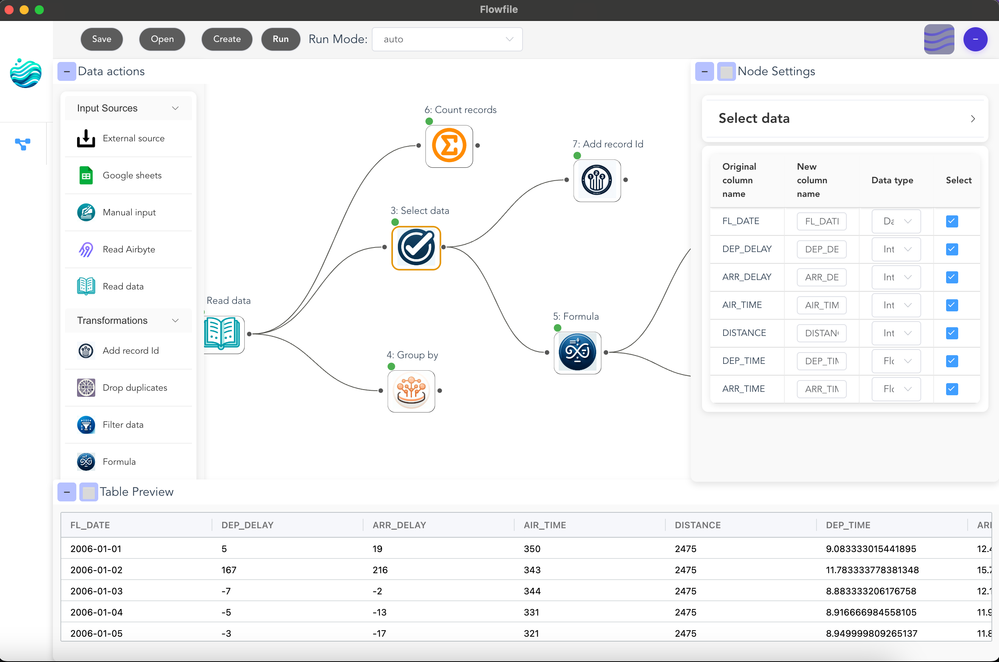

# Visual Editor Guide

Build powerful data pipelines without writing code using Flowfile's intuitive drag-and-drop interface.

## What You'll Learn

- 🔧 **Build flows visually** - Drag, drop, and connect nodes
- 📊 **Transform data** - Filter, aggregate, join, and more
- 🔌 **Connect to data sources** - Databases, files, and cloud storage
- 👁️ **Preview results** - See data at each step
- 📤 **Export to code** - Generate Python code from your visual flows

## Getting Started

### Your First Flow

1. **Create a new flow** - Click "Create" in the toolbar
2. **Add an input node** - Drag a "Read Data" node from the left panel
3. **Configure the node** - Click it and set file path in the right panel
4. **Add transformations** - Connect filter, sort, or other nodes
5. **Run the flow** - Click "Run" and see your results

### Interface Overview

- **Left Panel**: Node library organized by category
- **Center Canvas**: Build your flow here
- **Right Panel**: Configure selected nodes
- **Bottom Panel**: Preview data and logs

## Core Concepts

### Nodes
Each node represents a data operation:
- **Input nodes** - Load data from files, databases, APIs
- **Transform nodes** - Modify and clean your data
- **Combine nodes** - Join and merge datasets
- **Aggregate nodes** - Summarize and group data
- **Output nodes** - Save or export results

### Connections
Draw lines between nodes to define data flow. Data moves from top to bottom, left to right.

### Execution
- **Development mode** - See data at every step (great for debugging)
- **Performance mode** - Optimized execution for large datasets

## Learn More

### 📚 Guides
- [Building Flows](building-flows.md) - Detailed workflow guide
- [Node Reference](nodes/) - Complete documentation of all nodes

### 🎯 Tutorials
- [Connect to Databases](tutorials/database-connectivity.md) - PostgreSQL, MySQL, and more
- [Cloud Storage Setup](tutorials/cloud-connections.md) - Work with S3 data
- [Export to Python](tutorials/code-generator.md) - Convert visual flows to code

## Tips for Success

1. **Start simple** - Build basic flows before adding complexity
2. **Use descriptions** - Document nodes for your future self
3. **Preview often** - Check data at each transformation
4. **Save regularly** - Flows are saved as `.flowfile` files
5. **Try both modes** - Development for testing, Performance for production

## Visual vs Code

Wondering when to use visual vs Python? Here's a quick guide:

**Use Visual Editor when:**
- Exploring new datasets
- Building one-off analyses
- Collaborating with non-technical users
- Creating documented workflows
- Learning data transformations

**Consider Python API when:**
- Integrating with existing code
- Building programmatic pipelines
- Need version control
- Require advanced custom logic
- Automating workflows

Remember, you can always switch between them!

---

*Ready to build? Start with [Building Flows](building-flows.md) or explore the [Node Reference](nodes/).*