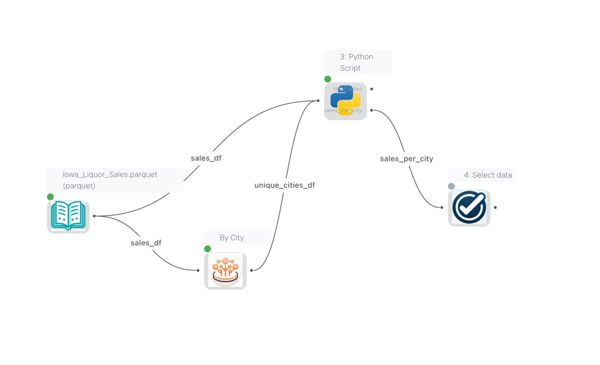
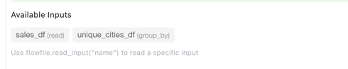
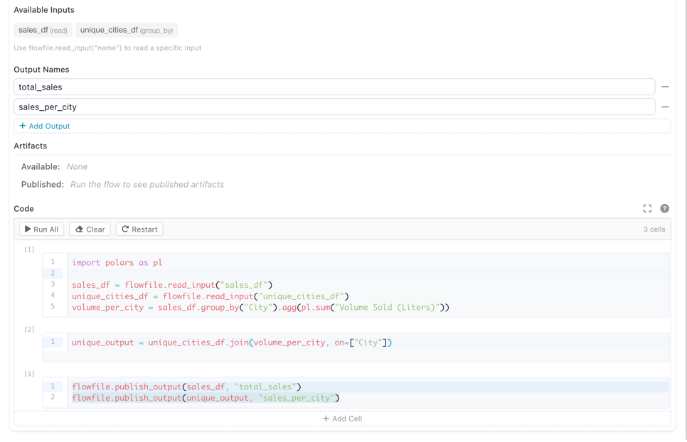

# The flowfile_ctx API

`flowfile_ctx` is the object your code talks to when Python runs on a kernel. It is available wherever kernel Python runs — inside a [Python Script node](kernels.md) on the canvas, and inside [catalog notebook](catalog/notebooks.md) cells. One API, two contexts: this page documents it once for both.

The object is injected automatically. No import is needed — `flowfile_ctx` is already in scope inside any cell or Python Script node connected to a kernel.

## Which calls exist where

Most of the API works identically in both contexts. The exception is the input/output calls, which move data along **flow edges** — a Python Script node has upstream and downstream connections, a notebook cell does not.

| Area | Python Script node | Notebook cell |
|------|:---:|:---:|
| [Reading input data](#reading-input-data) (`read_input`, `read_inputs`) | Yes | No — cells have no input edges |
| [Writing output data](#writing-output-data) (`publish_output`) | Yes | No — cells have no output edges |
| [Displaying results](#displaying-results) (`display`, `explore`) | Yes | Yes |
| [Logging](#logging) (`log`, `log_info`, …) | Yes | Yes |
| [Local artifacts](#local-artifacts-flow-scoped) (`publish_artifact`, …) | Yes | Yes |
| [Global artifacts](#global-artifacts-catalog) (`publish_global`, …) | Yes | Yes |
| [Catalog tables](#catalog-tables) (`read_catalog_table`, `write_catalog_table`) | Yes | Yes |
| [Shared files](#shared-files) (`get_shared_location`) | Yes | Yes |

The input/output calls raise a `RuntimeError` outside a flow run because there is no edge to read from or write to. Everything else — display, logging, artifacts, catalog tables, shared files — reaches the catalog and shared storage directly and behaves the same in a cell.

---

## Writing Code

Inside a Python Script node connected to a kernel, you write standard Python code. The `flowfile_ctx` object is available automatically — no imports needed.

### Reading Input Data

!!! note "Node context"
    `read_input` / `read_inputs` read data arriving on a node's input edges. They only work inside a Python Script node. Notebook cells have no input edges — read your data with [`read_catalog_table`](#catalog-tables) instead.

When multiple nodes are connected to a Python Script node, each input gets a **name** derived from the source node's **node reference**. These names are visible as **edge labels** on the canvas, so you can see at a glance which data flows into which input.



*Edge labels on the canvas showing the names of each connection into the Python Script node*

The Python Script node settings panel displays an **Available Inputs** section that lists all connected inputs by name and source node type. Use these names with `flowfile_ctx.read_input("name")` to read a specific input.



*The Available Inputs panel showing input names and their source node types*

```python
# Read the main input as a Polars LazyFrame
df = flowfile_ctx.read_input()

# Read a named input (when multiple inputs are connected)
orders = flowfile_ctx.read_input("orders")
customers = flowfile_ctx.read_input("customers")

# Read all inputs at once
all_inputs = flowfile_ctx.read_inputs()
# Returns: {"main": [LazyFrame, ...], "orders": [LazyFrame, ...]}
```

!!! tip "Setting input names"
    Input names come from the **node reference** of each source node. You can set or change a node's reference in its settings panel. If no reference is set, the default name is `df_{node_id}`. Names must be lowercase and can only contain letters, digits, and underscores.

!!! tip "Showing connection names on the canvas"
    To display connection names on the canvas, enable **Show edge labels** in the [Flow Settings](building-flows.md#flow-settings).

### Writing Output Data

!!! note "Node context"
    `publish_output` writes to a node's output edges. It only works inside a Python Script node. To persist a result from a notebook cell, write it to the catalog with [`write_catalog_table`](#catalog-tables).

A Python Script node can publish multiple named outputs, each flowing to a different downstream node. To set this up:

1. In the node settings panel, add output names under **Output Names** (e.g. `total_sales`, `sales_per_city`)
2. In your code, use `flowfile_ctx.publish_output(df, "name")` to publish data to each named output



*The Python Script node settings showing two named outputs (`total_sales` and `sales_per_city`) and the code that publishes to them*

```python
# Publish a single (default) output
result = df.filter(pl.col("amount") > 100).select("id", "amount", "date")
flowfile_ctx.publish_output(result)

# Publish multiple named outputs
flowfile_ctx.publish_output(sales_df, "total_sales")
flowfile_ctx.publish_output(unique_output, "sales_per_city")
```

Both `pl.LazyFrame` and `pl.DataFrame` are accepted by `publish_output`.

### Displaying Results

Use `flowfile_ctx.display()` to render rich output in the output panel:

```python
# Display a matplotlib chart
import matplotlib.pyplot as plt

fig, ax = plt.subplots()
ax.bar(["A", "B", "C"], [10, 20, 15])
ax.set_title("Sales by Category")
flowfile_ctx.display(fig, title="Sales Chart")
```

Supported display types:

| Object Type | Rendering |
|-------------|-----------|
| `polars.DataFrame` / `polars.LazyFrame` | Interactive sortable table |
| `matplotlib.figure.Figure` | PNG image |
| `plotly.graph_objects.Figure` | Interactive HTML |
| `PIL.Image.Image` | PNG image |
| HTML string (e.g. `"<b>hello</b>"`) | Rendered HTML |
| Any other object | Plain text via `str()` |

A Polars `DataFrame` or `LazyFrame` renders as an interactive, sortable table
(LazyFrames are head-collected). Up to 10,000 rows are shown by default — pass
`max_rows=` to change the cap:

```python
df = flowfile_ctx.read_input().collect()
flowfile_ctx.display(df)               # interactive table
flowfile_ctx.display(df, max_rows=500) # smaller cap
```

For ad-hoc visual exploration of a frame, use `flowfile_ctx.explore()` — it opens
the full Graphic Walker explorer (a data grid plus a drag-to-chart visualization
builder) inline:

```python
flowfile_ctx.explore(df)
```

!!! tip "Interactive mode"
    In cell-execution mode, the last expression in your code is automatically displayed — similar to Jupyter notebooks. A bare `df` shows its **repr** (what the object is); call `flowfile_ctx.display(df)` for the interactive table or `flowfile_ctx.explore(df)` for the explorer.

### Logging

Send real-time log messages to the flow viewer:

```python
flowfile_ctx.log("Processing started")
flowfile_ctx.log_info("Loaded 1,234 rows")
flowfile_ctx.log_warning("Column 'price' has 5 null values")
flowfile_ctx.log_error("Failed to parse date column")
```

---

## Artifacts

Artifacts let you persist Python objects (models, arrays, DataFrames) across executions within the same flow. They are scoped to the flow that created them.

### Local Artifacts (Flow-scoped)

```python
# Save a trained model
from sklearn.ensemble import RandomForestClassifier

model = RandomForestClassifier().fit(X_train, y_train)
flowfile_ctx.publish_artifact("rf_model", model)

# In a later execution or different node in the same flow:
model = flowfile_ctx.read_artifact("rf_model")
predictions = model.predict(X_test)

# List all artifacts in this flow
artifacts = flowfile_ctx.list_artifacts()
for a in artifacts:
    print(f"{a.name} (node {a.node_id})")

# Delete an artifact
flowfile_ctx.delete_artifact("rf_model")
```

Artifacts are automatically serialized using the best format for the object type:

| Object Type | Format |
|-------------|--------|
| Polars / Pandas DataFrame | Parquet |
| scikit-learn, NumPy, XGBoost, LightGBM | Joblib |
| Everything else | Cloudpickle |

### Global Artifacts (Catalog)

Global artifacts are stored in the Flowfile catalog and persist beyond the current flow. They can be retrieved from any flow or session.

```python
# Publish to the global catalog
artifact_id = flowfile_ctx.publish_global(
    "sales_model_v2",
    model,
    description="Random Forest trained on Q4 data",
    tags=["ml", "classification"],
)

# Retrieve from the global catalog (latest version)
model = flowfile_ctx.get_global("sales_model_v2")

# Same artifact, addressed by its qualified reference
model = flowfile_ctx.get_global("General.default::sales_model_v2")

# Get a specific version
model_v1 = flowfile_ctx.get_global("sales_model_v2", version=1)

# List all global artifacts
artifacts = flowfile_ctx.list_global_artifacts(tags=["ml"])
for a in artifacts:
    print(f"{a.name} v{a.version} — {a.python_type}")

# Delete a global artifact
flowfile_ctx.delete_global_artifact("sales_model_v2")
```

!!! note "Registered flow required to persist"
    `publish_global` needs a flow registration to persist the artifact. Core normally auto-provisions a scratch registration for you, so this works in most cases. When no registration is available it returns `-1` and skips persisting rather than raising.

#### Referring to an artifact by name

Every name-based operation (`get_global`, `delete_global_artifact`, and the corresponding `/artifacts/by-name/...` routes) accepts two forms:

| Form | Example | Resolution |
|------|---------|------------|
| Bare name | `"sales_model_v2"` | Searched across every namespace you can see. Fails with a conflict when the same name exists in more than one namespace. |
| Qualified reference | `"General.default::sales_model_v2"` | `catalog.schema` before the separator, artifact name after it. Unambiguous by construction. |

The reference is split on the **last** `::`, so artifact names themselves cannot contain `::` — `publish_global` rejects such a name. If the namespace path no longer resolves (a renamed catalog or schema) the bare name is used as a fallback, and only fails when that name is ambiguous. When no `version` is given, the newest active version is resolved.

!!! warning "Version deletes are guarded"
    `DELETE /artifacts/{id}` refuses to delete the current latest version while other versions exist (409 `CANNOT_DELETE_LATEST`, overridable with `force=true`) and refuses to delete the last remaining version (delete the artifact itself with `DELETE /artifacts/by-name/{ref}` instead). Kernel calls authenticate as the internal service principal and bypass both guards, so `delete_global_artifact` behaves exactly as before.

!!! tip "Artifact Persistence"
    Local artifacts are automatically saved to disk and recovered if the kernel restarts — no configuration needed.

### Catalog Tables

Kernel cells can read and write Delta-format catalog tables directly, mirroring the ``flowfile_frame.read_catalog_table`` / ``write_catalog_table`` API. The kernel performs the Delta write locally (it has direct access to the catalog storage) and reports the resulting metadata to Core — Core never materialises the dataset.

The kernel exposes three typed handles — `CatalogRef`, `SchemaRef`, `TableRef` — for path-style navigation. The top-level `read_catalog_table` / `write_catalog_table` still accept plain strings for one-shot scripts.

```python
import polars as pl

# Navigate the hierarchy
cat = flowfile_ctx.get_catalog("General")           # CatalogRef
sch = cat.get_schema("default")                     # SchemaRef
orders = sch.get_table_ref("orders")                # TableRef (may not exist yet)

# Shortcut from a catalog ref
orders = cat.get_table_ref(schema_name="default", table_name="orders")

# Or grab the seeded default schema directly
sch = flowfile_ctx.default_schema()

# Discover everything available
for cat in flowfile_ctx.list_catalogs():
    print(cat.name)
    for sch in cat.list_schemas():
        for tbl in sch.list_tables():
            print(f"  {sch.name}.{tbl.name} ({tbl.row_count} rows)")

# Read via a ref — equivalent to flowfile_ctx.read_catalog_table(orders)
df = orders.read()
df_v3 = orders.read(delta_version=3)   # time travel

# Write via the ref — creates the table if it doesn't exist yet
new_data = pl.DataFrame({"id": [1, 2, 3], "name": ["a", "b", "c"]})
orders = orders.write(new_data, write_mode="overwrite")  # returns refreshed ref

# Per-mode writes
orders.write(new_data, write_mode="append")
orders.write(new_data, write_mode="upsert", merge_keys=["id"])
orders.write(new_data, write_mode="update", merge_keys=["id"])
orders.write(new_data.select("id"), write_mode="delete", merge_keys=["id"])
orders.write(new_data, write_mode="error")   # raises if table already exists

# Schema-level convenience: same effect, no intermediate ref
sch.write_table(new_data, "customers", write_mode="overwrite")
sch.read_table("customers")

# String form still works for one-shot usage
lf = flowfile_ctx.read_catalog_table("orders")              # default schema
lf = flowfile_ctx.read_catalog_table("orders", schema="sales")
flowfile_ctx.write_catalog_table(new_data, "customers", write_mode="overwrite")
```

| `write_mode` | Behaviour | Requires `merge_keys` |
|--------------|-----------|------------------------|
| `overwrite`  | Replace the table's data (Delta version increments). | No |
| `append`     | Add rows; schema_mode="merge" so new columns are tolerated. | No |
| `upsert`     | Insert new rows, update existing rows matched by merge keys. | Yes |
| `update`     | Update only existing rows that match merge keys. | Yes |
| `delete`     | Remove rows matching merge keys. | Yes |
| `error`      | Fail if the table already exists. | No |

!!! note "No `virtual` or `scd2` mode in the kernel"
    `flowfile_frame.write_catalog_table` also supports `"virtual"` (backs a table by a registered flow) and `"scd2"` (see [Slowly Changing Dimensions](catalog/slowly-changing-dimensions.md)) write modes. The kernel intentionally does not expose either — flow registration and version-history writes stay in the visual editor or `flowfile_frame`.

---

## Shared Files

Use `flowfile_ctx.get_shared_location()` to write files that are accessible across all Flowfile services and survive container restarts:

```python
# Write a CSV to the shared directory
output_path = flowfile_ctx.get_shared_location("reports/monthly.csv")
df.collect().write_csv(output_path)

# The file is now accessible from other nodes and services
```

---

## `flowfile_ctx` API Reference

The following functions are available inside kernel code via the `flowfile_ctx` object:

### Data I/O

| Function | Description                                                                                                   |
|----------|---------------------------------------------------------------------------------------------------------------|
| `read_input(name="main")` | Read input data as a `pl.LazyFrame`. If more than one source is provided, it attempts to concat all sources. |
| `read_inputs()` | Read all named inputs as `dict[str, list[LazyFrame]]`                                                         |
| `publish_output(df, name="main")` | Write a DataFrame/LazyFrame as output                                                                         |

### Local Artifacts

| Function | Description |
|----------|-------------|
| `publish_artifact(name, obj)` | Store a Python object in the flow's artifact store |
| `read_artifact(name)` | Retrieve a stored artifact |
| `delete_artifact(name)` | Remove an artifact |
| `list_artifacts()` | List all artifacts in the current flow |

### Global Artifacts

| Function | Description |
|----------|-------------|
| `publish_global(name, obj, ...)` | Persist an object to the global catalog |
| `get_global(name, version=None)` | Retrieve from the global catalog; `name` may be bare or qualified `catalog.schema::name`, latest version when unset |
| `list_global_artifacts(...)` | List available global artifacts |
| `delete_global_artifact(name, ...)` | Delete a global artifact (same reference forms) |

### Display & Logging

| Function | Description |
|----------|-------------|
| `display(obj, title="")` | Render rich output (charts, images, HTML, text) |
| `log(message, level="INFO")` | Send a log message to the flow viewer |
| `log_info(message)` | Shortcut for `log(message, "INFO")` |
| `log_warning(message)` | Shortcut for `log(message, "WARNING")` |
| `log_error(message)` | Shortcut for `log(message, "ERROR")` |

### Utilities

| Function | Description |
|----------|-------------|
| `get_shared_location(filename)` | Get a path in the shared directory |

---

## Related Documentation

- [Kernel Execution](kernels.md) — creating kernels, the Python Script node, and the Node Designer
- [Notebooks](catalog/notebooks.md) — running `flowfile_ctx` cells in the catalog
- [Node Designer](node-designer.md) — custom nodes with kernel support
- [Kernel Architecture](../../for-developers/kernel-architecture.md) — technical deep-dive for developers
