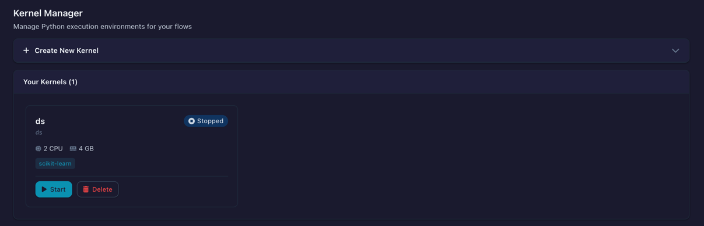
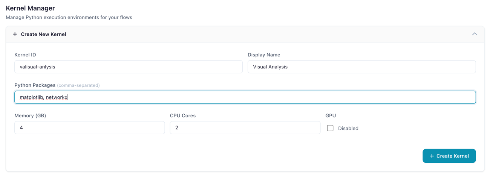
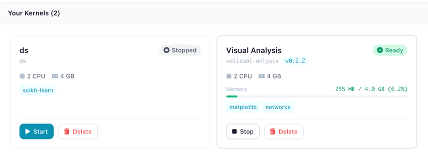
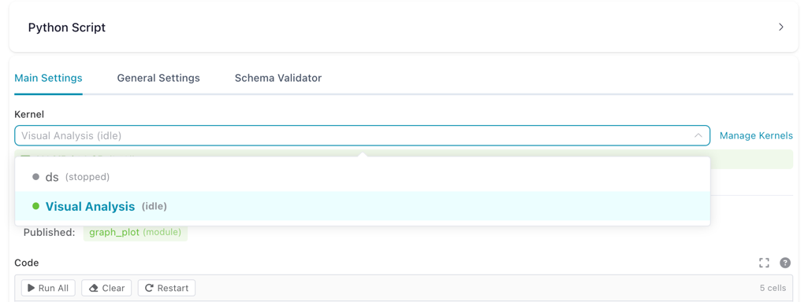

# Kernel Execution

Run custom Python code in isolated Docker containers with full access to your flow's data.

!!! warning "Beta Feature"
    Kernel execution is currently in **beta**. The core functionality is working, but some features are still under active development and optimization. See [Known Limitations](#known-limitations) for details.

Kernels provide a sandboxed execution environment for Python Script nodes. Each kernel runs inside its own Docker container with configurable resources (CPU, memory, GPU), persistent namespaces across executions, and access to the `flowfile` API for reading inputs, writing outputs, and managing artifacts.

---

## Prerequisites

- **Docker** must be installed and running on the host machine
- The **flowfile-kernel** Docker image must be built:

```bash
docker compose build flowfile-kernel
```

!!! tip "Desktop App"
    When running Flowfile as a desktop application, Docker must be available on your local machine. Verify with `docker info`.

---

## Kernel Manager

The Kernel Manager is the central dashboard for creating, starting, stopping, and monitoring kernels. Open it from the **sidebar menu**.

*The Kernel Manager showing configured kernels with status, resource usage, and actions*

When Docker is not running or the kernel image has not been built, a status banner appears at the top of the page with instructions on how to resolve the issue.


*Warning banner shown when Docker is unavailable or the kernel image is missing*

---

## Creating a Kernel

1. In the Kernel Manager, click **Create Kernel** to expand the creation form
2. Fill in the configuration fields:


*The kernel creation form with resource configuration options*

| Setting | Description | Default |
|---------|-------------|---------|
| **Kernel ID** | Unique identifier (alphanumeric) | — |
| **Name** | A human-readable display label | — |
| **Packages** | Comma-separated pip packages to install at startup | *(none)* |
| **Memory (GB)** | Maximum memory the container can use (0.5–64 GB) | `2` |
| **CPU Cores** | Number of CPU cores allocated (0.5–32) | `2` |
| **GPU** | Enable GPU passthrough (requires NVIDIA Docker) | `false` |

3. Click **Create Kernel** to save the configuration
4. Click **Start** on the kernel card to launch the container

### Kernel Cards

Each kernel is displayed as a card showing its current state, resource allocation, and live memory usage.


*A kernel card showing status badge, CPU/memory allocation, installed packages, and memory usage bar*

The status badge indicates the kernel's current state:

| Status | Badge | Meaning |
|--------|-------|---------|
| **Stopped** | Gray | Container is not running |
| **Starting** | Blue (animated) | Container is initializing |
| **Ready** | Green | Idle and ready for execution |
| **Executing** | Orange (animated) | Currently running code |
| **Error** | Red | Failed — check error message on the card |

The memory usage bar shows real-time consumption, color-coded green (normal), orange (warning, >80%), or red (critical, >95%).

---

## Python Script Node

Add a **Python Script** node to your flow to write and execute Python code in a kernel.

### Selecting a Kernel

In the node settings panel, the kernel dropdown shows all available kernels with their current state.


*Kernel dropdown in the Python Script node settings, showing available kernels and their state*

!!! warning "Kernel Required"
    A running kernel is required to execute Python code. If no kernel is selected or the selected kernel is stopped, a warning message appears with instructions.

### Notebook Editor

The code editor uses a Jupyter-style notebook interface with multiple cells. Each cell can be executed independently.


*The notebook editor showing multiple code cells with execution counters, a toolbar, and output*

**Toolbar actions:**

| Button | Description |
|--------|-------------|
| **Run All** | Execute all cells in order |
| **Clear** | Erase all cell outputs |
| **Restart** | Clear all kernel variables for this flow |

**Cell actions** (visible on hover):

| Action | Shortcut | Description |
|--------|----------|-------------|
| Run cell | `Shift+Enter` | Execute the cell |
| Run and advance | `Cmd/Ctrl+Enter` | Execute and move to next cell |
| Move up/down | — | Reorder cells |
| Delete | — | Remove the cell |

### Cell Output

After executing a cell, the output area shows results, stdout, and any errors.


*Cell output showing a rendered matplotlib chart, execution time, and stdout*

Output types rendered:

- **Charts** — matplotlib and plotly figures rendered inline
- **Images** — PIL images displayed as PNG
- **HTML** — rendered in a sandboxed iframe
- **Text** — plain text from `print()` statements or `flowfile.display()`
- **Errors** — tracebacks displayed in a red block

### Expanded Editor

Click **Expand Editor** to open a fullscreen code editing view. The expanded editor shows the kernel status and memory usage in the header bar.

### Artifacts Panel

The node settings panel shows artifacts available from upstream nodes and artifacts published by the current node.


*Artifacts panel showing available upstream artifacts and published artifacts for the current node*

### API Reference

Click the **?** button in the code editor header to open the built-in API reference.

---

## Writing Code

Inside a Python Script node connected to a kernel, you write standard Python code. The `flowfile` module is available automatically — no imports needed.

### Reading Input Data

```python
# Read the main input as a Polars LazyFrame
df = flowfile.read_input()

# Read a named input (when multiple inputs are connected)
orders = flowfile.read_input("orders")
customers = flowfile.read_input("customers")

# Read all inputs at once
all_inputs = flowfile.read_inputs()
# Returns: {"main": [LazyFrame, ...], "orders": [LazyFrame, ...]}
```

### Writing Output Data

```python
# Process data and publish the result
result = df.filter(pl.col("amount") > 100).select("id", "amount", "date")
flowfile.publish_output(result)

# Publish a named output
flowfile.publish_output(summary, name="summary")
```

Both `pl.LazyFrame` and `pl.DataFrame` are accepted by `publish_output`.

### Displaying Results

Use `flowfile.display()` to render rich output in the node's output panel:

```python
# Display a matplotlib chart
import matplotlib.pyplot as plt

fig, ax = plt.subplots()
ax.bar(["A", "B", "C"], [10, 20, 15])
ax.set_title("Sales by Category")
flowfile.display(fig, title="Sales Chart")
```

Supported display types:

| Object Type | Rendering |
|-------------|-----------|
| `matplotlib.figure.Figure` | PNG image |
| `plotly.graph_objects.Figure` | Interactive HTML |
| `PIL.Image.Image` | PNG image |
| HTML string (e.g. `"<b>hello</b>"`) | Rendered HTML |
| Any other object | Plain text via `str()` |

!!! tip "Interactive mode"
    In cell-execution mode, the last expression in your code is automatically displayed — similar to Jupyter notebooks.

### Logging

Send real-time log messages to the flow viewer:

```python
flowfile.log("Processing started")
flowfile.log_info("Loaded 1,234 rows")
flowfile.log_warning("Column 'price' has 5 null values")
flowfile.log_error("Failed to parse date column")
```

---

## Artifacts

Artifacts let you persist Python objects (models, arrays, DataFrames) across executions within the same flow. They are scoped to the flow that created them.

### Local Artifacts (Flow-scoped)

```python
# Save a trained model
from sklearn.ensemble import RandomForestClassifier

model = RandomForestClassifier().fit(X_train, y_train)
flowfile.publish_artifact("rf_model", model)

# In a later execution or different node in the same flow:
model = flowfile.read_artifact("rf_model")
predictions = model.predict(X_test)

# List all artifacts in this flow
artifacts = flowfile.list_artifacts()
for a in artifacts:
    print(f"{a.name} (node {a.node_id})")

# Delete an artifact
flowfile.delete_artifact("rf_model")
```

Artifacts are automatically serialized using the best format for the object type:

| Object Type | Format |
|-------------|--------|
| Polars / Pandas DataFrame | Parquet |
| scikit-learn, NumPy, XGBoost, LightGBM | Joblib |
| Everything else | Cloudpickle |

### Global Artifacts (Catalog)

Global artifacts are stored in the Flowfile catalog and persist beyond the current flow. They can be retrieved from any flow or session.

```python
# Publish to the global catalog
artifact_id = flowfile.publish_global(
    "sales_model_v2",
    model,
    description="Random Forest trained on Q4 data",
    tags=["ml", "classification"],
)

# Retrieve from the global catalog
model = flowfile.get_global("sales_model_v2")

# Get a specific version
model_v1 = flowfile.get_global("sales_model_v2", version=1)

# List all global artifacts
artifacts = flowfile.list_global_artifacts(tags=["ml"])
for a in artifacts:
    print(f"{a.name} v{a.version} — {a.python_type}")

# Delete a global artifact
flowfile.delete_global_artifact("sales_model_v2")
```

!!! note "Registered Flows Required"
    `publish_global` requires the flow to be registered in the catalog. It is not available in interactive (cell) mode.

---

## Persistence & Recovery

When persistence is enabled, local artifacts are automatically saved to disk inside the container. If the kernel restarts, artifacts are recovered based on the configured recovery mode:

| Recovery Mode | Behavior |
|---------------|----------|
| **Lazy** (default) | Artifacts are indexed on disk but loaded into memory only when accessed |
| **Eager** | All artifacts are loaded into memory immediately on startup |
| **Clear** | All persisted artifacts are deleted on startup |

---

## Shared Files

Use `flowfile.get_shared_location()` to write files that are accessible across all Flowfile services and survive container restarts:

```python
# Write a CSV to the shared directory
output_path = flowfile.get_shared_location("reports/monthly.csv")
df.collect().write_csv(output_path)

# The file is now accessible from other nodes and services
```

---

## Cancelling Execution

To interrupt a long-running code execution:

1. Click the **Stop** button in the node's execution panel
2. The kernel receives a `KeyboardInterrupt` signal
3. Execution halts and control returns to the idle state

This works the same way as pressing `Ctrl+C` in a Python terminal.

---

## Resource Monitoring

The kernel tracks memory usage via the container's cgroup filesystem. You can view current memory consumption both on the kernel card in the Kernel Manager and in the Python Script node header.

If a kernel exceeds its memory limit, Docker terminates the container and Flowfile reports an out-of-memory error.

---

## Using Kernels in the Node Designer

Custom nodes built with the [Node Designer](node-designer.md) can also run on kernels. This lets you create reusable nodes that depend on third-party libraries (e.g. scikit-learn, XGBoost) or that need artifact support.

### Enabling Kernel Mode

In the Node Designer, check **Require Kernel Execution** in the metadata section. This reveals a kernel selector and output name configuration.

*The Node Designer with kernel execution enabled, showing the kernel dropdown and output names*

When a user drops your kernel-enabled custom node into a flow, the node settings panel shows a kernel dropdown so they can choose which kernel runs it.

*A kernel-enabled custom node in a flow with the kernel selector visible*

### What Changes

Your `process` method code stays the same — the `self.settings_schema` access pattern works identically. Behind the scenes, the Node Designer generates a self-contained kernel script that:

1. Creates proxy classes replicating `self.settings_schema.section.component.value`
2. Reads inputs via `flowfile.read_input()`
3. Runs your process method body
4. Publishes outputs via `flowfile.publish_output()` for each named output

The full `flowfile` API (artifacts, display, logging) is available inside kernel-enabled custom nodes.

For details on building custom nodes, see [Node Designer](node-designer.md#kernel-execution).

---

## Known Limitations

Kernel execution is in beta. The following limitations are known and being worked on:

- **Flow-to-code export** — Python Script nodes that use kernel execution are not yet included in the [Export to Python](tutorials/code-generator.md) code generator. Kernel nodes will be skipped in the generated code.
- **Artifact state visibility** — There is currently no UI to browse or inspect the contents of stored artifacts. You can list artifacts via `flowfile.list_artifacts()` in code, but there is no visual artifact explorer yet.
- **Python package versioning** — Packages specified during kernel creation are installed via `pip install` at container startup without version pinning. There is no lock file or reproducible environment mechanism yet. To pin versions, specify them explicitly in the packages field (e.g. `scikit-learn==1.4.0, pandas==2.1.0`).

---

## `flowfile` API Reference

The following functions are available inside kernel code via the `flowfile` module:

### Data I/O

| Function | Description |
|----------|-------------|
| `read_input(name="main")` | Read input data as a `pl.LazyFrame` |
| `read_first(name="main")` | Read only the first input file |
| `read_inputs()` | Read all named inputs as `dict[str, list[LazyFrame]]` |
| `publish_output(df, name="main")` | Write a DataFrame/LazyFrame as output |

### Local Artifacts

| Function | Description |
|----------|-------------|
| `publish_artifact(name, obj)` | Store a Python object in the flow's artifact store |
| `read_artifact(name)` | Retrieve a stored artifact |
| `delete_artifact(name)` | Remove an artifact |
| `list_artifacts()` | List all artifacts in the current flow |

### Global Artifacts

| Function | Description |
|----------|-------------|
| `publish_global(name, obj, ...)` | Persist an object to the global catalog |
| `get_global(name, version=None)` | Retrieve from the global catalog |
| `list_global_artifacts(...)` | List available global artifacts |
| `delete_global_artifact(name, ...)` | Delete a global artifact |

### Display & Logging

| Function | Description |
|----------|-------------|
| `display(obj, title="")` | Render rich output (charts, images, HTML, text) |
| `log(message, level="INFO")` | Send a log message to the flow viewer |
| `log_info(message)` | Shortcut for `log(message, "INFO")` |
| `log_warning(message)` | Shortcut for `log(message, "WARNING")` |
| `log_error(message)` | Shortcut for `log(message, "ERROR")` |

### Utilities

| Function | Description |
|----------|-------------|
| `get_shared_location(filename)` | Get a path in the shared directory |

---

## Related Documentation

- [Node Designer](node-designer.md) — Create custom nodes with kernel support
- [Building Flows](building-flows.md) — Using nodes in workflows
- [Transform Nodes](nodes/transform.md) — Built-in transformation nodes
- [Docker Deployment](../deployment/docker.md) — Running Flowfile with Docker
- [Kernel Architecture](../../for-developers/kernel-architecture.md) — Technical deep-dive for developers
