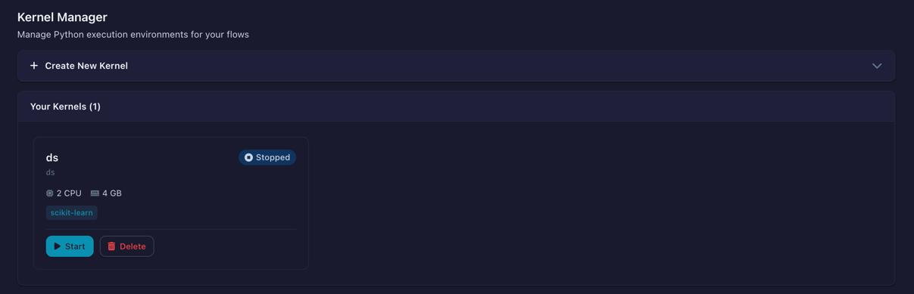
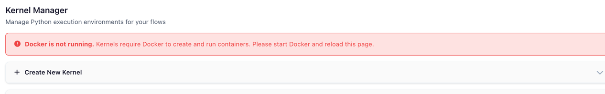
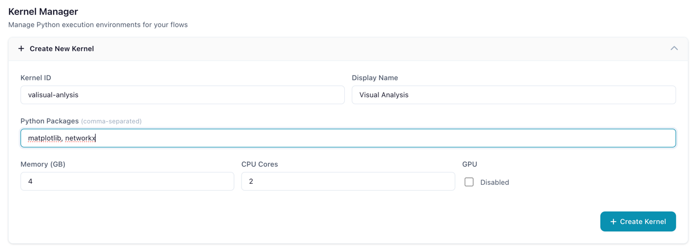
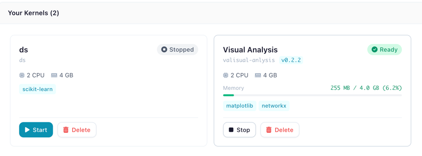
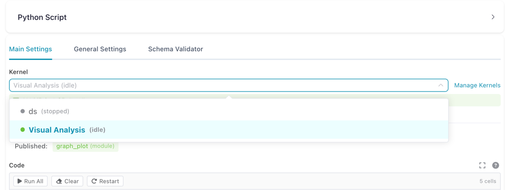
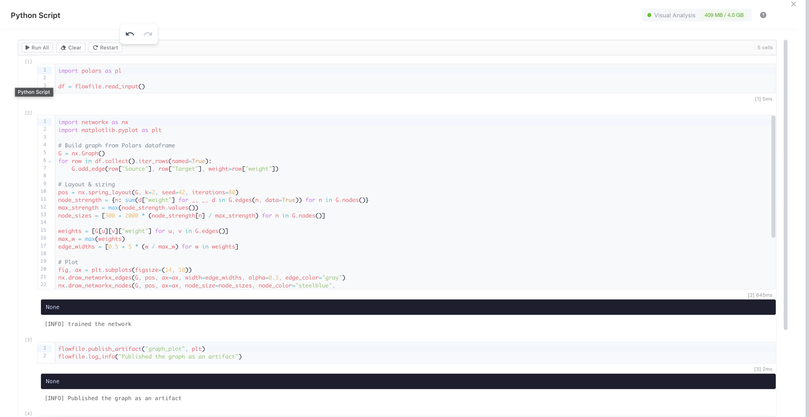
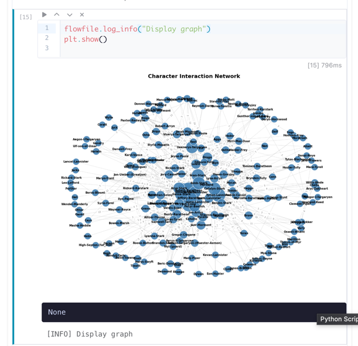
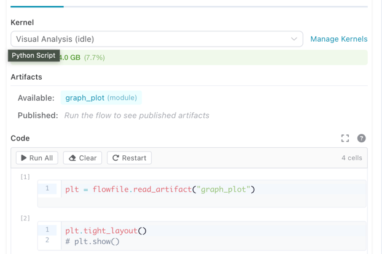

# Kernel Execution

Run custom Python code in isolated Docker containers with full access to your flow's data.

!!! info "Not in Flowfile Lite"
    Kernel execution requires Docker and the full desktop/server build. The browser-only [Flowfile Lite](../deployment/lite.md) edition cannot run kernels — use the **Polars Code** node for in-browser Python/Polars logic.

!!! info "Requires Docker"
    Kernel execution runs your Python in Docker containers, so Docker must be available on the host. A few [current limitations](#current-limitations) apply.

Kernels provide a sandboxed execution environment for Python Script nodes. Each kernel runs inside its own Docker container with configurable resources (CPU, memory, GPU), persistent namespaces across executions, and access to the `flowfile_ctx` API for reading inputs, writing outputs, and managing artifacts.

!!! info "Renamed from `flowfile`"
    The kernel-context global was previously called `flowfile`. It has been renamed to `flowfile_ctx` to avoid colliding with the `flowfile` PyPI package, which you may want to `import` inside a cell. The old name still works (it forwards to `flowfile_ctx` and emits a `DeprecationWarning` on first use) but will be removed in a future release.

---

## Prerequisites

- **Docker** must be installed and running on the host machine
- A kernel **image** must be installed — the Kernel Manager lists the standard images and pulls them for you with one click (see [Kernel images](#kernel-images)); no manual build needed

!!! tip "Desktop App"
    When running Flowfile as a desktop application, Docker must be available on your local machine. Verify with `docker info`.

---

## Kernel Manager

The Kernel Manager is the central dashboard for creating, starting, stopping, and monitoring kernels. Open it from **Settings → Execution → Python Kernels** (the gear icon in the left sidebar).

*The Kernel Manager showing configured kernels with status, resource usage, and actions*

When Docker is not running or no kernel image is installed, a status banner appears at the top of the page with instructions on how to resolve the issue.

*Warning banner shown when Docker is unavailable or the kernel image is missing*

---

## Kernel images

Every kernel is created from an **image flavour** that decides which packages are pre-installed. The Kernel Manager's images panel lists the standard flavours and installs (pulls) them on demand:

| Flavour | Ships | Use for |
|---------|-------|---------|
| **Base** | Polars, PyArrow, NumPy | Plain data work |
| **ML** | Base + scikit-learn, XGBoost, LightGBM, statsmodels | Machine-learning nodes and scripts |
| **Lite** | Same packages as Base, but only Polars and the kernel runtime are version-pinned | Installing large extra libraries whose own dependency trees need room to resolve |
| **Custom image** | Whatever you put in it | Your own published Docker image URI |

A kernel's flavour matters beyond notebooks: a [kernel-environment custom node](node-designer.md#execution-environment) declares the packages it needs, and those are **not installed automatically** — the node must run on a kernel whose image provides them. Flowfile does compare the two for you: the node's kernel picker marks kernels that have all the declared packages, offers **Add missing packages** on a near-miss (the kernel is stopped, rebuilt with the additions, and started again), and **Create kernel for this node** pre-fills a new kernel from the node's requirements. For scikit-learn and friends, that means an ML kernel (or a kernel with the package added — see below).

---

## Creating a Kernel

1. In the Kernel Manager, click **Create new kernel** to expand the creation form
2. Fill in the configuration fields:

*The kernel creation form with resource configuration options*

| Setting | Description | Default |
|---------|-------------|---------|
| **Kernel ID** | Unique identifier (alphanumeric) | — |
| **Name** | A human-readable display label | — |
| **Image flavour** | Base, ML, Lite, or a custom image URI (see [Kernel images](#kernel-images)) | `Base` |
| **Packages** | Extra pip packages baked into the kernel's image on top of the flavour (version pins encouraged) | *(none)* |
| **Memory (GB)** | Maximum memory the container can use (0.5–64 GB) | `4` |
| **CPU Cores** | Number of CPU cores allocated (0.5–32) | `2` |
| **GPU** | Enable GPU passthrough (requires NVIDIA Docker) | `false` |

3. Click **Create Kernel** to save the configuration
4. Click **Start** on the kernel card to launch the container

Extra packages are resolved against the flavour's version constraints and baked into a per-kernel image when the kernel is created — not installed on every start. Editing a stopped kernel's package list rebuilds its image.

### Kernel Cards

Each kernel is displayed as a card showing its current state, resource allocation, and live memory usage.

*A kernel card showing status badge, CPU/memory allocation, installed packages, and memory usage bar*

The status badge indicates the kernel's current state:

| Status | Badge | Meaning |
|--------|-------|---------|
| **Stopped** | Gray | Container is not running |
| **Starting** | Blue (animated) | Container is initializing |
| **Ready** | Green | Idle and ready for execution |
| **Executing** | Orange (animated) | Currently running code |
| **Error** | Red | Failed — check error message on the card |

The memory usage bar shows real-time consumption, color-coded green (normal), orange (warning, >80%), or red (critical, >95%).

---

## Python Script Node

Add a **Python Script** node to your flow to write and execute Python code in a kernel.

### Selecting a Kernel

In the node settings panel, the kernel dropdown shows all available kernels with their current state.

*Kernel dropdown in the Python Script node settings, showing available kernels and their state*

!!! warning "Kernel Required"
    A running kernel is required to execute Python code. If no kernel is selected or the selected kernel is stopped, a warning message appears with instructions.

### Notebook Editor

The code editor uses a Jupyter-style notebook interface with multiple cells. Each cell can be executed independently.

*The notebook editor showing multiple code cells with execution counters, a toolbar, and output*

**Toolbar actions:**

| Button | Description |
|--------|-------------|
| **Run All** | Execute all cells in order |
| **Clear** | Erase all cell outputs |
| **Restart** | Clear all kernel variables for this flow |

**Cell actions** (visible on hover):

| Action | Shortcut | Description |
|--------|----------|-------------|
| Run cell | `Shift+Enter` | Execute the cell |
| Run and advance | `Cmd/Ctrl+Enter` | Execute and move to next cell |
| Move up/down | — | Reorder cells |
| Delete | — | Remove the cell |

### Cell Output

After executing a cell, the output area shows results, stdout, and any errors.

*Cell output showing a rendered matplotlib chart, execution time, and stdout*

Output types rendered:

- **Tables** — Polars DataFrames/LazyFrames as interactive sortable tables
- **Charts** — matplotlib and plotly figures rendered inline
- **Images** — PIL images displayed as PNG
- **HTML** — rendered in a sandboxed iframe
- **Text** — plain text from `print()` statements or `flowfile_ctx.display()`
- **Errors** — tracebacks displayed in a red block

### Expanded Editor

Click **Expand Editor** to open a fullscreen code editing view. The expanded editor shows the kernel status and memory usage in the header bar.

### Artifacts Panel

The node settings panel shows artifacts available from upstream nodes and artifacts published by the current node.

*Artifacts panel showing available upstream artifacts and published artifacts for the current node*

### API Reference

Click the **?** button in the code editor header to open the built-in API reference. The full `flowfile_ctx` surface — reading inputs, publishing outputs, display, logging, artifacts, catalog tables, and shared files — is documented on [The flowfile_ctx API](kernel-api.md).

---

## Writing code: the flowfile_ctx API

Inside a Python Script node connected to a kernel, you write standard Python code. The `flowfile_ctx` object is available automatically — no imports needed — and it is your handle for reading the node's inputs, publishing its outputs, displaying rich results, logging, and working with artifacts and catalog tables.

The same object powers [catalog notebook](catalog/notebooks.md) cells, so it is documented once on its own page: [The flowfile_ctx API](kernel-api.md). The [Reading Input Data](kernel-api.md#reading-input-data) and [Writing Output Data](kernel-api.md#writing-output-data) sections cover the node-specific input/output edges.

---

## Using Kernels in the Node Designer

Custom nodes built with the [Node Designer](node-designer.md) can also run on kernels. This lets you create reusable nodes that depend on third-party libraries (e.g. scikit-learn, XGBoost) or that need artifact support.

### Enabling Kernel Mode

In the Node Designer's **Execution** group, choose the **Isolated kernel** card. A **Dependencies (pip)** editor records the packages the node needs — a requirement to satisfy, not an install step, so run and test the node on a kernel whose image provides them (for ML libraries, the [ML flavour](#kernel-images)). See [Execution environment](node-designer.md#execution-environment) for the full picture.

When a user drops your kernel-enabled custom node into a flow, the node settings drawer shows a kernel picker, with the node's dependencies listed beside it, so they can choose which kernel runs it.

### What Changes

Your `process` method code stays the same — the `self.settings_schema` access pattern works identically. Behind the scenes, the Node Designer generates a self-contained kernel script that:

1. Creates proxy classes replicating `self.settings_schema.section.component.value`
2. Reads inputs via `flowfile_ctx.read_input()`
3. Runs your process method body
4. Publishes outputs via `flowfile_ctx.publish_output()` for each named output

The full `flowfile_ctx` API (artifacts, display, logging) is available inside kernel-enabled custom nodes.

For details on building custom nodes, see [Node Designer](node-designer.md#how-kernel-execution-works), and for a full worked example — the same node built visually and as code — see [K-Means on a Kernel](kmeans-kernel-node.md).

---

## Current limitations

- **Flow-to-code export** — Python Script nodes that use kernel execution are not included in the [Export to Python](tutorials/code-generator.md) code generator. Kernel nodes are skipped in the generated code.
- **Artifact state visibility** — There is no UI to browse or inspect the contents of stored artifacts. You can list artifacts via `flowfile_ctx.list_artifacts()` in code, but there is no visual artifact explorer.

---

## Related Documentation

- [The flowfile_ctx API](kernel-api.md) — The cell-side API for inputs, outputs, display, artifacts, and catalog tables
- [Node Designer](node-designer.md) — Create custom nodes with kernel support
- [Building Flows](building-flows.md) — Using nodes in workflows
- [Transform Nodes](nodes/transform.md) — Built-in transformation nodes
- [Docker Deployment](../deployment/docker.md) — Running Flowfile with Docker
- [Kernel Architecture](../../for-developers/kernel-architecture.md) — Technical deep-dive for developers
