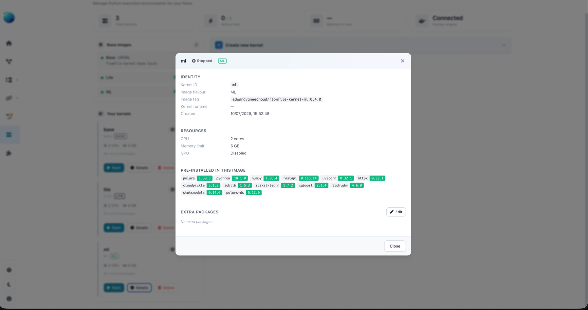
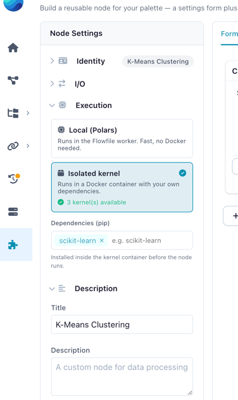
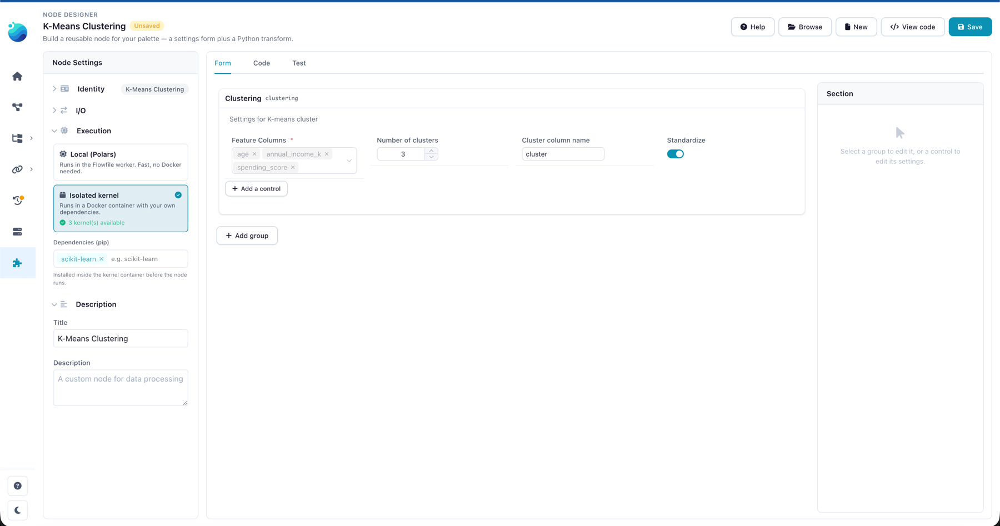
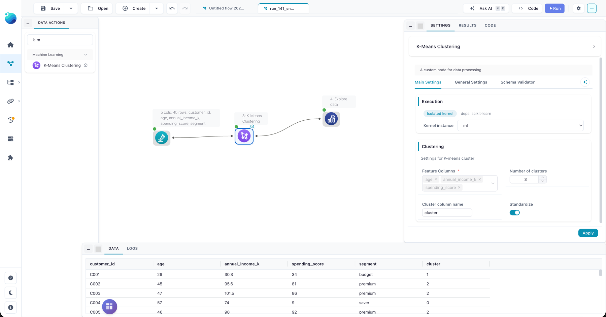
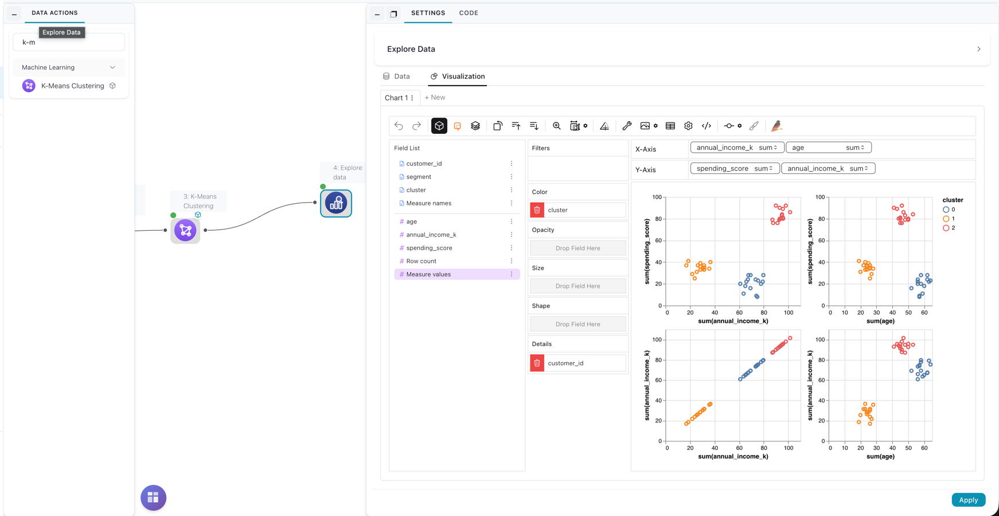

# Tutorial: K-Means on a Kernel

This tutorial builds one custom node that runs **K-Means clustering** over the numeric columns you choose, using scikit-learn inside an [isolated kernel](kernels.md). It's the kernel counterpart to the local-execution [Emoji Generator tutorial](custom-node-tutorial.md) — same shape, but the `process` method reaches for a third-party library, so it runs on a kernel that provides it.

You'll build the **same node two ways**:

1. **Visually, in the [Node Designer](node-designer.md)** — no file to write by hand. This is the primary path here.
2. **As a plain `.py` file** — for version-controlled or programmatic authoring.

The two are interchangeable: a node built in the designer's visual subset saves to a `.py` file, and that file reopens in the designer. The visual build and the file below are the *same node*.

!!! info "What you'll build"
    A **K-Means Clustering** node that:

    - Lands in the **ML** palette group.
    - Lets the user pick numeric feature columns, the number of clusters `k`, an output column name, and whether to standardize features first.
    - Runs scikit-learn in a Docker kernel and adds a cluster-label column to the data.

## Before you start: a kernel with scikit-learn

This node runs its Python in a **kernel** — a Docker container managed from the [Kernel Manager](kernels.md). The kernel you run it on must already have scikit-learn: Flowfile does not install a node's dependencies at run time. Of the standard kernel images, **only the ML flavour ships scikit-learn** (along with XGBoost, LightGBM, and statsmodels) — on a Base or Lite kernel this tutorial fails with a `ModuleNotFoundError`.

Set the kernel up once (Docker must be running):

1. Open the **Kernel Manager** from the sidebar.
2. If the **ML** image isn't installed yet, click **Install** next to it in the images panel.
3. Click **Create new kernel** and pick **Image flavour → ML**; name it something you'll recognize later, like `ml`.
4. Click **Start** on the new kernel's card and wait for the green **Ready** badge.

Everything else happens in the Node Designer.

<details markdown="1">
<summary>The ML kernel in the Kernel Manager — scikit-learn pre-installed</summary>



</details>

!!! note "Why a kernel here?"
    scikit-learn isn't one of the libraries Flowfile ships with, and a **local** node can only use what's already installed. A kernel gives the node its own Docker environment that does have it. Need a package no standard image provides? Add it to the kernel's **Packages** field when you create the kernel — extra packages are baked into the kernel's image.

---

## Build it in the Node Designer

Open **Node Designer** from the sidebar and click **New**.

### 1. Identity

In the left **Node Settings** panel, under **Identity**:

- **Node Name** → `K-Means Clustering`
- **Category** → `ML` (type it or pick it — this becomes the palette group)
- **Node Icon** → pick anything that reads as clustering/ML.

### 2. Execution environment

Open the **Execution** group and choose the **Isolated kernel** card. A **Dependencies (pip)** editor appears — add one tag:

```
scikit-learn
```

The tag declares what the node needs; it shows on the node's kernel badge so anyone using the node knows to pick a kernel that has it — your ML kernel does. (If Docker is unavailable, the card explains why and links to the Kernel Manager.)

<details markdown="1" open>
<summary>Execution environment</summary>



</details>

### 3. The settings form

On the **Form** tab, add a group. Give it the display title **Clustering** and the Python name `clustering` (this is what you'll type in the code). Then **Add a control** four times:

| Control | Field name | Configure |
|---------|------------|-----------|
| **Column Selector** | `feature_columns` | Data types → **Numeric**, **Multiple** on, **Required** on |
| **Numeric Input** | `n_clusters` | Label "Number of clusters (k)", default `3`, min `2`, max `20` |
| **Text Input** | `cluster_column` | Label "Cluster column name", default `cluster` |
| **Toggle Switch** | `standardize` | Label "Standardize features first", default on |

<details markdown="1">
<summary>The Clustering group</summary>



</details>

### 4. The process logic

Switch to the **Code** tab. The signature header is fixed — you write the **body only**. The **Form fields** panel on the left lists every control with its accessor path; click one to insert it.

```python
from sklearn.cluster import KMeans
from sklearn.preprocessing import StandardScaler

cfg = self.settings_schema.clustering
feature_cols = cfg.feature_columns.value     # list[str]
k = int(cfg.n_clusters.value)                # a Numeric Input is always a float
label_col = cfg.cluster_column.value

df = inputs[0].collect()                     # sklearn needs eager data
features = df.select(feature_cols).to_numpy()
if cfg.standardize.value:
    features = StandardScaler().fit_transform(features)

model = KMeans(n_clusters=k, n_init=10, random_state=42)
labels = model.fit_predict(features)

flowfile_ctx.log_info(
    f"Fitted {k} clusters over {len(feature_cols)} features and {df.height} rows"
)
return df.with_columns(pl.Series(label_col, labels))
```

Three things in that body are worth calling out — they're the difference between a kernel node that runs and one that doesn't:

!!! warning "Import third-party libraries *inside* `process`"
    `from sklearn... import ...` lives **inside** `process`, not at the top of the file. Flowfile's core loads your node file to register it in the palette, and core does **not** have the kernel's dependencies installed. A top-level `import sklearn` would make the node load with an error. Importing inside `process` keeps registration clean — the import only runs in the kernel, which has the package.

- **`int(cfg.n_clusters.value)`** — a Numeric Input value is always a `float`; `KMeans` wants an `int`, so cast it.
- **`flowfile_ctx`** — available directly inside a kernel node's `process`. Use it for run feedback (`log_info`), and — see [Extensions](#extensions) — artifacts. (`flowfile_ctx` is *not* available in a `local` node.)

### 5. Test it

On the **Test** tab, pick your **ML kernel** from the **Kernel** selector — the dry run executes on that kernel, so this choice decides whether `from sklearn...` works. If the test fails with `ModuleNotFoundError: No module named 'sklearn'`, the selected kernel doesn't have scikit-learn: switch to the ML kernel from [Before you start](#before-you-start-a-kernel-with-scikit-learn).

Then paste this sample — nine customers in three obvious groups — and click **Run test**:

```csv
customer_id,age,annual_income_k,spending_score,segment
C001,24,27.5,33,budget
C002,26,30.1,38,budget
C003,23,25.8,31,budget
C004,45,95.6,81,premium
C005,47,101.5,86,premium
C006,44,90.2,79,premium
C007,57,74.0,18,saver
C008,60,68.5,22,saver
C009,58,71.3,15,saver
```

Set the feature columns to `age`, `annual_income_k`, and `spending_score`, and leave **k** at 3. The output grid gains a `cluster` column, and the three groups fall into three clusters that line up with the `segment` label — which the numeric picker leaves alone. You also get the schema, row count, and your `log_info` line in the **Logs** panel — the same execution path a real run uses. Tick **Save test setup with node** to keep the sample and settings in the file.

<!-- IMAGE-PLACEHOLDER-TO-CHANGE: the Test tab for a kernel node — the Kernel selector set to the ML kernel, the dry-run output grid with the cluster column, and the log_info line in Logs (save as docs/assets/images/guides/node-designer/kmeans-test-tab.png) -->

### 6. Save and use it in a flow

Click **Save**. The node loads immediately — no restart — under the **ML** group in the palette, with a small kernel badge marking it as kernel-backed. For a fuller dataset than the nine-row test sample, the repo ships [`customer_segments.csv`](https://raw.githubusercontent.com/edwardvaneechoud/Flowfile/main/data/templates/customer_segments.csv) — 45 customers across the same three segments (`budget`, `premium`, `saver`).

Drag the node onto the canvas, connect the data, and open its settings drawer: next to the **Kernel instance** picker the drawer shows the node's dependencies (`deps: scikit-learn`), so pick the ML kernel here too, then run.

<details markdown="1">
<summary>On the canvas: ML palette group, kernel picker, and the cluster column</summary>



</details>

### 7. Explore the clusters

To see what K-Means found, connect an **Explore Data** node to the output and open its **Visualization** tab: plot the feature columns against each other and drag `cluster` onto **Color**. With the 45-customer sample from step 6, the three segments separate cleanly.

<details markdown="1">
<summary>Feature scatter plots colored by cluster</summary>



</details>

---

## The same node as a file

If you prefer to write the node directly — to version-control it, or to skip the UI — here is the complete file. Save it as `~/.flowfile/user_defined_nodes/kmeans_clustering.py`. Because it stays within the visual subset, it **reopens in the Node Designer**: this file and the visual build above are the same node.

```python
import polars as pl

from flowfile import node_designer as nd


class KMeansSettings(nd.NodeSettings):
    clustering: nd.Section = nd.Section(
        title="Clustering",
        description="Group rows into clusters from their numeric features.",
        feature_columns=nd.ColumnSelector(
            label="Feature columns",
            data_types=nd.Types.Numeric,
            multiple=True,
            required=True,
        ),
        n_clusters=nd.NumericInput(
            label="Number of clusters (k)",
            default=3,
            min_value=2,
            max_value=20,
        ),
        cluster_column=nd.TextInput(
            label="Cluster column name",
            default="cluster",
        ),
        standardize=nd.ToggleSwitch(
            label="Standardize features first",
            default=True,
            description="Scale each feature to mean 0 / unit variance before clustering.",
        ),
    )


class KMeansClusteringNode(nd.CustomNodeBase):
    node_name: str = "K-Means Clustering"
    node_category: str = "ML"
    title: str = "K-Means Clustering"
    intro: str = "Group rows into k clusters over the numeric columns you choose."

    environment: str = "kernel"
    dependencies: list[str] = ["scikit-learn"]

    settings_schema: KMeansSettings = KMeansSettings()

    def process(self, *inputs: pl.LazyFrame) -> pl.LazyFrame:
        # Third-party imports live inside process: the kernel has them, core does not.
        from sklearn.cluster import KMeans
        from sklearn.preprocessing import StandardScaler

        cfg = self.settings_schema.clustering
        feature_cols = cfg.feature_columns.value     # list[str]
        k = int(cfg.n_clusters.value)                # a Numeric Input is always a float
        label_col = cfg.cluster_column.value

        df = inputs[0].collect()                     # sklearn needs eager data
        features = df.select(feature_cols).to_numpy()
        if cfg.standardize.value:
            features = StandardScaler().fit_transform(features)

        model = KMeans(n_clusters=k, n_init=10, random_state=42)
        labels = model.fit_predict(features)

        flowfile_ctx.log_info(
            f"Fitted {k} clusters over {len(feature_cols)} features and {df.height} rows"
        )
        return df.with_columns(pl.Series(label_col, labels))
```

!!! note "Not auto-tested"
    Unlike the [greeting example](creating-custom-nodes.md#quick-start), this node isn't part of the docs test suite — it needs scikit-learn and a running kernel, which the test environment doesn't provide. Run it in the designer's Test tab instead.

---

## Extensions

Once the base node works, two small additions show off what a kernel node can do. Both use the [`flowfile_ctx` API](kernel-api.md).

**Persist the fitted model** as a flow artifact, so a downstream node can reuse it:

```python
flowfile_ctx.publish_artifact("kmeans_model", model)
```

**Emit the cluster centroids as a second output.** Declare two output names and return a dict (see [Multiple outputs](creating-custom-nodes.md#multiple-outputs)):

```python
number_of_outputs: int = 2
output_names: list[str] = ["clustered", "centroids"]

# in process, instead of a single return:
centroids = pl.DataFrame(model.cluster_centers_, schema=feature_cols)
return {
    "clustered": df.with_columns(pl.Series(label_col, labels)),
    "centroids": centroids,
}
```

---

## Related Documentation

- [Custom Node Tutorial](custom-node-tutorial.md) — the local-execution counterpart (Emoji Generator).
- [Custom Nodes in Code](creating-custom-nodes.md) — the full SDK reference: components, execution environments, multi-output.
- [Node Designer](node-designer.md) — the visual designer, in depth.
- [Kernel Execution](kernels.md) — creating and running Docker kernels.
- [The flowfile_ctx API](kernel-api.md) — logging, artifacts, and catalog access inside kernels.
