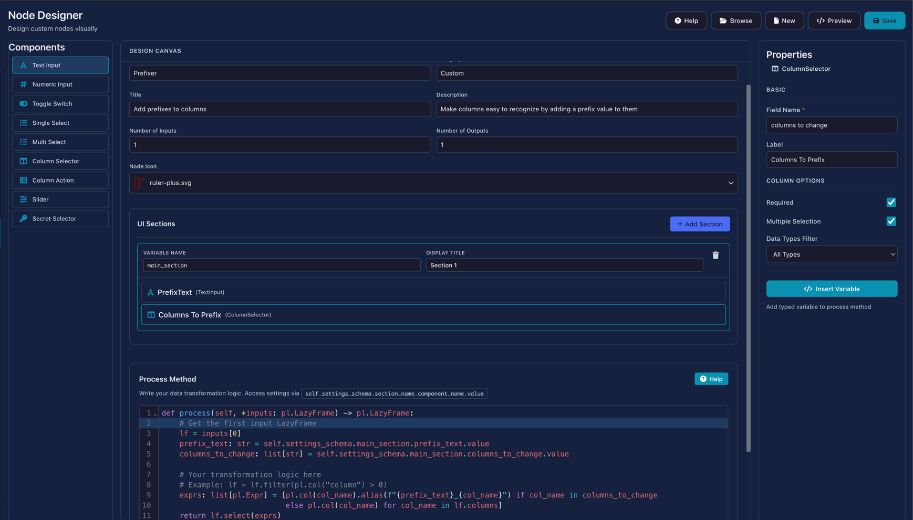
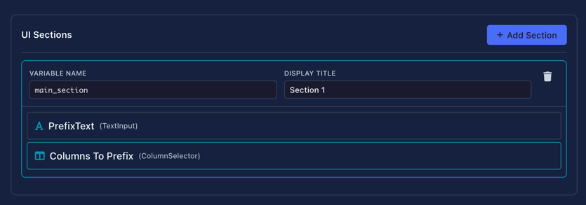
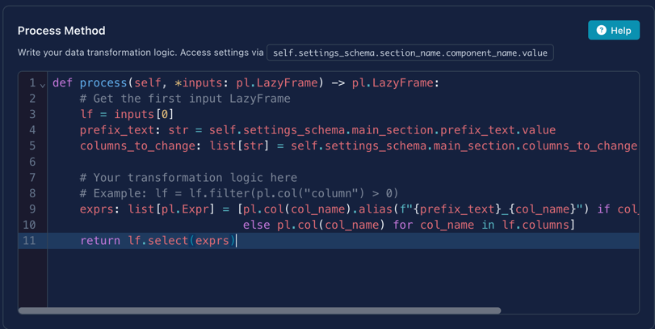

# Node Designer

Create custom transformation nodes visually—no Python files required.

The Node Designer lets you build reusable nodes by dragging UI components onto a canvas, configuring their properties, and writing transformation logic. Your custom nodes appear in the node palette alongside built-in nodes.


*The Node Designer with a "Prefixer" node being created*

---

## Quick Start

1. Open **Node Designer** from the sidebar menu
2. Set your node's name and category
3. Drag components from the left panel into a section
4. Write your transformation code in the Process Method editor
5. Click **Save** to add your node to the palette

!!! tip "Restart Required"
    After saving a new node, refresh `cmd/cntr + r` Flowfile to load it into the node palette.

---

## Interface Overview

The Node Designer uses a three-panel layout:

<div class="grid cards" markdown>

-   **Component Palette** (Left)

    ---

    Draggable UI components for building your node's settings interface

-   **Design Canvas** (Center)

    ---

    Visual preview of your node's configuration panel with metadata settings

-   **Properties Panel** (Right)

    ---

    Configuration options for the currently selected component

</div>

---

## Design Canvas

The center panel is where you define your node's identity and structure.

### Node Metadata


| Field | Description                          | Example |
|-------|--------------------------------------|---------|
| **Node Name** | Internal identifier (no spaces)      | `Prefixer` |
| **Category** | Where it will appears in the palette | `Custom`, `Text`, `Transform` |
| **Title** | Display name shown on the node       | `Add prefixes to columns` |
| **Description** | Tooltip text explaining the node     | `Make columns easy to recognize...` |
| **Number of Inputs** | How many input connections           | `1` (most common) |
| **Number of Outputs** | How many output connections          | `1` (most common) |
| **Node Icon** | Visual identifier in the palette     | Select from icon library |

!!! warning "Features Under Development"
    **Category** and **Number of Outputs** are currently under development. 
    For now, custom nodes will appear in the default category and support single outputs.

### UI Sections

Sections group related components together. Each section:

- Has a **Variable Name** (used in code, e.g., `main_section`)
- Has a **Display Title** (shown in UI, e.g., "Section 1")
- Can contain multiple components
- Appears as a collapsible group in the node's settings panel

Click **+ Add Section** to create a new section, then drag components into it.



---

## Component Palette

Drag these components from the left panel into your sections:

### Input Components

| Component | Use Case | Value Type |
|-----------|----------|------------|
| **Text Input** | Names, patterns, custom strings | `str` |
| **Numeric Input** | Thresholds, counts, percentages | `int` or `float` |
| **Toggle Switch** | Enable/disable features | `bool` |
| **Single Select** | Choose one option from a list | `str` |
| **Slider** | Select a value within a range | `int` or `float` |

### Column Components

| Component | Use Case | Value Type |
|-----------|----------|------------|
| **Column Selector** | Pick one column from input data | `str` |
| **Multi Select** | Select multiple columns | `list[str]` |
| **Column Action** | Column with operation choice | `dict` |

### Special Components

| Component | Use Case | Value Type        |
|-----------|----------|-------------------|
| **Secret Selector** | API keys, passwords, credentials | `str` (SecretStr) |

!!! warning "Security Best Practice"
    Always use Secret Selector for sensitive data like API keys. Never hardcode credentials in your process code.

---

## Properties Panel

{ align=right width="280" }

When you select a component on the canvas, configure it in the right panel.

### Basic Properties

All components share these basic properties:

| Property | Description |
|----------|-------------|
| **Field Name** | Internal identifier used in code (e.g., `columns_to_change`) |
| **Label** | Display text shown to users (e.g., "Columns To Prefix") |

Additional options vary depending on the selected UI component (e.g., min/max for Numeric Input, data type filters for Column Selector, options list for Single Select).

Click **Insert Variable** to copy the accessor path for use in your process code.

---

## Process Method

The bottom section contains the code editor where you write your transformation logic.



### Function Signature

```python
def process(self, *inputs: pl.LazyFrame) -> pl.LazyFrame:
```

Your function receives Polars LazyFrames and must return a LazyFrame.

### Accessing Component Values

Use `self.settings_schema` to access values from your UI components:

```python
# Pattern: self.settings_schema.<section_name>.<component_name>.value

# Get text input value
prefix_text: str = self.settings_schema.main_section.prefix_text.value

# Get selected columns (list)
columns_to_change: list[str] = self.settings_schema.main_section.columns_to_change.value

# Get numeric value
threshold: float = self.settings_schema.options.threshold.value

# Get toggle state
is_enabled: bool = self.settings_schema.options.is_enabled.value
```

!!! tip "Use Insert Variable"
    Click **Insert Variable** in the Properties panel to automatically insert the correct accessor path for any component.

### Complete Example

Here's a full example that adds a prefix to selected column names:

```python
def process(self, *inputs: pl.LazyFrame) -> pl.LazyFrame:
    # Get the first input LazyFrame
    lf = inputs[0]
    prefix_text: str = self.settings_schema.main_section.prefix_text.value
    columns_to_change: list[str] = self.settings_schema.main_section.columns_to_change.value
    
    # Build expressions: rename selected columns, keep others unchanged
    exprs: list[pl.Expr] = [
        pl.col(col_name).alias(f"{prefix_text}_{col_name}") 
        if col_name in columns_to_change else pl.col(col_name) 
        for col_name in lf.columns
    ]
    return lf.select(exprs)
```

### Generated Code

When you click **Preview**, the Node Designer shows the complete Python class that will be generated:

```python
# Auto-generated custom node
# Generated by Node Designer

import polars as pl
from flowfile_core.flowfile.node_designer import (
    CustomNodeBase, Section, NodeSettings, TextInput, ColumnSelector
)

# Section 1
main_section = Section(
    title="Section 1",
    prefix_text=TextInput(
        label="PrefixText",
    ),
    columns_to_change=ColumnSelector(
        label="Columns To Prefix",
        required=True,
        multiple=True,
    ),
)

class PrefixerSettings(NodeSettings):
    main_section: Section = main_section


class Prefixer(CustomNodeBase):
    node_name: str = "Prefixer"
    node_category: str = "Custom"
    node_icon: str = "ruler-plus.svg"
    title: str = "Add prefixes to columns"
    intro: str = "Make columns easy to recognize by adding a prefix value to them"
    number_of_inputs: int = 1
    number_of_outputs: int = 1
    settings_schema: PrefixerSettings = PrefixerSettings()

    def process(self, *inputs: pl.LazyFrame) -> pl.LazyFrame:
        # Get the first input LazyFrame
        lf = inputs[0]
        prefix_text: str = self.settings_schema.main_section.prefix_text.value
        columns_to_change: list[str] = self.settings_schema.main_section.columns_to_change.value

        exprs: list[pl.Expr] = [
            pl.col(col_name).alias(f"{prefix_text}_{col_name}") 
            if col_name in columns_to_change else pl.col(col_name) 
            for col_name in lf.columns
        ]
        return lf.select(exprs)
```

This generated class is what gets saved to your user-defined nodes directory.

---

## Toolbar Actions

| Button | Shortcut | Description |
|--------|----------|-------------|
| **Help** | — | Open documentation modal |
| **Browse** | — | Load an existing node definition |
| **New** | — | Create a blank node definition |
| **Preview** | — | View the generated Python code |
| **Save** | — | Save the node to your user-defined nodes directory |

## Programmatic Alternative

For more control or version-controlled node definitions, you can create nodes as Python files. See [Creating Custom Nodes](../../for-developers/creating-custom-nodes.md) for the code-based approach.

---

## Related Documentation

- [Building Flows](building-flows.md) — Using nodes in workflows
- [Transform Nodes](nodes/transform.md) — Built-in transformation nodes
- [Creating Custom Nodes](../../for-developers/creating-custom-nodes.md) — Python-based node creation