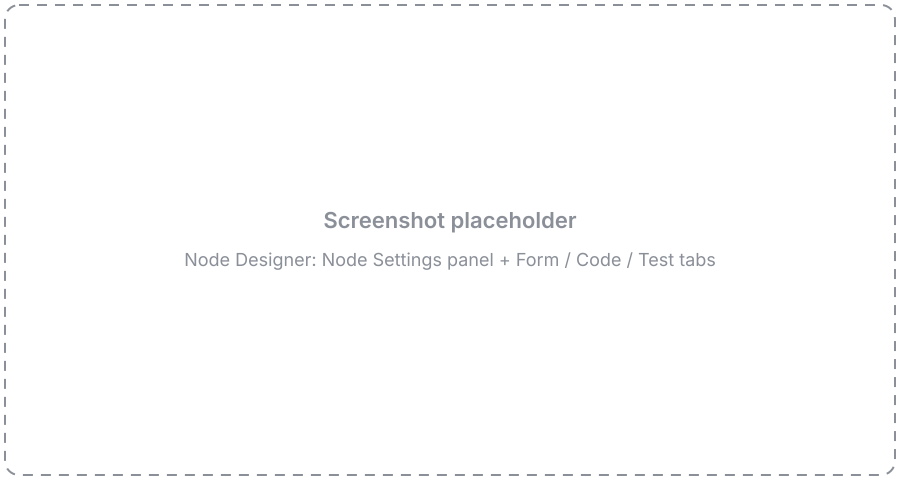

# Node Designer

The Node Designer lets you build reusable custom nodes visually — no Python file to write by hand. When the palette doesn't have the operation you need, you build it here: drag controls to lay out the settings form, write the transformation as one small `process` method, test it against sample data, and save. Your node then appears in the palette alongside the built-in ones, with its own settings form — usable by anyone on your team, whether or not they code.

The node's `.py` file is the single source of truth. The designer writes it, and — because a well-formed node file round-trips — it can reopen that file and load it straight back into the visual editor. Hand-written files that stay within the visual subset reopen visually too; anything more exotic opens in code-only mode.

!!! info "Not in Flowfile Lite"
    The Node Designer requires the full desktop/server build and is not available in the browser-only [Flowfile Lite](../deployment/lite.md) edition. Use the **Polars Code** node for custom logic there.

<!-- IMAGE-PLACEHOLDER-TO-CHANGE: old UI, re-capture the current Node Designer (Node Settings panel + Form / Code / Test tabs) -->


---

## Quick Start

!!! tip "Prefer to follow along?"
    The [**Build your first custom node**](custom-node-tutorial.md) tutorial walks the whole thing click-by-click in a few minutes. For a node that needs a third-party library, see [K-Means on a Kernel](kmeans-kernel-node.md). This page is the reference behind them.

1. Open **Node Designer** from the sidebar menu.
2. In the left **Node Settings** panel, set the node's name and category.
3. On the **Form** tab, add a group and drop controls into it with **Add a control**.
4. On the **Code** tab, write your `process` logic (body only — the signature is fixed).
5. On the **Test** tab, paste a small sample and run the node to confirm it works.
6. Click **Save**. The node loads immediately — no restart.

!!! tip "No restart needed"
    Flowfile hot-reloads the custom-nodes directory. A saved node is available in the palette right away. If a file was added outside the designer while Flowfile was open, click **Rescan** (in the Node Designer's **Browse** dialog or the Catalog's **Custom Nodes** tab) to pick it up.

---

## Layout

The designer has two regions:

- **Node Settings** (left) — the node's identity, I/O, execution environment, and description, grouped into collapsible sections.
- **Workspace** (center/right) — three tabs: **Form**, **Code**, and **Test**.

The toolbar at the top has **Browse** (open an existing node), **New** (start blank), **View code** (see the full generated file), and **Save**. A dot next to the node name marks unsaved changes.

---

## Node Settings panel

The left panel holds everything about the node except its form and logic. It is organized into four collapsible groups.

### Identity

| Field | Description |
|-------|-------------|
| **Node Name** | The node's name and internal identifier. |
| **Category** | The palette group the node lands in — a real combobox (see [Category](#category-real-palette-groups)). |
| **Node Icon** | The icon shown on the canvas and in the palette (see [Icons](#icons)). |

### I/O

- **Number of Inputs** — how many input ports the node has (0–10). Inputs arrive positionally in `process`.
- **Number of Outputs** — how many output ports (1–10). When there is more than one output, an **Output Names** editor appears; each name becomes a separate output handle. (For the isolated-kernel environment, output names are always editable.)

### Execution

The [execution environment picker](#execution-environment) — Local or Isolated kernel.

### Description

- **Title** — the display name shown on the node.
- **Description** — the intro text shown in the node's settings drawer and the palette tooltip. [Markdown is supported](#markdown-in-descriptions).

---

## Category (real palette groups)

**Category** is a combobox: pick a standard group (Custom, Input, Transform, Combine, Aggregate, ML, Output) or type a new name to create your own group. Existing custom categories from your other nodes appear under **Your categories**.

The category is a real palette group. A node with category `Text Processing` appears under a **Text Processing** group in the palette; the group is created from the name. The default, `Custom`, keeps the historical **User Defined Operations** group. Naming a built-in group exactly places the node in that group.

---

## Form tab

The **Form** tab is the settings form your node's users will see — built WYSIWYG. What you assemble here is exactly what renders in the node's settings drawer.

### Groups

A **group** is a titled, collapsible section of the form (a `Section` in the SDK). Add groups from the group list at the top of the tab. Each group has:

- A **display title** (shown to users), inline-editable.
- A **Python attribute name** (used in your `process` code, e.g. `main_section`), editable next to the title and sanitized to a valid identifier.

Click a group to select it; the controls you add land in the selected group.

### Adding controls

Inside a group, click **Add a control** to open a popover of the available control types:

| Control | Use case | Value type |
|---------|----------|-----------|
| **Text Input** | Names, patterns, custom strings | `str` |
| **Numeric Input** | Thresholds, counts, percentages | `float` |
| **Toggle Switch** | Enable/disable a feature | `bool` |
| **Single Select** | Choose one option from a list | `str` |
| **Multi Select** | Choose several options | `list[str]` |
| **Column Selector** | Pick column(s) from the input data | `str` / `list[str]` |
| **Column Action** | A column paired with an operation choice | `dict` |
| **Slider** | A value within a range | `float` |
| **Secret Selector** | API keys, passwords, credentials | `SecretStr` |

The keyword name you give a control is the field name you read in `process`.

!!! note "Secrets are your responsibility"
    Flowfile does not scan your `process` code to verify a secret is handled safely. Don't log secrets, expose them in error messages, or write them to output. Secrets are also **not available in the isolated-kernel environment** — reading one there fails at run time.

### The Control Inspector

Selecting a control opens the **Control Inspector** on the right. It edits that control's properties — the field name, label, and type-specific options (min/max for a numeric input, the option list for a select, allowed data types for a column selector, and so on).

The inspector also has an **Insert Variable** action that copies the accessor path (`self.settings_schema.<group>.<field>.value`) so you can paste it straight into your `process` code.

### Preview values double as test settings

The values you enter in the form preview are functional: they are the settings used when you run the **Test** tab, and "Save test setup with node" persists them as the node's `example_settings`.

---

## Code tab

The **Code** tab is where you write the `process` method.

- A **read-only signature header** shows the fixed signature: `def process(self, *inputs: pl.LazyFrame) -> pl.LazyFrame:`. You edit the **body only** — the designer composes the header and body back into the full method when it saves.
- The editor has Polars-aware autocompletion.
- The **Form fields** panel on the left lists every control you added with its accessor path. Click a field to insert its accessor into the editor.

### The `process` contract

- Inputs are **`pl.LazyFrame`**, one per input port, passed positionally: `inputs[0]`, `inputs[1]`, …
- Return a `pl.LazyFrame` or `pl.DataFrame` (the framework normalizes either), or a `dict` keyed by output name for a multi-output node.
- Read a control's value with `self.settings_schema.<group>.<field>.value`.

Because inputs are lazy, prefer lazy Polars operations and return the frame unmaterialized. If a step genuinely needs eager data (a per-row Python callback, a shape-dependent branch), call `.collect()` **inside** `process` — it materializes in the isolated worker process, not in Flowfile's core.

```python
def process(self, *inputs: pl.LazyFrame) -> pl.LazyFrame:
    lf = inputs[0]
    prefix = self.settings_schema.main_section.prefix_text.value
    cols = self.settings_schema.main_section.columns_to_change.value
    return lf.rename({c: f"{prefix}_{c}" for c in cols})
```

### View code

The toolbar's **View code** button (and the Browse dialog's **Code** action) shows the full generated `.py` file — the class, settings schema, and process method the designer will write. The frontend never generates this Python itself; the backend renders it from your design, which is what guarantees the file round-trips.

---

## Test tab

The **Test** tab runs the node against sample data without adding it to a flow — the same execution path a real run uses.

1. Provide a **sample input** per input port. Edit the grid directly or paste CSV. For a multi-input node, switch between input ports with the tabs.
2. Click **Run test**.
3. The results show a **per-output preview grid**, the output schema, row count, run duration, and which environment ran it. **Logs** and any **error** (with a collapsible traceback) appear alongside.

The settings used are your Form-tab preview values.

### Save the test setup with the node

Tick **Save test setup with node** to persist the samples and settings into the file as `example_inputs` and `example_settings`. They travel with the node and reload the next time you open it, so the dry run is reproducible. Samples are capped (a small grid, not a dataset) and stored inside the `.py` file.

---

## Execution environment

Every node declares where its `process` runs. The Execution group offers two cards:

- **Local (Polars)** — the default. `process` runs in a `flowfile_worker` subprocess: a killable, isolated child that owns the dataset memory. Fast, no Docker. The worker does not pip-install anything, so a local node may use only packages already available to Flowfile.
- **Isolated kernel** — `process` runs inside a Docker kernel. Use it when the node needs third-party libraries or stronger isolation. A **Dependencies (pip)** tag editor on this card lists packages the kernel installs before the node runs. Kernel nodes can declare multiple named outputs. Secrets are not available here.

The picker shows live Docker status. When Docker is unavailable, the Isolated-kernel card explains why and offers **Open Kernel Manager** and **Retry** — never a silent, dead dropdown. Create and start kernels in the [Kernel Manager](kernels.md) first.

Local execution is the default and fully supported; the isolated-kernel environment is newer and still growing (it needs Docker and has a few [current limitations](kernels.md#current-limitations)). The designer itself is the same either way — only where `process` runs changes.

!!! note "Legacy nodes still load"
    Older nodes that used a `requires_kernel` flag still load — it maps to the isolated-kernel environment automatically.

### How kernel execution works

For an isolated-kernel node, Flowfile builds a self-contained script from your node file: it defines your node class, bakes your settings values in as JSON, reads the inputs through `flowfile_ctx.read_inputs()`, calls your real `process` method, and publishes each declared output with `flowfile_ctx.publish_output()`. Your `process` code is unchanged, and the `self.settings_schema.<group>.<field>.value` access pattern works identically.

```python
def process(self, *inputs: pl.LazyFrame) -> pl.LazyFrame:
    from sklearn.ensemble import RandomForestClassifier

    df = inputs[0].collect()   # collect once for the eager sklearn API
    target = self.settings_schema.main_section.target_column.value

    X = df.drop(target).to_numpy()
    y = df[target].to_numpy()
    model = RandomForestClassifier(n_estimators=100).fit(X, y)
    flowfile_ctx.log_info(f"Trained with accuracy {model.score(X, y):.3f}")

    return df.with_columns(pl.Series("prediction", model.predict(X))).lazy()
```

For the full `flowfile_ctx` API (artifacts, display, logging, catalog access) available inside kernels, see [The flowfile_ctx API](kernel-api.md).

### Kernel selector in a flow

When you drop a kernel-enabled node onto the canvas, its settings drawer shows a **Kernel** picker to choose which kernel instance runs it.

---

## Icons

**Node Icon** in the Identity group lets you pick from the standard icon set or upload your own. The icon appears on the canvas and in the palette. Kernel-environment nodes carry a small corner badge on the canvas.

---

## Markdown in descriptions

The node **Description** (intro) renders as Markdown in the settings drawer and the palette hover tooltip, so you can use bold, links, and lists. Canvas labels stay plain single-line text.

---

## Browse, edit, duplicate

**Browse** opens the custom-node library. Each node card offers:

- **Edit** — load the node into the designer. If the file is within the visual subset, it opens in the Form and Code tabs; otherwise it opens in [code-only mode](#code-only-mode).
- **Duplicate** — start a new node from a copy.
- **Code** — view the file's source read-only.
- **Delete** — remove the node (with a confirmation).
- **Rescan** — re-read the directory to pick up files added outside the designer.

A file that failed to load (a syntax or import error) stays listed with a warning marker rather than vanishing, so you can open and fix it.

The first time you save a hand-written node from the designer, its formatting is canonicalized; the designer shows a diff preview before writing.

---

## Code-only mode

A file that uses constructs outside the visual subset — builder objects, dynamic construction, non-literal component arguments — still loads, but in **code-only mode**: a single full-file editor with a banner listing the parser issues that kept it out of the visual editor. The **Test** tab still works. Click **Re-check** after editing to re-parse; if the file now fits the subset, the designer switches to the visual Form view.

---

## Mounting other directories

The default custom-nodes directory is `~/.flowfile/user_defined_nodes/`, but you can register additional folders — for example a version-controlled repo of shared nodes. Register a directory in the Catalog's **Custom Nodes** tab (or via `POST /custom-node-mounts`); registrations persist in a `mounts.json` next to the default directory.

Mounted directories are **read-only sources**: the designer edits and saves them, but a fresh save always writes to the default directory, never into a mount. Nodes from mounts appear in the palette and the Custom Nodes tab like any other.

---

## The Catalog Custom Nodes tab

The Catalog has a **Custom Nodes** tab that lists every custom node across the default directory and all mounts, with its source, category, and load state. From there you can **Rescan**, manage mount folders, and open a node straight into the designer (a deep link with `?openFile=<file.py>`).

---

## Programmatic alternative

For version-controlled node definitions or more control, write nodes as Python files directly. The two paths interoperate: a file written in the visual subset reopens visually. See [Creating Custom Nodes](creating-custom-nodes.md).

---

## Related Documentation

- [Creating Custom Nodes](creating-custom-nodes.md) — the Python SDK reference.
- [Custom Node Tutorial](custom-node-tutorial.md) — a guided end-to-end build (local execution).
- [K-Means on a Kernel](kmeans-kernel-node.md) — build the same node visually and as code, running scikit-learn in a kernel.
- [Kernel Execution](kernels.md) — creating and running Docker kernels.
- [The flowfile_ctx API](kernel-api.md) — the API available inside kernel nodes.
- [Building Flows](building-flows.md) — using nodes in workflows.
