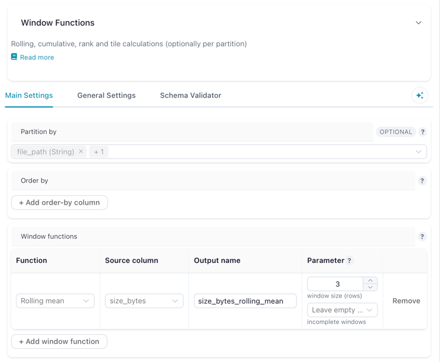

# Aggregations

Aggregations collapse or reshape a dataset: totals per group, a crosstab, a running total, a row count. Everything here changes the shape of the table, not just its contents.

| Action | What it does | Lite |
|---|---|:--:|
| [Group by](#group-by) | One row per group, with totals, averages or counts across the rest | ● |
| [Pivot data](#pivot-data) | Turn the values of one column into columns of their own | ● |
| [Unpivot data](#unpivot-data) | Turn a set of columns back into rows | ● |
| [Count records](#count-records) | Add the total row count as a column | ● |
| [Window functions](#window-functions) | Rolling, cumulative, rank and tile calculations, without collapsing rows | |

!!! info "In Flowfile Lite"
    **Group by**, **Pivot data**, **Unpivot data** and **Count records** run in the browser-only [Flowfile Lite](../../deployment/lite.md) build. **Window functions** needs the full desktop or server build.

## { width="44" height="44" } Group by

Produces one row per combination of the columns you group by, with an aggregation applied to every other column you list.

**Settings**

| Setting | Description |
|---|---|
| **Group By Columns** | Columns that define the groups. |
| **Aggregations** | One row per output column: the source column, the function, and an optional new name. |
| **Output Column Name** | Custom name for the aggregated result. Optional — defaults to the source column's name. |

**Aggregation functions**, exactly as the drawer lists them: `groupby`, `sum`, `max`, `mean`, `median`, `min`, `count`, `n_unique`, `first`, `last`, `concat`. The average is `mean`; there is no `avg`.

## { width="44" height="44" } Pivot data

Converts long data to wide: each distinct value in the pivot column becomes a column of its own, filled from the value column.

**Settings**

| Setting | Description |
|---|---|
| **Index Columns** | Columns that define the rows of the final table. |
| **Pivot Column** | Its unique values become the new column names. |
| **Value Column** | The column supplying the values that fill those new columns. |
| **Aggregations** | Applied when more than one value lands in the same cell. |

Pivot reads the data to discover which columns to create, so unlike most actions it runs eagerly rather than waiting for the rest of the flow.

## { width="44" height="44" } Unpivot data

The reverse of Pivot: a set of columns collapses into two, one holding the old column name and one holding its value. This is what turns a spreadsheet laid out with a column per month into something you can group and chart.

**Settings**

| Setting | Description |
|---|---|
| **Index Columns** | Columns that stay as they are, repeated once per unpivoted row. |
| **Value Columns** | The columns that collapse into name/value pairs. |
| **Data Type Selector** | Pick columns by data type instead of by name (for example, every `string` column). |
| **Selection Mode** | `column` to list columns explicitly, `data_type` to use the selector. |

## { width="44" height="44" } Count records

Counts the rows and returns that single number in a column named `number_of_records`. It has no settings.

## { width="44" height="44" } Window functions

Adds rolling, cumulative, rank or tile columns calculated over ordered — and optionally partitioned — rows. Each function you configure produces one new column and every input row survives, which is what separates this from [Group by](#group-by).

Each row under **Window functions** is one output column: pick the function, the source column, the name to write, and the function's own parameters.

**Settings**

| Setting | Description |
|---|---|
| **Partition by** | Optional. Columns that restart each calculation per group. Leave empty to calculate over the whole table. |
| **Order by** | Column(s) plus direction that define row order within each partition. Required for rolling and tile functions. |
| **Window functions** | One or more operations. Each takes a function, a source column, an output column name, and any function-specific parameters. |

**Available functions**

| Function | Group | Parameters | Output |
|---|---|---|---|
| Rolling sum / mean / min / max / std | Rolling | Window size in rows, and how to handle incomplete windows | Aggregate over a sliding window |
| Cumulative sum / count / min / max | Cumulative | — | Running total, count, min or max up to each row |
| Rank | Ranking | Tie-breaking method: `ordinal`, `dense`, `min`, `max` or `average` | Rank of each row |
| Tile | Ranking | Number of groups | Splits the ordered rows into N equal-sized buckets |

For rolling functions, the first rows — where the window is not yet full — can be left `null` (the default), computed from the partial window, or filled with `0`.

Each function needs a unique output column name, and existing columns are always preserved.

---

[← Combine Operations](combine.md) | [Next: Output Operations →](output.md)
