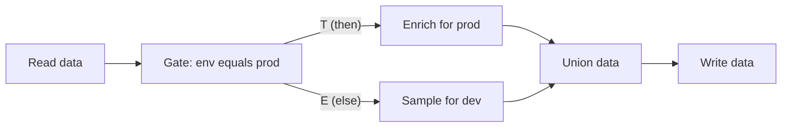

# Combine Nodes  

**Combine nodes** merge multiple datasets by **matching values**, **stacking rows**, **finding similar records**, **generating all possible combinations**, or **grouping related elements in a network**.

!!! info "Some combine nodes are not in Flowfile Lite"
    The browser-only [Flowfile Lite](../../deployment/lite.md) build supports **Join**, **Cross Join**, and **Union Data**. **Fuzzy Match**, **Graph Solver**, and **Gate** require the full desktop/server build.

## Node Details

### { width="50" height="50" } Join  

The **Join** node merges two datasets based on matching values in selected columns.

---

#### **Key Features**  
- Supports seven join types: **inner**, **left**, **right**, **full**, **semi**, **anti**, and **cross**  
- Join on **one or more columns**  
- Handles duplicate column names with automatic renaming  

---

#### **Usage**  
1. Connect two input datasets (**left** and **right**).  
2. Select a **join type** (see the table below).  
3. Choose **columns to join on** (not needed for `cross`).  
4. Select **which columns to keep** from each dataset.  

---

#### **Configuration Options**  

| Parameter         | Description                                              |
|------------------|----------------------------------------------------------|
| **Join Type**    | `inner`, `left`, `right`, `full`, `semi`, `anti`, or `cross`. |
| **Join Columns** | Columns used to match records between datasets. Not required for a `cross` join. |

**Join types:**

| Type | Result |
|------|--------|
| `inner` | Only rows with a match in both inputs. |
| `left` | Every left row; matched right columns, nulls where there is no match. |
| `right` | Every right row; matched left columns, nulls where there is no match. |
| `full` | Every row from both inputs, matched where possible. |
| `semi` | Left rows that have a match on the right — right columns are not added. |
| `anti` | Left rows that have no match on the right. |
| `cross` | Every combination of left and right rows (Cartesian product). |

!!! note "`full` vs `outer`"
    The Join node's dropdown labels the full outer join **`full`**. The programmatic API also accepts `outer` as an alias for the same strategy. For a Cartesian product with no keys, the dedicated [Cross Join](#cross-join) node is usually clearer than the `cross` type here.

---

### { width="50" height="50" } Fuzzy Match  

The **Fuzzy Match** node joins datasets based on **similar values** instead of exact matches, using various matching algorithms.

---

#### **Key Features**  
- Six string-similarity algorithms: `levenshtein`, `jaro`, `jaro_winkler`, `hamming`, `damerau_levenshtein`, and `indel`  
- Configurable **similarity threshold**  
- Calculates **match scores**  
- Joins datasets based on approximate values  

---

#### **Usage**  
1. Connect two datasets (**left** and **right**).  
2. Select **columns** to match on.  
3. Choose a **fuzzy matching algorithm**.  
4. Set a **similarity threshold** (0-100; defaults to `80`).  

---

#### **Configuration Options**  

| Parameter           | Description                                                                                                   |
|---------------------|--------------------------------------------------------------------------------------------------------------|
| **Join Columns**    | Columns used for fuzzy matching.                                                                             |
| **Fuzzy Algorithm** | One of `levenshtein`, `jaro`, `jaro_winkler`, `hamming`, `damerau_levenshtein`, or `indel`.                  |
| **Threshold Score** | Minimum similarity score for a match, on a scale of 0-100. Defaults to `80`.                                 |

---

### { width="50" height="50" } Union Data  

The **Union Data** node merges multiple datasets by stacking rows together.

---

#### **Key Features**  

- Combines multiple datasets into one  
- **Automatically aligns columns** based on names  
- Uses **diagonal relaxed mode**, allowing flexible column matching  

---

#### **Usage**  

1. Connect multiple input datasets.  
2. The node will automatically align and stack the data.  

Union is also the re-convergence point for conditional branches: it runs as long as at least one of its inputs survived, so a branch that was gated off contributes nothing. A branch that *failed* still blocks it. See [Gate](#gate).

---

### { width="50" height="50" } Gate

The **Gate** node decides whether a branch runs at all. Its data input passes through unchanged while the gate's condition holds. When the condition does not hold, the gate itself still succeeds — but every node downstream of it is **skipped**, not failed. The run stays green, progress still reaches its total, and sources upstream of the gate still finish their post-run work (a Kafka Source commits its offsets as usual).

Where [Filter](transform.md#filter-data) decides which *rows* continue, Gate decides whether the *rest of the branch* executes.

---

#### Inputs

| Handle | Purpose |
|---|---|
| **Data (passes through)** | The dataset the gate forwards. Required, on the left edge. |
| **Control (optional)** | The small square pip at the **bottom** of the node — a signal, not data. Read only when the condition source is **Formula**; when connected, the formula is checked against this input instead of the data input. |

#### Outputs

| Handle | Purpose |
|---|---|
| **Then** (`T`) | The data, live while the condition holds. The only output unless the else output is enabled. |
| **Else** (`E`, optional) | Enable **Add an else output** in the settings: the data leaves here when the condition does **not** hold. Exactly one of the two sides runs per execution; the other side's downstream is skipped. |

---

#### Condition source: flow parameter

The default. Pick a flow parameter (defined in **Flow settings**), an operator, and — for the comparing operators — a value. The value you type is coerced using the parameter's declared type, so an `integer` parameter compares as a number, not as text.

<!-- IMAGE-PLACEHOLDER-TO-CHANGE: the Gate settings drawer in parameter mode — the Condition source toggle (Flow parameter / Formula) and the Parameter / Operator / Value row -->

| Operator | Gate opens when |
|---|---|
| **equals** | The parameter's value equals the value you typed. |
| **not equals** | It does not equal that value. |
| **is one of** | It appears in the comma-separated list you typed. |
| **is not one of** | It does not appear in that list. |
| **is true** | It reads as boolean true (`true`, `1`, `yes`, `on`). |
| **is false** | It does not read as true. |
| **is set** | It is not empty. |

Parameter conditions are resolved before the run starts, so the execution plan already knows which branches are live. Overriding the parameter is what flips the gate — including on a [headless run](../../deployment/cli.md): `flowfile run flow my_flow.yaml --param env=prod`.

---

#### Condition source: formula

Write a flowfile formula — the same expression language as the [Filter](transform.md#filter-data) node's advanced mode. The gate applies it as a row predicate and opens when **at least one row matches**. An empty result closes the gate — no matching rows means don't run the branch. A formula that cannot run (a typo, an unknown column) fails the gate visibly rather than silently picking a branch, and `${param}` references resolve inside the formula like in any other node.

The formula is checked against the **control input when one is connected, otherwise against the data input itself**:

- *Gate on the data:* leave the control handle unconnected and write the condition over the data's own columns — `[status] = 'error'` runs the branch only when error rows exist.
- *Gate on a signal:* wire any node to the control handle and the formula reads that frame instead — a Group By producing `null_rate` feeding the control handle with formula `[null_rate] < 0.05` gates the write on a quality verdict computed elsewhere.

A formula gate re-evaluates on every run even when nothing else in the flow changed, because the data it checks can change without any setting changing.

---

#### The if/else pattern

Enable **Add an else output** and the gate becomes a two-exit router: one condition, two branches, complementarity guaranteed. Put each branch behind one exit and re-converge them on a **Union**:

Exactly one side runs, and the Union outputs whichever branch ran. A column produced only by the skipped branch is absent from the output — it does not come back as nulls. So when the two branches produce different shapes, configure the nodes downstream of the Union against the columns the branches share, or end each branch with a Select that establishes a common shape (keep the missing columns) before the Union. Note that edit-time schema prediction is gate-blind: the canvas predicts the union of both branches' columns, so a run's actual output can be narrower than the predicted schema.

(Two separate gates with hand-written complementary conditions still work — but the else output cannot drift out of complement, so prefer it.)

---

#### Skipped is not failed

A deliberately skipped node shows a hollow grey ring on the canvas ("Skipped (gated off) — condition not met") and appears as **Skipped** in the run report with no runtime. It is a successful outcome: the flow's overall status stays green and the completed-node count still reaches its total.

Skips caused by a *failure* or by invalid settings are unchanged — they still block everything downstream, including a Union that has other healthy inputs.

!!! warning "A closed gate does not stop the upstream"
    A gate only prevents its **downstream** from running. Everything between the source and the gate still executes, so an expensive read placed above a gate is paid for even when the branch is off. Put the gate as early in the branch as the condition allows.

---

#### Export to Python

Gates survive all three [code export modes](../tutorials/code-generator.md) — Polars, FlowFrame, and Project: each gate becomes a real `if` block over the generated function's keyword arguments (the else branch renders under `if not (...)`), each branch appends its frame to a list under its `if` guard, and the Union concatenates the list — a gated-off branch simply isn't in it. A formula gate exports as a small row-probe helper evaluated when the pipeline function runs.

Single-node preview ignores gates entirely — fetching one node's data plans as if every gate were open, so you can inspect a branch that this run's condition would skip.

---

### { width="50" height="50" } Cross Join

The **Cross Join** node creates all possible combinations between two datasets.

---

#### **Key Features**  

- Generates a **Cartesian product** of two datasets  
- Automatically aligns columns  
- Handles duplicate column names  

---

#### **Usage**  

1. Connect two datasets (**left** and **right**).
2. Select the columns that you would like to keep and their output names
3. The node will generate all possible row combinations.  

---

### { width="50" height="50" } Graph Solver

The **Graph Solver** node groups related records based on connections in a graph-structured dataset.

---

#### **Key Features**  
- Identifies **connected components** in graph-like data  
- Groups related nodes into the same category  
- Supports **custom output column names**  

---

#### **Usage**  
1. Select **From** and **To** columns to define relationships.  
2. The node assigns a **group identifier** to connected nodes.  

---

#### **Configuration Options**  

| Parameter           | Description                                      |
|--------------------|--------------------------------------------------|
| **From Column**    | Defines the starting point of each connection.  |
| **To Column**      | Defines the endpoint of each connection.        |
| **Output Column**  | Stores the assigned group identifier.           |

---

### Run Flow

The **Run Flow** node executes another, catalog-registered flow inside the current one — the calling side of a [subflow](../subflows.md). Its input and output handles are shaped by the child flow's Flow Input and Flow Output nodes, and its settings map values into the child's parameters, including running the child once per row of a driving table.

| Parameter | Description |
|-----------|-------------|
| **Flow** | The catalog-registered child flow to run |
| **Parameter bindings** | Default, constant, or column-mapped value per child parameter |
| **Iteration mode** | Run once with the first row's values, or once per row (capped at 1000) |

See [Subflows](../subflows.md) for registration, wiring, and error handling.

---
[← Transform data](transform.md) | [Next: Aggregate data →](aggregate.md)