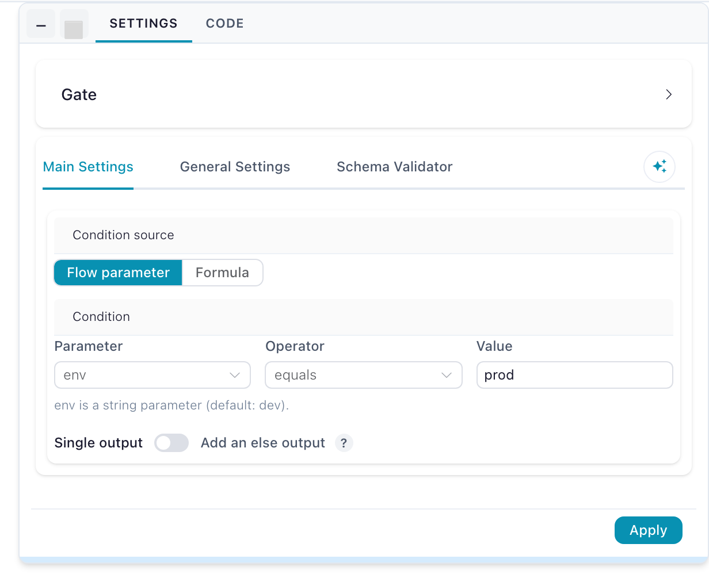
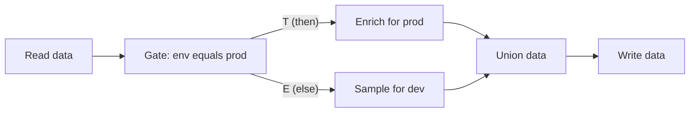
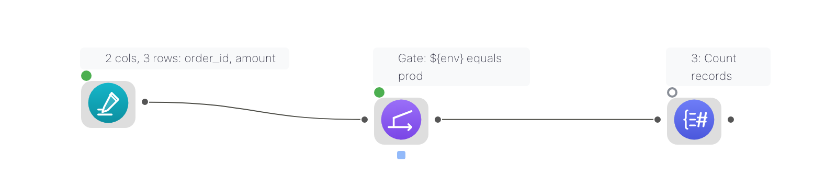

# Combine Operations

Most of these bring separate datasets together — by matching values, stacking rows, or finding near-matches. The category also holds the actions that work on relationships *within* one table, and the ones that control which branches of a flow run at all, so a few take a single input rather than two.

| Action | What it does | Lite |
|---|---|:--:|
| [Join](#join) | Match rows from two datasets on shared key columns | ● |
| [Fuzzy match](#fuzzy-match) | Match rows on values that are similar but not identical | |
| [Union data](#union-data) | Stack datasets on top of each other | ● |
| [Cross join](#cross-join) | Every combination of rows from two datasets | ● |
| [Graph solver](#graph-solver) | Group records that are connected to each other — one input | |
| [Gate](#gate) | Run a branch only when a condition holds | |
| [Wait For](#wait-for) | Hold a branch until another branch finishes | |
| [Run Flow](#run-flow) | Execute another flow as a single step | |

!!! info "In Flowfile Lite"
    The browser-only [Flowfile Lite](../../deployment/lite.md) build supports **Join**, **Cross join** and **Union data**. The rest need the full desktop or server build.

## { width="44" height="44" } Join

Matches rows from two inputs on one or more shared key columns — the spreadsheet VLOOKUP, without the lookup breaking when rows move. Connect the left and right datasets, pick the join type, choose the key columns, and select which columns to keep from each side. Duplicate column names are renamed automatically.

**Settings**

| Setting | Description |
|---|---|
| **Join Type** | How unmatched rows are treated. See the table below. |
| **Join Columns** | The column pairs matched against each other. |
| **Left data** / **Right data** | The column list for each input. Untick **Keep** to drop a column, type a **New column name** to rename it, and drag rows to set the output order. Hidden for semi and anti joins. |

| Type | Result |
|---|---|
| `inner` | Only rows with a match in both inputs. |
| `left` | Every left row; matched right columns, nulls where there is no match. |
| `right` | Every right row; matched left columns, nulls where there is no match. |
| `full` | Every row from both inputs, matched where possible. |
| `semi` | Left rows that have a match on the right — right columns are not added. |
| `anti` | Left rows that have no match on the right. |

Semi and anti joins pass all left-side columns through unchanged. `outer` is accepted as an alias for `full`.

For a Cartesian product with no keys at all, use the dedicated [Cross join](#cross-join) action — the Join node's strategies all require key columns.

## { width="44" height="44" } Fuzzy match

Matches rows on values that are close rather than identical, which is what you need when the same customer is "Acme Corp" in one system and "ACME Corporation" in another. Each match carries a score, so you can see how confident it was.

**Settings**

| Setting | Description |
|---|---|
| **Join Columns** | The column pairs compared against each other. |
| **Fuzzy Algorithm** | One of `levenshtein`, `jaro`, `jaro_winkler`, `hamming`, `damerau_levenshtein` or `indel`. |
| **Threshold Score** | Minimum similarity for a match, 0–100. Default `80`. |
| **Left data** / **Right data** | The column list for each input. Untick **Keep** to drop a column, type a **New column name** to rename it, and drag rows to set the output order. |

Fuzzy matching compares candidate pairs rather than looking keys up directly, so it is far more expensive than a [Join](#join). Cut both inputs down first — filter to the rows that need matching, and join exactly the ones that match cleanly.

## { width="44" height="44" } Union data

Stacks datasets on top of each other, aligning columns by name. Columns that exist in only some inputs are kept and filled with nulls elsewhere, so inputs do not have to share an identical schema. It has no settings — connect the inputs and it aligns them.

Union is also where conditional branches re-converge: it runs as long as at least one input survived, so a branch that was [gated](#gate) off simply contributes nothing. A branch that *failed*, on the other hand, still blocks it.

## { width="44" height="44" } Cross join

Produces every combination of rows from two inputs — the Cartesian product. Ten rows joined to five gives fifty.

**Settings**

| Setting | Description |
|---|---|
| **Left data** / **Right data** | The column list for each input. Untick **Keep** to drop a column, type a **New column name** to rename it, and drag rows to set the output order. |

Both lists arrive pre-filled with every incoming column, all kept. Renaming matters here because the two sides often share column names.

Output size is the product of the inputs, so this grows fast. It is the right action for building a complete grid (every product against every month, say) and the wrong one for matching records.

## { width="44" height="44" } Graph solver

Unlike the rest of this category, Graph solver takes a **single input**: one table of pairwise connections, where each row is an edge. It assigns a shared group identifier to everything transitively connected — the connected components of a graph. If A links to B and B links to C, all three land in one group even though A and C never appear together.

**Settings**

| Setting | Description |
|---|---|
| **From Column** | The starting point of each connection. |
| **To Column** | The endpoint of each connection. |
| **Output Column** | Where the assigned group identifier is written. |

This is the action behind entity resolution: after a [Fuzzy match](#fuzzy-match) produces pairs of records that look like the same thing, Graph solver collapses those pairs into one group per real-world entity.

## { width="44" height="44" } Gate

Decides whether a branch runs at all. The data input passes through unchanged while the condition holds. When it does not hold, the gate itself still succeeds — but every node downstream is **skipped**, not failed. The run stays green, progress still reaches its total, and sources upstream of the gate still finish their post-run work (a Kafka Source commits its offsets as usual).

Where [Filter data](transform.md#filter-data) decides which *rows* continue, Gate decides whether the *rest of the branch* executes.

**Settings**

| Setting | Description |
|---|---|
| **Condition source** | **Flow parameter** (the default) compares a parameter against a value; **Formula** evaluates a row predicate. |
| **Parameter** / **Operator** / **Value** | Shown for a flow-parameter condition. The value is coerced to the parameter's declared type. |
| **Formula** | Shown for a formula condition. The gate opens when at least one row matches. |
| **Add an else output** | Off by default. Adds a second exit that runs when the condition does *not* hold. |

### Inputs and outputs

| Handle | Purpose |
|---|---|
| **Data (passes through)** | The dataset the gate forwards. Required, on the left edge. |
| **Control (optional)** | The small square pip at the **bottom** of the node — a signal, not data. Read only when the condition source is **Formula**; when connected, the formula is checked against this input instead of the data input. |
| **Then** (`T`) | The data, live while the condition holds. The only output unless the else output is enabled. |
| **Else** (`E`, optional) | Enable **Add an else output** in the settings: the data leaves here when the condition does **not** hold. Exactly one of the two sides runs per execution; the other side's downstream is skipped. |

### Condition source: flow parameter

The default. Pick a flow parameter (defined in **Flow settings**), an operator, and — for the comparing operators — a value. The value you type is coerced using the parameter's declared type, so an `integer` parameter compares as a number, not as text.

Parameter conditions resolve before the run starts, so the execution plan already knows which branches are live.

| Operator | Gate opens when |
|---|---|
| **equals** | The parameter's value equals the value you typed. |
| **not equals** | It does not equal that value. |
| **is one of** | It appears in the comma-separated list you typed. |
| **is not one of** | It does not appear in that list. |
| **is true** | It reads as boolean true (`true`, `1`, `yes`, `on`). |
| **is false** | It does not read as true. |
| **is set** | It is not empty. |

Overriding the parameter is what flips the gate — including on a [headless run](../../deployment/cli.md): `flowfile run flow my_flow.yaml --param env=prod`.

### Condition source: formula

Write a flowfile formula — the same expression language as [Filter data](transform.md#filter-data)'s advanced mode. The gate applies it as a row predicate and opens when **at least one row matches**. An empty result closes the gate: no matching rows means don't run the branch. A formula that cannot run (a typo, an unknown column) fails the gate visibly rather than silently picking a branch, and `${param}` references resolve inside the formula like in any other node — `${env} = 'prod'` compares the parameter's value against the literal.

The formula is checked against the **control input when one is connected, otherwise against the data input itself**:

- *Gate on the data:* leave the control handle unconnected and write the condition over the data's own columns — `[status] = 'error'` runs the branch only when error rows exist.
- *Gate on a signal:* wire any node to the control handle and the formula reads that frame instead — a Group by producing `null_rate` feeding the control handle with formula `[null_rate] < 0.05` gates the write on a quality verdict computed elsewhere.

A formula gate re-evaluates on every run even when nothing else in the flow changed, because the data it checks can change without any setting changing.

### The if/else pattern

Enable **Add an else output** and the gate becomes a two-exit router: one condition, two branches, complementarity guaranteed. Put each branch behind one exit and re-converge them on a **Union data**:

Exactly one side runs, and the Union outputs whichever branch ran.

When the two branches produce different columns

A column produced only by the skipped branch is absent from the output — it does not come back as nulls. So when the two branches produce different shapes, configure the nodes downstream of the Union against the columns the branches share, or end each branch with a [Select data](transform.md#select-data) that establishes a common shape (keep the missing columns) before the Union.

Edit-time schema prediction is gate-blind: the canvas predicts the union of both branches' columns, so a run's actual output can be narrower than the predicted schema.

Two separate gates with hand-written complementary conditions still work, but the else output cannot drift out of complement.

Skipped is not failed — what a closed gate looks like on the canvas

{ .ff-wide }

A deliberately skipped node shows a hollow grey ring on the canvas ("Skipped (gated off) — condition not met") and appears as **Skipped** in the run report with no runtime. It is a successful outcome: the flow's overall status stays green and the completed-node count still reaches its total.

Skips caused by a *failure* or by invalid settings are unchanged — they still block everything downstream, including a Union that has other healthy inputs.

!!! warning "A closed gate does not stop the upstream"
    A gate only prevents its **downstream** from running. Everything between the source and the gate still executes, so an expensive read placed above a gate is paid for even when the branch is off. Put the gate as early in the branch as the condition allows.

Export to Python — how a gate becomes a real if block

Gates survive all three [code export modes](../tutorials/code-generator.md) — Polars, FlowFrame and Project: each gate becomes a real `if` block over the generated function's keyword arguments. An else-output gate exports as a genuine `if`/`else` pair, and the Union re-converging its two sides collapses to a conditional assignment — whichever side ran is the result. A Union behind independent gates instead appends each surviving branch to a list under its own `if` guard and concatenates the list, so a gated-off branch simply isn't in it. A formula gate exports as a small row-probe helper evaluated when the pipeline function runs.

Single-node preview ignores gates entirely — fetching one node's data plans as if every gate were open, so you can inspect a branch that this run's condition would skip.

## { width="44" height="44" } Wait For

A pass-through with two inputs: the **left** input flows through unchanged, and the **right** input only enforces ordering. Once both have finished, the node emits the left input's data on its single output. There are no settings — wire the data branch into the left input and the dependency branch into the right.

Use it when a downstream node depends on a *side effect* of a sibling branch rather than on its data. The common case is [Apply Model](ml.md#apply-model) needing [Train Model](ml.md#train-model) to have written its artifact first.

## { width="44" height="44" } Run Flow

Executes another, catalog-registered flow inside this one — the calling side of a [subflow](../subflows.md). Its input and output handles are shaped by the child flow's Flow Input and Flow Output nodes.

**Settings**

| Setting | Description |
|---|---|
| **Flow** | The catalog-registered child flow to run. |
| **Parameter bindings** | Default, constant, or column-mapped value per child parameter. |
| **Iteration mode** | Run once with the first row's values, or once per row (capped at 1000). |

[Subflows](../subflows.md) covers registration, wiring and error handling.

---

[← Transformations](transform.md) | [Next: Aggregations →](aggregate.md)
