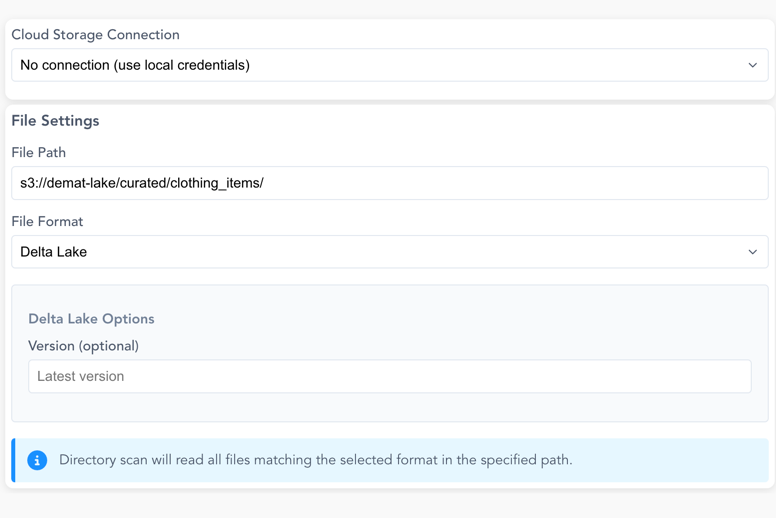
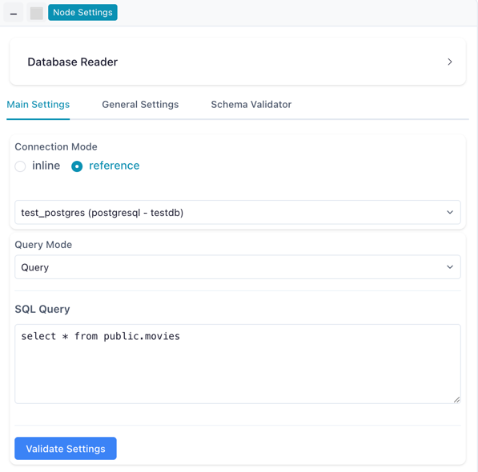
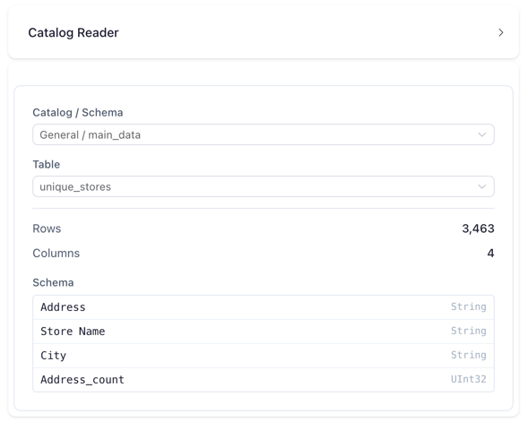

# Input Nodes

Input nodes are the starting point for any data flow. Flowfile supports reading from **local files**, **databases**, **cloud storage**, **catalog tables**, and **manual input**.

!!! info "Not all input nodes are in Flowfile Lite"
    The browser-only [Flowfile Lite](../../deployment/lite.md) build reads **local files (CSV/Excel/Parquet)**, **remote URLs**, **Manual Input**, and **Read from Catalog** — but it has no backend, so **Cloud Storage Reader** and **Database Reader** are not available.

## Node Details

### { width="50" height="50" } Read Data

The **Read Data** node allows you to load local data into your flow. It currently supports **CSV**, **Excel**, and **Parquet** file formats, each with specific configuration options.

#### **Supported Formats:**

- **CSV files** (`.csv`)
- **Excel files** (`.xlsx`, `.xls`)
- **Parquet files** (`.parquet`)

#### **Usage:**

1. Select your input file.  
2. Configure any format-specific options.  
3. Preview and confirm your data.  

---

#### CSV  
When a **CSV** file is selected, the following setup options are available:  

| Parameter               | Description                                                                                                                                                                          |
|-------------------------|--------------------------------------------------------------------------------------------------------------------------------------------------------------------------------------|
| **Has Headers**         | Determines whether the first row is used as headers. If `"yes"`, the first row is treated as column names. If `"no"`, default column names like `"Column 1, Column 2, ..."` are assigned. |
| **Delimiter**           | Specifies the character used to separate values (e.g., comma `,`, semicolon `;`, tab `\t`).                                                                                          |
| **Encoding**            | Defines the file encoding (e.g., `UTF-8`, `ISO-8859-1`).                                                                                                                             |
| **Quote Character**     | Character used to enclose text fields, preventing delimiter conflicts (e.g., `"`, `'`).                                                                                              |
| **New Line Delimiter**  | Specifies how new lines are detected (e.g., `\n`, `\r\n`).                                                                                                                          |
| **Schema Infer Length** | Determines how many rows are scanned to infer column types.                                                                                                                         |
| **Truncate Long Lines** | If enabled, long lines are truncated instead of causing errors.                                                                                                                     |
| **Ignore Errors**       | If enabled, the process continues even if some rows cause errors.                                                                                                                   |

---

#### Excel  
When an **Excel** file is selected, you can specify the sheet, select specific rows and columns, and configure headers and type inference options to tailor data loading to your needs.

| Parameter          | Description                                                                                                                                              |
|--------------------|----------------------------------------------------------------------------------------------------------------------------------------------------------|
| **Sheet Name**     | The name of the sheet to be read. If not specified, the first sheet is used.                                                                             |
| **Start Row**      | The row index (zero-based) from which reading starts. Default is `0` (beginning of the sheet).                                                           |
| **Start Column**   | The column index (zero-based) from which reading starts. Default is `0` (first column).                                                                  |
| **End Row**        | The row index (zero-based) at which reading stops. Default is `0` (read all rows).                                                                       |
| **End Column**     | The column index (zero-based) at which reading stops. Default is `0` (read all columns).                                                                 |
| **Has Headers**    | Determines whether the first row is treated as headers. If `true`, the first row is used as column names. If `false`, default column names are assigned. |
| **Type Inference** | If `true`, the engine attempts to infer data types. If `false`, data types are not automatically inferred.                                               |

---

#### Parquet  
When a **Parquet** file is selected, no additional setup options are required. Parquet is a columnar storage format optimized for efficiency and performance. It retains schema information and data types, enabling faster reads and writes without manual configuration.

---

### { width="50" height="50" } Cloud Storage Reader

The **Cloud Storage Reader** node reads data directly from cloud object storage. It supports **AWS S3** (including S3-compatible services like MinIO), **Azure Data Lake Storage (ADLS)**, and **Google Cloud Storage (GCS)**.

Screenshot: Cloud Storage Reader Configuration

#### **Connection Options:**
- Use a saved cloud connection — **AWS S3**, **Azure Data Lake Storage (ADLS)**, or **Google Cloud Storage (GCS)** (see [Manage Cloud Connections](../tutorials/cloud-connections.md))
- For S3, use local AWS credentials instead (an AWS CLI profile or environment variables)

#### **File Settings:**

| Parameter          | Description                                                                                              |
|--------------------|----------------------------------------------------------------------------------------------------------|
| **File Path**      | Path to the file or directory (e.g., `bucket-name/folder/file.csv`)                                    |
| **File Format**    | Supported formats: CSV, Parquet, JSON, Delta Lake                                                       |
| **Scan Mode**      | Single file or directory scan (reads all matching files in a directory)                                 |

#### **Format-Specific Options:**

**CSV Options:**
- **Has Headers**: First row contains column headers
- **Delimiter**: Character separating values (default: `,`)
- **Encoding**: File encoding (UTF-8 or UTF-8 Lossy)

**Delta Lake Options:**
- **Version**: Specify a specific version to read (optional, defaults to latest)

---

### { width="50" height="50" } Manual Input

The **Manual Input** node allows you to create data directly within Flowfile or paste data from your clipboard.

---

### { width="50" height="50" } Database Reader

The **Database Reader** node loads data from database tables or custom SQL queries. It supports **PostgreSQL**, **MySQL**, and **SQLite**.

#### **Connection Modes:**

| Mode | Description |
|------|-------------|
| **Reference** | Use a saved connection from the [Connection Manager](../connections.md) (recommended) |
| **Inline** | Enter connection credentials directly in the node settings |

#### **Query Settings:**

| Parameter | Description |
|-----------|-------------|
| **Schema** | Database schema to query (e.g., `public`) |
| **Table** | Table name to read from |
| **Custom SQL** | Optional: write a custom SQL query instead of reading a full table |

#### **Usage:**

1. Add a **Database Reader** node to your flow
2. Select **Reference** mode and choose a saved connection (or use **Inline** for quick tests)
3. Select the schema and table, or write a custom SQL query
4. Click **Validate Settings** to verify the connection
5. Run the flow to load data

*Database Reader node configured with a reference connection*

For a step-by-step tutorial, see [Connect to PostgreSQL](../tutorials/database-connectivity.md).

---

### REST API Reader

The **REST API Reader** node fetches JSON data from an HTTP endpoint and loads it into your flow. It supports `GET` and `POST` requests, custom headers and query parameters, several authentication schemes, and automatic pagination. JSON is the only supported response format.

#### **Request Settings:**

| Parameter | Description |
|-----------|-------------|
| **Method** | HTTP method: `GET` or `POST`. Default `GET`. |
| **URL** | The request URL (required), e.g. `https://api.example.com/v1/items`. |
| **Record path** | Dot-path to the array of records inside the JSON response (e.g. `data.items`). Leave empty to use the top-level response. Nested objects are flattened into dotted column names. |
| **Headers** | Optional request headers, as name/value pairs. |
| **Query parameters** | Optional query-string parameters, as name/value pairs. |
| **JSON body** | Request body sent with `POST` requests (must be valid JSON). |

#### **Authentication:**

The credential is never stored on the node — it references a reusable [secret](../catalog/secrets.md) by name.

| Type | Description |
|------|-------------|
| **None** | No authentication (default). |
| **API key** | Sends the key under a configurable **Key name** (default `X-API-Key`), placed in either the request **Header** or **Query param**. |
| **Bearer token** | Sends the secret as an `Authorization: Bearer <token>` header. |
| **Basic** | HTTP Basic authentication with a **Username** and a secret password. |

#### **Pagination:**

| Strategy | Description |
|----------|-------------|
| **None** | A single request (default). |
| **Offset / limit** | Increments an offset parameter (default `offset`) by the page size (default `100`), passed via a limit parameter (default `limit`). |
| **Page number** | Increments a page parameter (default `page`) starting from a configurable start page (default `1`). |
| **Cursor / next-page token** | Follows a cursor read from the response body (dot-path) or a response header, sent back via a configurable request parameter. |

Paginated reads are bounded by **Max pages** (default `1000`) and an optional **Max records** cap (leave blank for unlimited).

#### **Advanced:**

| Parameter | Description |
|-----------|-------------|
| **Timeout (seconds)** | Per-request timeout. Default `30`. |
| **Max retries** | Number of retries for transient failures. Default `3`. |

#### **Usage:**

1. Add a **REST API Reader** node to your flow.
2. Set the **Method** and **URL**, and (for nested responses) the **Record path**.
3. Add any **headers**, **query parameters**, or a **JSON body** (for `POST` requests).
4. Configure **Authentication** and **Pagination** if the API requires them.
5. Click **Fetch sample** to run one capped request and preview the inferred columns. If you skip this, the schema is inferred on the first run.

---

### Kafka Source

The **Kafka Source** node consumes messages from a **Kafka** or **Redpanda** topic and loads them into your flow. It reads JSON-encoded message values using a saved [Kafka connection](../connections.md#kafka-connections).

#### **Settings:**

| Parameter | Description |
|-----------|-------------|
| **Kafka Connection** | A saved Kafka connection (bootstrap servers and security settings). Set one up in the [Connections](../connections.md#kafka-connections) manager first. |
| **Topic Name** | The topic to consume from. Use **Fetch Topics** to list topics from the broker, or type the name directly. |
| **Start Offset** | Where to begin reading when no tracked offset exists: `latest` (default) or `earliest`. |
| **Max Messages** | Maximum number of messages to read in a single run. Default `100,000`. |
| **Poll Timeout (seconds)** | How long to poll the broker for messages. Default `30`. |
| **Sync Name** | *(Optional)* A unique key used to track consumer offsets between runs. When set, each run continues from where the previous one stopped (incremental reads). |

Message values are parsed as **JSON** (the only supported value format).

#### **Usage:**

1. Create a Kafka connection in the [Connections](../connections.md#kafka-connections) manager.
2. Add a **Kafka Source** node and select the connection.
3. Click **Fetch Topics** and choose a topic (or enter the topic name).
4. Configure the **Start Offset**, **Max Messages**, and **Poll Timeout**.
5. (Optional) Set a **Sync Name** for incremental reads across runs.
6. Click **Infer Schema** to preview the columns parsed from sample messages.

!!! tip "Incremental reads and resetting offsets"
    With a **Sync Name** set, Flowfile tracks the consumer group's offsets so each run only reads new messages. Use the **Reset Offsets** button to clear the tracked position — the next run then re-reads from the configured **Start Offset**.

---

### Google Analytics Reader

The **Google Analytics Reader** node runs a **Google Analytics 4 (GA4)** report and loads the result into your flow. It uses a saved Google Analytics connection (authenticated with a **service account** key or via **OAuth**) and lets you choose metrics, dimensions, a date range, filters, and sorting.

#### **Settings:**

| Parameter | Description |
|-----------|-------------|
| **Google Analytics Connection** | A saved GA connection. Each connection stores its credentials and an optional default property. Set one up from the **Connections** page (Google Analytics tab). |
| **GA4 Property ID** | The numeric GA4 property to query (e.g. `123456789`). Prefilled from the connection's default property when one is set. |
| **Start Date** / **End Date** | The report date range. Accepts GA4 relative tokens (e.g. `7daysAgo`, `yesterday`, `today`) or absolute `YYYY-MM-DD` dates. Defaults are `7daysAgo` → `yesterday`. A **Quick Range** dropdown fills in common windows. |
| **Metrics** | One or more GA4 metrics to fetch (e.g. `sessions`, `totalUsers`). **At least one metric is required.** |
| **Dimensions** | *(Optional)* GA4 dimensions to break the metrics down by (e.g. `date`, `pagePath`, `eventName`). |
| **Row Limit** | *(Optional)* Cap on the number of rows. Leave blank to fetch every row GA returns (paginated in 100k-row chunks). |

#### **Filters:**

Add row-level filters on any selected metric or dimension. Each filter's **field** must be one of the chosen metrics or dimensions; Flowfile routes it to GA4's dimension or metric filter automatically. Multiple filters of the same kind are combined with **AND**.

- **Dimension (string) operators:** `equals`, `not_equals`, `contains`, `begins_with`, `ends_with`, `regex`, `in_list`, `not_in_list`. String matching is case-insensitive unless you enable the case-sensitive (`Aa`) toggle.
- **Metric (numeric) operators:** `equals`, `not_equals`, `less_than`, `less_equal`, `greater_than`, `greater_equal`, `between`.

#### **Sort By:**

Add one or more sort entries, each on a selected metric or dimension, in **Ascending** or **Descending** order. GA4 applies them in list order — combine with **Row Limit** to fetch top-N reports.

#### **Usage:**

1. Set up a Google Analytics connection from the **Connections** page.
2. Add a **Google Analytics Reader** node and select the connection.
3. Confirm the **Property ID** (or enter one if the connection has no default).
4. Choose a **date range**, one or more **metrics**, and any **dimensions**.
5. (Optional) Add **filters** and **sort** entries, and set a **Row Limit**.

!!! tip "Cache slow reports"
    Fetching from Google Analytics can be slow. Enable **Cache Results** on the node, or write the result to the [catalog](../catalog/index.md), for faster iteration.

---

### Catalog Reader

The **Catalog Reader** node reads a table registered in the [Catalog](../catalog/index.md). It supports both **physical** tables (Delta/Parquet files) and **[virtual tables](../catalog/virtual-tables.md)** (resolved on demand).

#### **Settings:**

| Parameter | Description |
|-----------|-------------|
| **Catalog / Schema** | Select the namespace containing the table |
| **Table** | Select from tables registered in the chosen namespace |

The table dropdown shows both physical and virtual tables. Virtual tables are marked with a **bolt icon** to distinguish them from physical tables.

Once a table is selected, the node displays metadata:
- **Rows** — total row count
- **Columns** — total column count
- **Schema** — column names and data types

#### **Usage:**

1. Add a **Catalog Reader** node to your flow
2. Select the catalog/schema namespace
3. Select the table from the dropdown
4. Review the schema preview
5. Run the flow to load the table data

*Catalog Reader showing table selection and schema preview*

#### **Reading Virtual Tables**

When you select a virtual table, the Catalog Reader resolves it at run time:

- **Optimized virtual tables** — the stored execution plan is deserialized instantly, with full Polars query optimization (predicate and projection pushdown)
- **Standard virtual tables** — the producer flow is executed end-to-end to produce the result

From your flow's perspective, a virtual table behaves identically to a physical one — the resolution happens transparently. For details on optimization and when to use virtual tables, see [Virtual Flow Tables](../catalog/virtual-tables.md).

#### **SQL Mode**

The Catalog Reader also supports a **SQL mode** where you can write SQL queries against all catalog tables (both physical and virtual). Tables are registered by name in a Polars SQL context, so you can join and query across the entire catalog. See [SQL Editor](../catalog/sql-editor.md) for more details.

---
[← Node overview](index.md) | [Next: Transform data →](transform.md)
