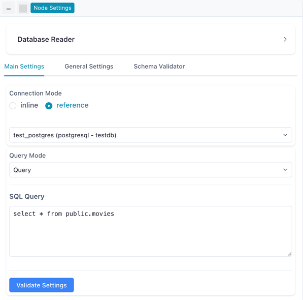
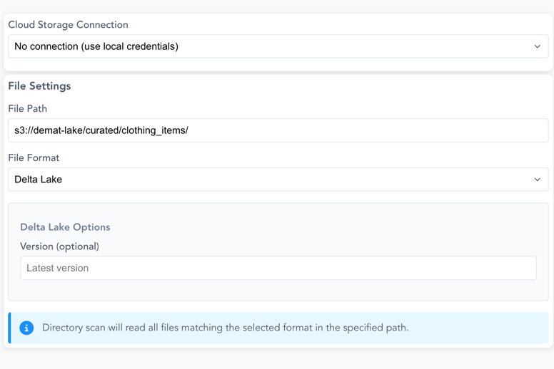
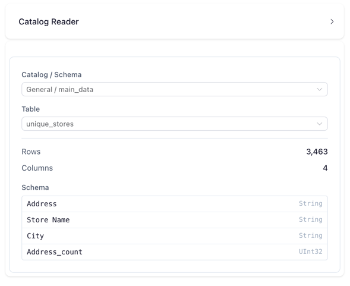

# Input Sources

Every flow starts here. Input actions have no incoming connection — they produce the first table, whether that comes from a file on your disk, a database, cloud storage, a streaming topic, an API, or the catalog.

| Action | What it does | Lite |
|---|---|:--:|
| [Read data](#read-data) | Load a local CSV, Excel, Parquet, Arrow, NDJSON or Avro file | ● |
| [List files](#list-files) | Turn a folder's contents into a table of file metadata | |
| [Manual input](#manual-input) | Type or paste a small dataset directly | ● |
| [Read from Database](#database-reader) | Query a table or write SQL against a database | |
| [Read from cloud provider](#cloud-storage-reader) | Read from S3, Azure Data Lake or Google Cloud Storage | |
| [Read from Catalog](#catalog-reader) | Read a registered catalog table, physical or virtual | ● |
| [REST API](#rest-api-reader) | Fetch JSON from an HTTP endpoint, with auth and pagination | |
| [Kafka Source](#kafka-source) | Consume messages from a Kafka or Redpanda topic | |
| [Google Analytics](#google-analytics-reader) | Run a GA4 report | |
| [Flow Input](#flow-input) | Named entry point when this flow runs inside another | |

!!! info "In Flowfile Lite"
    The browser-only [Flowfile Lite](../../deployment/lite.md) build reads local files, host-provided datasets (**External Data**, a Lite-only action), **Manual input** and **Read from Catalog**. It has no backend, so databases, cloud storage, APIs and Kafka are not available.

## { width="44" height="44" } Read data

Loads a local file. Pick the file and the format-specific settings below adapt to it.

**Settings**

| Setting | Description |
|---|---|
| **Path** | The file to read. Accepts a flow parameter inside the path, e.g. `${data_dir}/file.csv`. **Browse files** opens a picker. |
| **Read** | **Single file**, or a **directory** scan that reads every same-format file in a folder and stacks them into one table. Single file by default. |
| **File format** | The format of the files inside a scanned folder — a bare directory has no extension to sniff. Shown for a directory scan. |
| **File path column** | Optional name for an extra column holding each row's source file, so you can tell which file it came from. Shown for a directory scan. |

| Format | Extensions | Notes |
|---|---|---|
| CSV | `.csv`, `.txt` | Full parsing control, see below |
| Excel | `.xlsx`, `.xls` | Sheet and cell-range selection, see below |
| Parquet | `.parquet` | No extra settings; read lazily |
| Arrow IPC / Feather | `.arrow`, `.ipc`, `.feather` | Stores schema and types natively, read lazily so large files stream without being held in memory |
| NDJSON | `.ndjson`, `.jsonl` | One JSON record per line, schema inferred, read lazily |
| Avro | `.avro` | Row-based binary format that embeds its own schema. Read eagerly, on the compute worker rather than the core service |

### CSV settings

| Setting | Description |
|---|---|
| **Has Headers** | `yes` treats the first row as column names; `no` assigns `Column 1`, `Column 2`, … |
| **Delimiter** | The character separating values, such as `,`, `;` or `\t`. |
| **Encoding** | File encoding, such as `UTF-8` or `ISO-8859-1`. |
| **Quote Character** | Character enclosing text fields so delimiters inside them are not split on. |
| **New Line Delimiter** | How line ends are detected, such as `\n` or `\r\n`. |
| **Schema Infer Length** | How many rows are scanned to infer column types. |
| **Truncate Long Lines** | Truncate over-long lines instead of raising an error. |
| **Ignore Errors** | Continue past rows that fail to parse. |

### Excel settings

Type inference picks the reader. Enabled, a more permissive reader parses the sheet and assigns a data type per column; disabled, a faster reader returns values as stored. A sheet the fast reader cannot handle — blank cells or stray values outside the table — falls back to the permissive reader automatically, noted in the run log.

| Setting | Description |
|---|---|
| **Sheet Name** | Which sheet to read. Defaults to the first. |
| **Start Row** / **Start Column** | Zero-based index where reading begins. Default `0`. |
| **End Row** / **End Column** | Zero-based index where reading stops. `0` means read everything. |
| **Has Headers** | Treat the first row as column names. |
| **Type Inference** | Infer a data type per column, or return values as stored. |

## { width="44" height="44" } List files

Turns a folder into a table — one row per file, with its path, size and timestamps. Use it to inventory a drop folder, filter down to the files you actually want, and feed their paths into whatever comes next.

**Settings**

| Setting | Description |
|---|---|
| **Folder** | The folder to list. Accepts a flow parameter, e.g. `${data_dir}/incoming`. |
| **File types** | Extensions to keep (`csv`, `parquet`, …). Leave empty to list everything. |
| **Include** | List files, folders, or both. |
| **Hidden files** | Include dotfiles and hidden entries. Off by default. |
| **Search subfolders** | Descend into subfolders, up to **Max depth**. |
| **Max rows** | Cap the number of rows returned. |

**Output columns** — fixed, so downstream actions know the schema before the flow runs.

| Column | Type | Description |
|---|---|---|
| `file_name` | String | Name including the extension |
| `file_path` | String | Absolute path — the column downstream readers consume |
| `directory` | String | Absolute path of the containing folder |
| `relative_path` | String | Path relative to the folder you selected |
| `file_type` | String | Extension without the dot |
| `size_bytes` | Int64 | Size on disk |
| `last_modified` | Datetime | Last modification time |
| `created_date` | Datetime | Creation time |
| `is_directory` | Boolean | `true` for folders |

!!! tip "Reading every file in a folder"
    To *read* a folder of files rather than inventory it, [Read data](#read-data) has a **Directory** scan mode that reads them as one table. Reach for List files when you want the file metadata itself — to audit a folder, filter on size or modification date, or drive downstream logic from the file list.

## { width="44" height="44" } Manual input

Creates a dataset by typing it in or pasting from the clipboard. Useful for lookup tables, test fixtures, and the handful of rows you would otherwise keep in a stray spreadsheet.

**Settings**

The drawer is a small spreadsheet rather than a form: **Add Column** and **Add Row** grow the grid, and you type directly into the cells.

| Setting | Description |
|---|---|
| **Column name** | Typed into the header cell. New columns arrive as `Column 1`, `Column 2`, … |
| **Data type** | The type each column's values are cast to: String, Date, Datetime, Time, Int64, Int32, Int16, Float64, Float32 or Boolean. String by default, re-inferred when you paste. |
| **Paste CSV/TSV** | Opens a panel for bulk-loading delimited text, with a Tab / Comma / Auto-detect choice and a **First row is headers** toggle (on by default). |
| **Edit JSON** | Opens the same table as a JSON array of row objects, for editing or pasting wholesale. |

## { width="44" height="44" } Read from Database { #database-reader }

Loads data from a database table or a custom SQL query. Supports PostgreSQL, MySQL, SQLite, DuckDB, SQL Server and Denodo.

**Validate Settings** checks the connection before you run anything. [Connect to PostgreSQL](../tutorials/database-connectivity.md) is a step-by-step walkthrough.

**Connection modes**

| Mode | Description |
|---|---|
| **Reference** | Use a saved connection from the [Connection Manager](../connections.md). Recommended. |
| **Inline** | Enter credentials directly in the node settings. |

**Settings**

| Setting | Description |
|---|---|
| **Schema** | Database schema to query, e.g. `public`. |
| **Table** | Table to read from. |
| **Custom SQL** | Write a query instead of reading a whole table. |

## { width="44" height="44" } Read from cloud provider { #cloud-storage-reader }

Reads directly from cloud object storage: AWS S3 (including S3-compatible services like MinIO), Azure Data Lake Storage, and Google Cloud Storage.

Authenticate with a [saved cloud connection](../tutorials/cloud-connections.md), or — for S3 only — with local AWS credentials from a CLI profile or environment variables.

**Settings**

| Setting | Description |
|---|---|
| **File Path** | Full URI including the scheme, e.g. `s3://bucket/folder/file.csv`. **Browse** navigates the connection and picks one. |
| **File Format** | CSV, Parquet, JSON, Delta Lake or Iceberg. |
| **Scan Mode** | A single file, or a directory scan that reads every matching file in a folder. |

CSV adds **Has Headers**, **Delimiter** (default `,`) and **Encoding** (UTF-8 or UTF-8 Lossy). Delta Lake adds an optional **Version** to read a specific version rather than the latest.

## { width="44" height="44" } Read from Catalog { #catalog-reader }

Reads a table registered in the [Catalog](../catalog/index.md) — either a physical table backed by Delta or Parquet files, or a [virtual table](../catalog/virtual-tables.md) resolved on demand.

Once a table is selected the node shows its row count, column count, and schema.

**Settings**

| Setting | Description |
|---|---|
| **Catalog / Schema** | The namespace containing the table. |
| **Table** | The table itself. Virtual tables are marked with a bolt icon. |

### Reading history from an SCD2 table

When the selected table is tracked with [SCD2](../catalog/slowly-changing-dimensions.md), a **History** selector appears.

| Option | Description |
|---|---|
| **All records** (default) | Every version of every row. |
| **Active records** | Only the current version of each row, where `valid_to` is empty. |
| **Active at a point in time** | The version that was current at a given moment. |

The default is all records: reading an SCD2 table without setting History returns full history, not the current snapshot. Set it to **Active records** when the downstream flow expects one row per business key.

### Reading only what changed

When the selected table has [change tracking](../catalog/change-tracking.md) turned on, a **Read** selector appears above History.

| Option | Description |
|---|---|
| **Full table** (default) | The table as it is now. |
| **Changes since last run** | Everything committed after the version this reader last processed. Keeps a cursor, optionally named so several flows share one position. |
| **Changes since version** | Everything committed after a version you pick. |
| **Changes since time** | Everything committed at or after a timestamp. |

Every change mode adds `_change_type`, `_commit_version` and `_commit_timestamp` to the table's own columns. The Read selector is unavailable for virtual, SCD2 and SQL-mode readers, and while the reader is pinned to a table version. If the table is not tracked yet, the drawer offers an **Enable change tracking** button.

### Reading virtual tables

A virtual table resolves at run time and behaves identically to a physical one from the flow's perspective. Optimized virtual tables deserialize a stored execution plan instantly, keeping full Polars query optimization (predicate and projection pushdown); standard virtual tables run the producer flow end to end. See [Virtual Flow Tables](../catalog/virtual-tables.md).

### SQL mode

The node also has a SQL mode for querying across every catalog table, physical and virtual, registered by name in a Polars SQL context — so you can join across the whole catalog. See the [SQL editor](../catalog/sql-editor.md).

## { width="44" height="44" } REST API { #rest-api-reader }

Fetches JSON from an HTTP endpoint. Supports `GET` and `POST`, custom headers and query parameters, several authentication schemes, and automatic pagination. JSON is the only supported response format.

**Settings**

| Setting | Description |
|---|---|
| **Method** | `GET` or `POST`. Default `GET`. |
| **URL** | The request URL. Required. |
| **Record path** | Dot-path to the array of records inside the response, e.g. `data.items`. Leave empty to use the top level. Nested objects are flattened into dotted column names. |
| **Headers** | Optional request headers, as name/value pairs. |
| **Query parameters** | Optional query-string parameters, as name/value pairs. |
| **JSON body** | Body sent with `POST` requests. Must be valid JSON. |

**Authentication** — the credential is never stored on the node; it references a reusable [secret](../catalog/secrets.md) by name.

| Type | Description |
|---|---|
| **None** | No authentication. Default. |
| **API key** | Sends the key under a configurable **Key name** (default `X-API-Key`), in either the header or a query parameter. |
| **Bearer token** | Sends the secret as an `Authorization: Bearer <token>` header. |
| **Basic** | HTTP Basic authentication with a username and a secret password. |

**Pagination**

| Strategy | Description |
|---|---|
| **None** | A single request. Default. |
| **Offset / limit** | Increments an offset parameter (default `offset`) by the page size, passed via a limit parameter (default `limit`, default `100`). |
| **Page number** | Increments a page parameter (default `page`) from a configurable start page (default `1`). |
| **Cursor / next-page token** | Follows a cursor read from the response body (dot-path) or a response header, sent back via a configurable request parameter. |

Paginated reads are bounded by **Max pages** (default `1000`) and an optional **Max records** cap. **Timeout** defaults to 30 seconds and **Max retries** to `3`.

**Fetch sample** runs one capped request and previews the inferred columns. Skip it and the schema is inferred on the first run instead.

## { width="44" height="44" } Kafka Source

Consumes messages from a Kafka or Redpanda topic using a saved [Kafka connection](../connections.md#kafka-connections). Message values are parsed as JSON, the only supported value format.

**Settings**

| Setting | Description |
|---|---|
| **Kafka Connection** | A saved connection holding bootstrap servers and security settings. |
| **Topic Name** | The topic to consume. **Fetch Topics** lists what the broker has, or type the name. |
| **Start Offset** | Where to begin when no tracked offset exists: `latest` (default) or `earliest`. |
| **Max Messages** | Most messages to read in one run. Default `100,000`. |
| **Poll Timeout (seconds)** | How long to poll the broker. Default `30`. |
| **Sync Name** | Optional. A unique key tracking consumer offsets between runs, so each run continues where the last stopped. |

**Infer Schema** previews the columns parsed from sample messages.

!!! tip "Incremental reads and resetting offsets"
    With a **Sync Name** set, Flowfile tracks the consumer group's offsets so each run only reads new messages. **Reset Offsets** clears the tracked position, and the next run re-reads from the configured **Start Offset**.

## { width="44" height="44" } Google Analytics { #google-analytics-reader }

Runs a Google Analytics 4 report using a saved connection, authenticated with a service-account key or via OAuth.

**Settings**

| Setting | Description |
|---|---|
| **Google Analytics Connection** | A saved GA connection, holding its credentials and an optional default property. |
| **GA4 Property ID** | The numeric property to query, e.g. `123456789`. Prefilled from the connection's default when set. |
| **Start Date** / **End Date** | The report range. Accepts GA4 relative tokens (`7daysAgo`, `yesterday`, `today`) or absolute `YYYY-MM-DD` dates. Defaults `7daysAgo` → `yesterday`, and a **Quick Range** dropdown fills common windows. |
| **Metrics** | One or more GA4 metrics, e.g. `sessions`, `totalUsers`. At least one is required. |
| **Dimensions** | Optional breakdowns, e.g. `date`, `pagePath`, `eventName`. |
| **Row Limit** | Optional cap. Leave blank to fetch every row GA returns, paginated in 100k-row chunks. |

**Filters** apply to any selected metric or dimension, and Flowfile routes each to GA4's dimension or metric filter automatically. Multiple filters of the same kind combine with AND.

- Dimension (string) operators: `equals`, `not_equals`, `contains`, `begins_with`, `ends_with`, `regex`, `in_list`, `not_in_list`. Matching is case-insensitive unless the `Aa` toggle is on.
- Metric (numeric) operators: `equals`, `not_equals`, `less_than`, `less_equal`, `greater_than`, `greater_equal`, `between`.

**Sort By** takes one or more entries on a selected metric or dimension, ascending or descending. GA4 applies them in list order — combine with **Row Limit** for top-N reports.

!!! tip "Cache slow reports"
    Fetching from Google Analytics can be slow. Enable **Cache Results** on the node, or write the result to the [catalog](../catalog/index.md), for faster iteration.

## { width="44" height="44" } Flow Input

A named entry point for a [subflow](../subflows.md) — a flow called from another flow. It has no upstream connection: when the flow runs on its own it serves the sample data in its settings, and when a parent calls it through a [Run Flow](combine.md#run-flow) node, the parent's dataset replaces that sample.

**Settings**

| Setting | Description |
|---|---|
| **Input name** | The port name the parent binds data to. Default `input`. |
| **Sample data** | The dataset served when the flow runs standalone. |

---

[← All actions](index.md) | [Next: Transformations →](transform.md)
