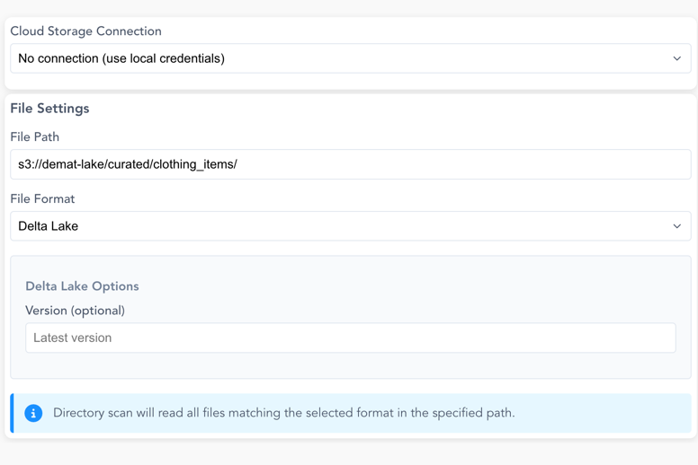

# Input Nodes

Input nodes are the starting point for any data flow. Flowfile currently supports reading from **local files**, **cloud storage (S3)**, and **manual input**.

## Node Details

### { width="50" height="50" } Read Data

The **Read Data** node allows you to load local data into your flow. It currently supports **CSV**, **Excel**, and **Parquet** file formats, each with specific configuration options.

#### **Supported Formats:**

- **CSV files** (`.csv`)
- **Excel files** (`.xlsx`, `.xls`)
- **Parquet files** (`.parquet`)

#### **Usage:**

1. Select your input file.  
2. Configure any format-specific options.  
3. Preview and confirm your data.  

---

#### CSV  
When a **CSV** file is selected, the following setup options are available:  

| Parameter               | Description                                                                                                                                                                          |
|-------------------------|--------------------------------------------------------------------------------------------------------------------------------------------------------------------------------------|
| **Has Headers**         | Determines whether the first row is used as headers. If `"yes"`, the first row is treated as column names. If `"no"`, default column names like `"Column 1, Column 2, ..."` are assigned. |
| **Delimiter**           | Specifies the character used to separate values (e.g., comma `,`, semicolon `;`, tab `\t`).                                                                                          |
| **Encoding**            | Defines the file encoding (e.g., `UTF-8`, `ISO-8859-1`).                                                                                                                             |
| **Quote Character**     | Character used to enclose text fields, preventing delimiter conflicts (e.g., `"`, `'`).                                                                                              |
| **New Line Delimiter**  | Specifies how new lines are detected (e.g., `\n`, `\r\n`).                                                                                                                          |
| **Schema Infer Length** | Determines how many rows are scanned to infer column types.                                                                                                                         |
| **Truncate Long Lines** | If enabled, long lines are truncated instead of causing errors.                                                                                                                     |
| **Ignore Errors**       | If enabled, the process continues even if some rows cause errors.                                                                                                                   |

---

#### Excel  
When an **Excel** file is selected, you can specify the sheet, select specific rows and columns, and configure headers and type inference options to tailor data loading to your needs.

| Parameter          | Description                                                                                                                                              |
|--------------------|----------------------------------------------------------------------------------------------------------------------------------------------------------|
| **Sheet Name**     | The name of the sheet to be read. If not specified, the first sheet is used.                                                                             |
| **Start Row**      | The row index (zero-based) from which reading starts. Default is `0` (beginning of the sheet).                                                           |
| **Start Column**   | The column index (zero-based) from which reading starts. Default is `0` (first column).                                                                  |
| **End Row**        | The row index (zero-based) at which reading stops. Default is `0` (read all rows).                                                                       |
| **End Column**     | The column index (zero-based) at which reading stops. Default is `0` (read all columns).                                                                 |
| **Has Headers**    | Determines whether the first row is treated as headers. If `true`, the first row is used as column names. If `false`, default column names are assigned. |
| **Type Inference** | If `true`, the engine attempts to infer data types. If `false`, data types are not automatically inferred.                                               |

---

#### Parquet  
When a **Parquet** file is selected, no additional setup options are required. Parquet is a columnar storage format optimized for efficiency and performance. It retains schema information and data types, enabling faster reads and writes without manual configuration.

---

### { width="50" height="50" } Cloud Storage Reader

The **Cloud Storage Reader** node allows you to read data directly from AWS S3.

Screenshot: Cloud Storage Reader Configuration

#### **Connection Options:**
- Use existing S3 connections configured in your workspace (see [Manage Cloud Connections](../tutorials/cloud-connections.md))
- Use local AWS CLI credentials or environment variables

#### **File Settings:**

| Parameter          | Description                                                                                              |
|--------------------|----------------------------------------------------------------------------------------------------------|
| **File Path**      | Path to the file or directory (e.g., `bucket-name/folder/file.csv`)                                    |
| **File Format**    | Supported formats: CSV, Parquet, JSON, Delta Lake                                                       |
| **Scan Mode**      | Single file or directory scan (reads all matching files in a directory)                                 |

#### **Format-Specific Options:**

**CSV Options:**
- **Has Headers**: First row contains column headers
- **Delimiter**: Character separating values (default: `,`)
- **Encoding**: File encoding (UTF-8 or UTF-8 Lossy)

**Delta Lake Options:**
- **Version**: Specify a specific version to read (optional, defaults to latest)

---

### { width="50" height="50" } Manual Input

The **Manual Input** node allows you to create data directly within Flowfile or paste data from your clipboard.

---
[← Node overview](index.md) | [Next: Transform data →](transform.md)
