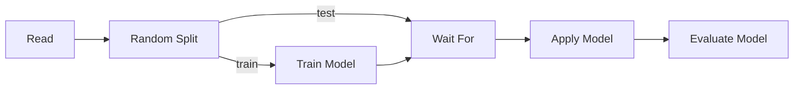

# Machine Learning Nodes

The ML nodes let you split a dataset, fit a model, score new rows with it, and
read off quality metrics — all from the visual canvas. Compute runs in Polars
(via [polars-ds](https://github.com/abstractqqq/polars_ds_extension)), so you
do not need scikit-learn or any extra Python environment.

!!! info "Not in Flowfile Lite"
    Machine Learning nodes require the full desktop/server build. The browser-only [Flowfile Lite](../../deployment/lite.md) edition does not include Train / Apply / Evaluate Model.

## The pipeline shape

A typical ML flow chains five nodes end-to-end:



- **Random Split** carves the input into a `train` and `test` slice.
- **Train Model** fits an algorithm on the `train` slice and writes the model
  artifact to a flow-scoped cache.
- **Wait For** is a one-line synchronisation node: it lets the `test` slice
  flow through unchanged but blocks until the trainer has finished writing.
- **Apply Model** reads the model the upstream Train Model wrote and adds a
  prediction column to the `test` slice.
- **Evaluate Model** compares the actual and predicted columns and emits a
  `(metric, value)` table.

!!! tip "Skipping Wait For"
    You can skip Wait For if Apply Model is reading from the catalog
    instead of an upstream node. The in-flow path shown above is the
    simplest train→apply chain and what the starter templates use.

---

## { width="50" height="50" } Random Split

Randomly partitions rows into named output handles. Default is two outputs,
`train` (80%) and `test` (20%), but you can configure up to ten splits with
arbitrary names.

#### Configuration

| Parameter        | Description                                                                                  |
|------------------|----------------------------------------------------------------------------------------------|
| **Splits**       | List of `name` + `percentage`. Names must start with a letter and percentages must sum to 100. |
| **Seed**         | Optional integer seed for reproducible splits. Leave empty for non-deterministic.            |

#### Behaviour

- One output handle per split, in the order you defined them.
- Each row lands in exactly one split. The split is purely random — there is
  no stratification by target class.
- Setting a seed (e.g. `42`) makes the split deterministic across runs, which
  is what you want for reproducible model evaluation.

---

## { width="50" height="50" } Train Model

Fits a model on the input rows and stores the artifact for downstream use.
The data passes through unchanged on the output, so you can chain other
nodes off the same Train Model output if you want.

#### Configuration

| Parameter             | Description                                                                                                  |
|-----------------------|--------------------------------------------------------------------------------------------------------------|
| **Target column**     | Column you are trying to predict.                                                                            |
| **Feature columns**   | One or more numeric columns used as predictors. Must not include the target.                                  |
| **Model type**        | Algorithm to fit. The drawer pulls the live list from `GET /ml/algorithms`.                                  |
| **Hyperparameters**   | Algorithm-specific. The form is generated from the algorithm spec — what shows up depends on the model type. |
| **Publish to catalog** | Off by default. When on, also stores the model in the global catalog under **Model name**.                  |
| **Model name / tags** | Required if publishing. Re-running with the same name auto-bumps the version.                                |

#### Algorithms

| Model type            | Task           | Output dtype | Notes                                                                  |
|-----------------------|----------------|--------------|------------------------------------------------------------------------|
| `linear_regression`   | regression     | `Float64`    | Ordinary least squares.                                                |
| `ridge_regression`    | regression     | `Float64`    | L2-penalised. Useful when features are correlated.                     |
| `lasso_regression`    | regression     | `Float64`    | L1-penalised. Drives some coefficients to zero (feature selection).    |
| `logistic_regression` | classification | `Int64`      | Binary classifier. Target column must contain `0`/`1` integer labels.  |
| `knn_classifier`      | classification | `Int64`      | Binary KNN with kd-tree lookup. Stores the training set in the artifact — fine for demos, heavy for huge data. |

#### Behaviour

- Hyperparameters are validated up front. An invalid combination fails on the
  Train Model node, not later inside the worker.
- The trained model is always cached at a flow-scoped path keyed off the node
  id, so an Apply Model further down the same flow can read it without
  publishing to the catalog.
- Publishing is opt-in. Toggle it on if you want to reuse the model from
  another flow or pin a specific version.

---

## { width="50" height="50" } Wait For

Pass-through node with two inputs: the **left** input flows through
unchanged, the **right** input only enforces ordering. Once both inputs have
finished, the node emits the left input's data on its single output.

Use it whenever a downstream node depends on a side effect of a sibling
branch — typically Apply Model needing Train Model's artifact to exist
before it runs.

#### Configuration

There are no settings. Wire the data branch into the left input and the
dependency branch into the right input.

---

## { width="50" height="50" } Apply Model

Adds a prediction column to the input. The model is loaded either from an
upstream Train Model in the same flow, or by name/version from the catalog.

#### Configuration

| Parameter             | Description                                                                                                                                                  |
|-----------------------|--------------------------------------------------------------------------------------------------------------------------------------------------------------|
| **Source**            | `Upstream` (default) reads the model from a Train Model node in this flow. `Catalog` looks the model up by name/version.                                     |
| **Upstream training node** | Picker populated from a `/ml/upstream-train-models` walk of the flow graph — only Train Model nodes that can actually reach this Apply Model show up.   |
| **Model name / version** | Used when the source is `Catalog`. Empty version means "latest active".                                                                                    |
| **Output column**     | Name of the prediction column. Defaults to `prediction`.                                                                                                     |

#### Behaviour

- The input must contain every feature column the model was trained on. A
  missing feature raises a clear error before any work runs.
- Linear/ridge/lasso/logistic models apply as a pure Polars expression — no
  Python loop, no worker round-trip. KNN collects once because it needs the
  full training set in memory to run a kd-tree query.
- The output dtype is the algorithm's `output_dtype` (`Float64` for
  regression, `Int64` for classification). For binary logistic regression,
  the prediction is the argmax of the sigmoid (i.e. `1` if the linear
  combination is positive, otherwise `0`).

---

## { width="50" height="50" } Evaluate Model

Compares an actual column against a predicted column and emits a
`(metric, value)` table. It does not care which Train/Apply pair produced
the prediction — point it at any frame that has both columns.

#### Configuration

| Parameter                  | Description                                                                                                                                          |
|----------------------------|------------------------------------------------------------------------------------------------------------------------------------------------------|
| **Actual column**          | Ground-truth column.                                                                                                                                 |
| **Predicted column**       | Prediction column added by Apply Model. Defaults to `prediction`.                                                                                    |
| **Task type**              | `auto` (default), `regression`, or `classification`. `auto` resolves the task from the upstream Train Model node when one is set, else regression. |
| **Upstream training node** | Optional pointer to a Train Model node in this flow, used only to resolve `task_type=auto`.                                                          |

#### Metrics

For `regression`:

| Metric  | Meaning                                                          |
|---------|------------------------------------------------------------------|
| `mae`   | Mean absolute error.                                             |
| `mse`   | Mean squared error.                                              |
| `rmse`  | Root mean squared error.                                         |
| `r2`    | Coefficient of determination. 1.0 is perfect, 0.0 is mean baseline. |
| `mape`  | Mean absolute percentage error. Rows where actual is `0` are dropped from this metric only. |
| `n`     | Row count after dropping nulls.                                  |

For `classification`:

| Metric        | Meaning                                                             |
|---------------|---------------------------------------------------------------------|
| `accuracy`    | Correct predictions / total.                                        |
| `precision`   | Macro-averaged across classes.                                      |
| `recall`      | Macro-averaged across classes.                                      |
| `f1`          | Macro-averaged F1.                                                  |
| `n_correct`   | Raw count of correct predictions.                                   |
| `n_total`     | Total rows after dropping nulls.                                    |

#### Behaviour

- Rows where either column is null are dropped before any metric is
  computed, so a single missing prediction doesn't poison the rest.
- For classification, both columns are cast to string before grouping, so
  integer `0/1` labels and string labels share one path.
- Macro-averaging weights every class equally, which is the right default
  for imbalanced data. There is no per-class breakdown in v1; the long-form
  output is meant to be filtered, joined, or charted downstream.

---

## Starter templates

Two beginner templates are shipped under **Templates → Beginner**:

- **Customer Churn Classification** — logistic regression on a synthetic
  churn dataset. Five features, binary `churned` target. Walks through the
  full split → train → wait → apply → evaluate chain.
- **Customer Churn (KNN)** — same dataset and shape, but uses the KNN
  classifier so you can compare a parametric and a neighbour-based model
  on the same hold-out split.

Both load `data/templates/customer_churn.csv` and produce an Evaluate Model
output you can inspect with the **Explore Data** node downstream.

The regression sibling, **House Price Regression**, uses
`linear_regression` on `data/templates/house_prices.csv` and is the
template to mirror when building your own regression flow.

---

## Python API

The same nodes are available as `FlowFrame` methods. The wiring is
identical — `train_model` returns a frame whose backing node is a Train
Model, and you pass that frame to `apply_model(upstream=...)` to chain
them.

```python
import flowfile as ff

raw = ff.read_csv("customer_churn.csv")
train, test = raw.random_split([("train", 80), ("test", 20)], seed=42)

trained = train.train_model(
    target="churned",
    features=["tenure_months", "monthly_charges", "support_calls", "has_contract"],
    model_type="logistic_regression",
    params={"l2_reg": 0.1},
)

scored = (
    test.wait_for(trained)            # block apply until train is done
        .apply_model(
            upstream=trained,
            output_column="predicted_churn",
        )
)

metrics = scored.evaluate_model(
    actual="churned",
    predicted="predicted_churn",
    task_type="auto",
    upstream_train=trained,
)

ff.open_graph_in_editor(metrics.flow_graph)  # see the canvas
```

The catalog path is also supported — pass `model_name=` (and optionally
`version=`) to `apply_model` instead of `upstream=`.

---

!!! info "For contributors"
    Adding a new algorithm to the registry is a backend-only change. See the
    [developer documentation](../../../for-developers/index.md) for how the
    backend is organized.
