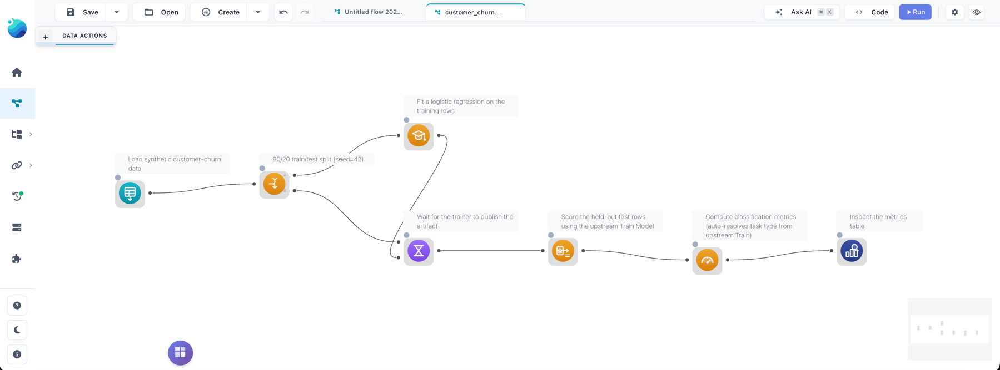

# Machine Learning

These four actions split a dataset, fit a model, score new rows with it, and read off quality metrics — all from the canvas. Compute runs in Polars (via [polars-ds](https://github.com/abstractqqq/polars_ds_extension)), so there is no scikit-learn or extra Python environment to install.

| Action | What it does |
|---|---|
| [Random Split](#random-split) | Partition rows into named groups, typically train and test |
| [Train Model](#train-model) | Fit a regression or classification model |
| [Apply Model](#apply-model) | Add a prediction column using a trained model |
| [Evaluate Model](#evaluate-model) | Compare actual against predicted and compute metrics |

!!! info "Not in Flowfile Lite"
    Machine Learning needs the full desktop or server build. The browser-only [Flowfile Lite](../../deployment/lite.md) edition does not include these.

## The pipeline shape

A typical ML flow chains five nodes end to end — here, a customer-churn classification:

{ .ff-wide }

- **Random Split** carves the input into a `train` and a `test` slice.
- **Train Model** fits an algorithm on the `train` slice and writes the model artifact to a flow-scoped cache.
- **[Wait For](combine.md#wait-for)** lets the `test` slice through unchanged but blocks until the trainer has finished writing. It is a general-purpose synchronization action, documented with the other [Combine Operations](combine.md).
- **Apply Model** reads the model the upstream Train Model wrote and adds a prediction column to the `test` slice.
- **Evaluate Model** compares the actual and predicted columns and emits a `(metric, value)` table.

!!! tip "Skipping Wait For"
    You can skip Wait For when Apply Model reads from the catalog instead of an upstream node. The in-flow path shown above is the simplest train → apply chain, and what the starter templates use.

## { width="44" height="44" } Random Split

Randomly partitions rows into named output handles. The default is two outputs, `train` (80%) and `test` (20%); up to ten splits with arbitrary names are supported.

**Settings**

| Setting | Description |
|---|---|
| **Splits** | List of `name` + `percentage`. Names must start with a letter, and percentages must sum to 100. |
| **Seed** | Optional integer seed for reproducible splits. Leave empty for non-deterministic. |

There is one output handle per split, in the order you defined them, and each row lands in exactly one. The split is purely random — there is no stratification by target class. Setting a seed (for example `42`) makes it deterministic across runs, so evaluations are reproducible.

## { width="44" height="44" } Train Model

Fits a model on the input rows and stores the artifact for downstream use. The data passes through unchanged on the output, so other nodes can chain off the same Train Model output.

**Settings**

| Setting | Description |
|---|---|
| **Target column** | The column you are trying to predict. |
| **Feature columns** | One or more numeric columns used as predictors. Must not include the target. |
| **Model type** | Algorithm to fit. The drawer pulls the live list from `GET /ml/algorithms`. |
| **Hyperparameters** | Algorithm-specific. The form is generated from the algorithm spec, so what appears depends on the model type. |
| **Publish to catalog** | Off by default. When on, also stores the model in the global catalog under **Model name**. |
| **Model name / tags** | Required if publishing. Re-running with the same name auto-bumps the version. |

### Algorithms

| Model type | Task | Output dtype | Notes |
|---|---|---|---|
| `linear_regression` | regression | `Float64` | Ordinary least squares. |
| `ridge_regression` | regression | `Float64` | L2-penalised. Useful when features are correlated. |
| `lasso_regression` | regression | `Float64` | L1-penalised. Drives some coefficients to zero, which selects features. |
| `logistic_regression` | classification | `Int64` | Binary classifier. The target column must contain `0`/`1` integer labels. |
| `knn_classifier` | classification | `Int64` | Binary KNN with kd-tree lookup. Stores the training set in the artifact — fine for demos, heavy for large data. |

Hyperparameters are validated up front, so an invalid combination fails on the Train Model node rather than later inside the worker. The trained model is always cached at a flow-scoped path keyed off the node id, which is how an Apply Model further down the same flow reads it without publishing. Publishing is opt-in: turn it on to reuse the model from another flow or to pin a specific version.

## { width="44" height="44" } Apply Model

Adds a prediction column to the input, loading the model either from an upstream Train Model in the same flow or by name and version from the catalog.

**Settings**

| Setting | Description |
|---|---|
| **Source** | `Upstream` (default) reads the model from a Train Model node in this flow. `Catalog` looks it up by name and version. |
| **Upstream training node** | Picker populated from a `/ml/upstream-train-models` walk of the flow graph — only Train Model nodes that can actually reach this node appear. |
| **Model name / version** | Used when the source is `Catalog`. An empty version means "latest active". |
| **Output column** | Name of the prediction column. Defaults to `prediction`. |

The input must contain every feature column the model was trained on; a missing feature raises a clear error before any work runs. Linear, ridge, lasso and logistic models apply as a pure Polars expression — no Python loop and no worker round-trip — while KNN collects once because it needs the full training set in memory for its kd-tree query.

The output dtype is the algorithm's `output_dtype`: `Float64` for regression, `Int64` for classification. For binary logistic regression the prediction is the argmax of the sigmoid, so `1` when the linear combination is positive and `0` otherwise.

## { width="44" height="44" } Evaluate Model

Compares an actual column against a predicted column and emits a `(metric, value)` table. It does not care which Train/Apply pair produced the prediction — point it at any frame that has both columns.

**Settings**

| Setting | Description |
|---|---|
| **Actual column** | The ground-truth column. |
| **Predicted column** | The prediction column added by Apply Model. Defaults to `prediction`. |
| **Task type** | `auto` (default), `regression` or `classification`. `auto` resolves the task from the upstream Train Model node when one is set, otherwise regression. |
| **Upstream training node** | Optional pointer to a Train Model node in this flow, used only to resolve `task_type=auto`. |

### Metrics

For `regression`:

| Metric | Meaning |
|---|---|
| `mae` | Mean absolute error. |
| `mse` | Mean squared error. |
| `rmse` | Root mean squared error. |
| `r2` | Coefficient of determination. 1.0 is perfect, 0.0 is the mean baseline. |
| `mape` | Mean absolute percentage error. Rows where actual is `0` are dropped from this metric only. |
| `n` | Row count after dropping nulls. |

For `classification`:

| Metric | Meaning |
|---|---|
| `accuracy` | Correct predictions / total. |
| `precision` | Macro-averaged across classes. |
| `recall` | Macro-averaged across classes. |
| `f1` | Macro-averaged F1. |
| `n_correct` | Raw count of correct predictions. |
| `n_total` | Total rows after dropping nulls. |

Rows where either column is null are dropped before any metric is computed, so a single missing prediction doesn't poison the rest. For classification both columns are cast to string before grouping, so integer `0`/`1` labels and string labels share one path. Macro-averaging weights every class equally, which is the right default for imbalanced data; there is no per-class breakdown, and the long-form output is meant to be filtered, joined or charted downstream.

## Starter templates

Three templates ship under **Templates → Beginner**:

- **Customer Churn Classification** — logistic regression on a synthetic churn dataset. Five features, binary `churned` target, walking the full split → train → wait → apply → evaluate chain.
- **Customer Churn (KNN)** — the same dataset and shape with the KNN classifier, so you can compare a parametric and a neighbour-based model on one hold-out split.
- **House Price Regression** — `linear_regression` on `data/templates/house_prices.csv`, the one to mirror when building your own regression flow.

The two churn templates load `data/templates/customer_churn.csv` and produce an Evaluate Model output you can inspect with an [Explore data](output.md#explore-data) node downstream.

## In Python

The same actions are `FlowFrame` methods, wired identically: `train_model` returns a frame whose backing node is a Train Model, and you pass that frame to `apply_model(upstream=...)` to chain them.

```python
--8<-- "docs/examples/ml_pipeline.py:example"
```

`random_split` takes a mapping of split name to percentage, which must sum to 100. `evaluate_model`'s first argument is the actual column; the prediction column and task type are keyword-only. The catalog path works too — pass `model_name=` (and optionally `version=`) to `apply_model` instead of `upstream=`.

---

[← Aggregations](aggregate.md) | [Next: Output Operations →](output.md)
