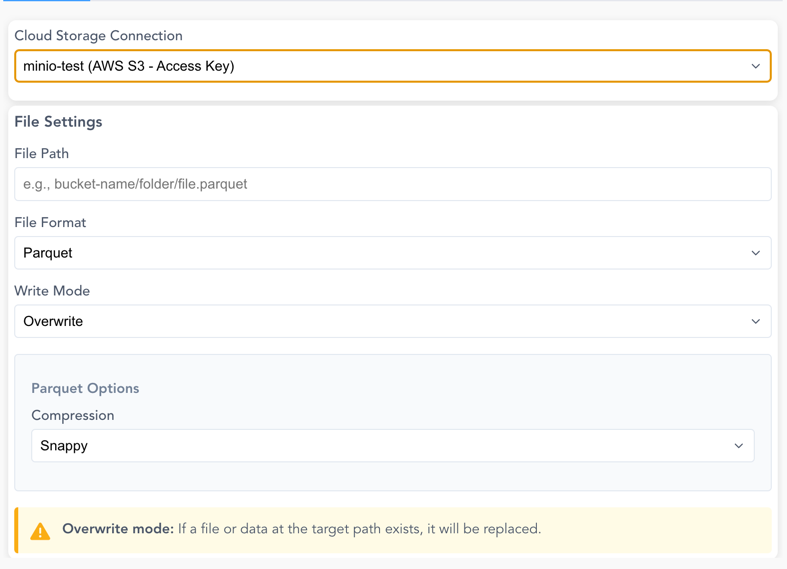
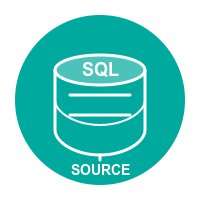
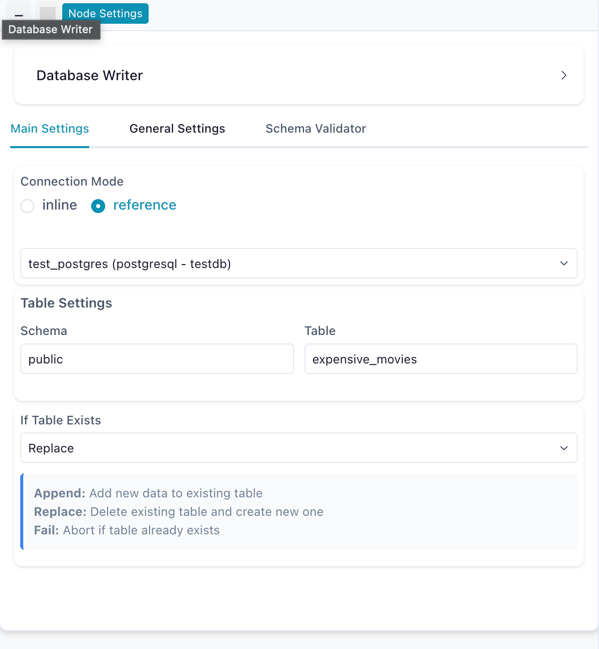
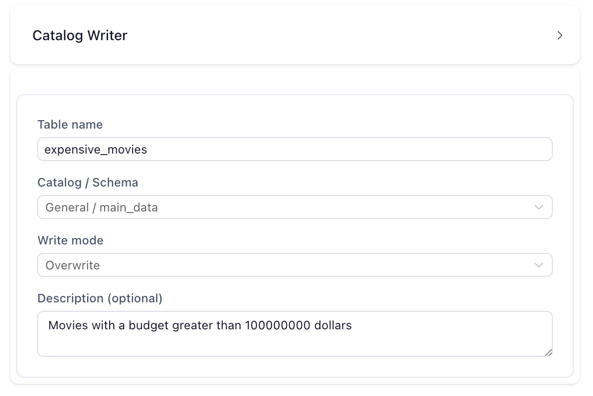

# Output Nodes

Output nodes represent the final steps in your data pipeline, allowing you to save your transformed data or explore it visually. These nodes help you deliver your results in the desired format or analyze them directly.

## Node Details
## Node Details  

### { width="50" height="50" } Write Data  

The **Write Data** node allows you to save your processed data in different formats. It supports **CSV**, **Excel**, and **Parquet**, each with specific configuration options.  

---

### **Supported Formats**  

- **CSV files** (`.csv`)  
- **Excel files** (`.xlsx`)  
- **Parquet files** (`.parquet`)  

---

### **Usage**  

1. Configure the **output file path**.  
2. Select the **file format**.  
3. Set writing options (e.g., delimiter, compression).  

---

### CSV  
When a **CSV** file is selected, the following setup options are available:  

| Parameter      | Description                                                             |
|----------------|-------------------------------------------------------------------------|
| **Delimiter**  | Specifies the character used to separate values (default: `,`).         |
| **Encoding**   | Defines the file encoding (default: `UTF-8`).                           |
| **Write Mode** | Determines how the file is saved (`overwrite`, `new file` or `append`). |

---

### Excel  
When an **Excel** file is selected, additional configurations allow customizing the output.

| Parameter      | Description                                                       |
|----------------|-------------------------------------------------------------------|
| **Sheet Name** | Name of the sheet where data will be written (default: `Sheet1`). |
| **Write Mode** | Determines how the file is saved (`overwrite` or `new file`).     |

---

### Parquet  
When a **Parquet** file is selected, no additional setup options are required. Parquet is a **columnar storage format**, optimized for efficient reading and writing.

| Parameter       | Description                                                   |
|-----------------|---------------------------------------------------------------|
| **Write Mode**  | Determines how the file is saved (`overwrite` or `new file`). |

---

### **General Configuration Options**  

| Parameter          | Description                                                                                                                 |
|--------------------|-----------------------------------------------------------------------------------------------------------------------------|
| **File Path**      | Directory and filename for the output file.                                                                                 |
| **File Format**    | Selects the output format (`CSV`, `Excel`, `Parquet`).                                                                      |
| **Overwrite Mode** | Controls whether to replace or append data. When `new file` is selected it will throw an error when the file already exists |

This node ensures that your transformed data is **saved in the correct format**, ready for further use or analysis.

---

### { width="50" height="50" } Cloud Storage Writer

The **Cloud Storage Writer** node allows you to save your processed data directly to cloud storage services like AWS S3.

Screenshot: Cloud Storage Writer Configuration

#### **Connection Options:**
- Use existing cloud storage connections configured in your workspace (see [Manage Cloud Connections](../tutorials/cloud-connections.md))
- Use local AWS CLI credentials or environment variables for authentication

#### **File Settings:**

| Parameter          | Description                                                                                              |
|--------------------|----------------------------------------------------------------------------------------------------------|
| **File Path**      | Full path including bucket/container and file name (e.g., `bucket-name/folder/output.parquet`)          |
| **File Format**    | Supported formats: CSV, Parquet, JSON, Delta Lake                                                       |
| **Write Mode**     | `overwrite` (replace existing) or `append` (Delta Lake only)                                            |

#### **Format-Specific Options:**

**CSV Options:**
- **Delimiter**: Character to separate values (default: `,`)
- **Encoding**: File encoding (UTF-8 or UTF-8 Lossy)

**Parquet Options:**
- **Compression**: Choose from Snappy (default), Gzip, Brotli, LZ4, or Zstd

**Delta Lake Options:**
- Supports both `overwrite` and `append` write modes
- Automatically handles schema evolution when appending

!!! warning "Overwrite Mode"
   When using `overwrite` mode, any existing file or data at the target path will be replaced. Make sure to verify the path before executing.

!!! info "Append Mode"
   Available only for Delta Lake format.

---

### { width="50" height="50" } Database Writer

The **Database Writer** node saves processed data to a database table. It supports PostgreSQL and MySQL.

#### **Connection Modes:**

| Mode | Description |
|------|-------------|
| **Reference** | Use a saved connection from the [Connection Manager](../connections.md) (recommended) |
| **Inline** | Enter connection credentials directly in the node settings |

#### **Settings:**

| Parameter | Description |
|-----------|-------------|
| **Schema** | Target database schema (e.g., `public`) |
| **Table** | Target table name |
| **Write Mode** | How to handle existing data: **Append**, **Replace**, or **Fail** |

#### **Write Modes:**

| Mode | Description |
|------|-------------|
| **Append** | Add rows to the existing table |
| **Replace** | Drop and recreate the table with new data |
| **Fail** | Error if the table already exists |

*Database Writer configured to replace a table using a saved connection*

For a step-by-step tutorial, see [Connect to PostgreSQL](../tutorials/database-connectivity.md).

---

### Catalog Writer

The **Catalog Writer** node saves data as a table in the [Catalog](../catalog.md). It supports two modes: **physical** (materialized as a Delta table on disk) and **virtual** (no data written — resolved on demand). The node uses a tabbed interface to switch between modes.

#### **Shared Settings:**

| Parameter | Description |
|-----------|-------------|
| **Table Name** | Name for the catalog table |
| **Catalog / Schema** | Target namespace in the catalog hierarchy |
| **Description** | Optional description for the table |

#### **Write to Catalog (Physical)**

Materializes data as a Delta table with full schema metadata, row count, and lineage information.

| Parameter | Description |
|-----------|-------------|
| **Write Mode** | How to handle existing data (see table below) |
| **Key Columns** | Required for Upsert, Update, and Delete modes — columns used to match rows |

**Write modes:**

| Mode | Description |
|------|-------------|
| **Overwrite** | Replace all existing data in the table |
| **Error if exists** | Fail if the table already exists |
| **Append** | Add rows to the existing table |
| **Upsert** | Insert new rows or update existing rows matching the key columns |
| **Update** | Update only existing rows matching the key columns (no inserts) |
| **Delete** | Remove rows from the target that match the key columns in the source |

#### **Usage:**

1. Add a **Catalog Writer** node to your flow
2. Enter a table name
3. Select the target catalog/schema namespace
4. Choose a write mode on the **Write to Catalog** tab
5. Optionally add a description
6. Run the flow to materialize and register the table

*Catalog Writer configured to write a table to the default schema*

#### **Virtual Table Mode**

Switch to the **Virtual Table** tab to create a [virtual flow table](../virtual-tables.md) — a catalog entry that stores no data on disk and resolves on demand by executing the producer flow.

<!-- PLACEHOLDER: Screenshot of the Catalog Writer virtual table tab with laziness check -->

*The Virtual Table tab showing a laziness check result*

When you select the Virtual Table tab, Flowfile automatically checks whether your pipeline supports **optimized resolution**:

- **Green checkmark** — all upstream nodes are lazy. The virtual table will store a serialized execution plan for instant resolution with predicate and projection pushdown.
- **Yellow warning** — some upstream nodes are eager or conditional. The virtual table will use standard resolution (re-executes the full producer flow on each read). The specific blocker nodes are listed.

!!! warning "Flow registration required"
    Virtual tables require the flow to be registered in the catalog. If the flow isn't registered, the virtual write will fail with an error. Open the flow from the catalog, or register it first.

For the full guide on virtual tables, optimization, and when to use them, see [Virtual Flow Tables](../virtual-tables.md).

---

### { width="50" height="50" } Explore Data

The Explore Data node provides interactive data exploration and analysis capabilities.

