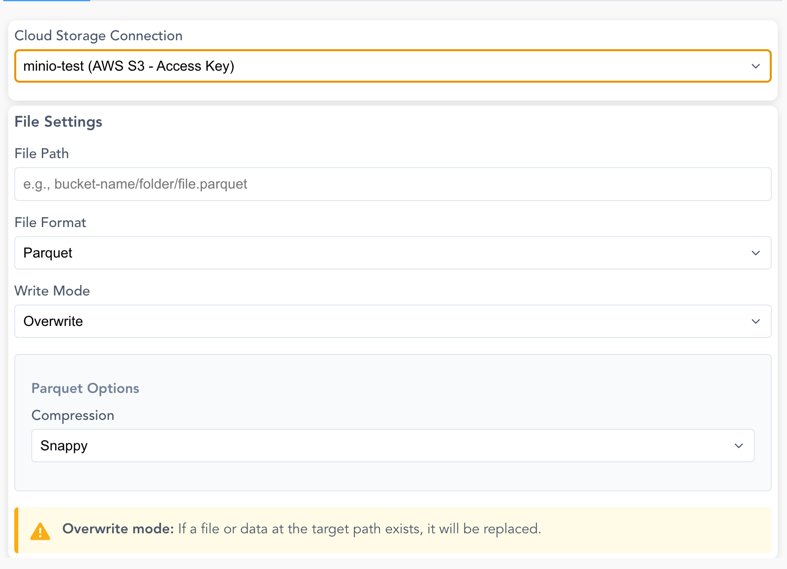
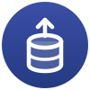
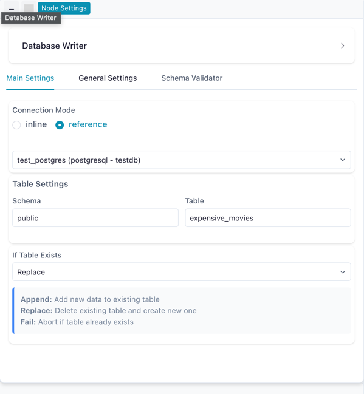
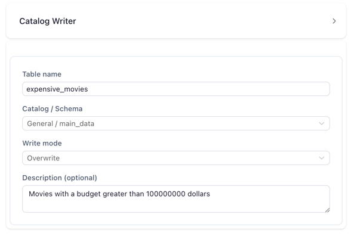

# Output Nodes

Output nodes represent the final steps in your data pipeline, allowing you to save your transformed data or explore it visually.

!!! info "Some output nodes are not in Flowfile Lite"
    In the browser-only [Flowfile Lite](../../deployment/lite.md) build, **Write Data** downloads a file to your browser (CSV, Parquet, or Excel — not the full desktop format set) and **Write to Catalog** / **Explore Data** work as usual. **Cloud Storage Writer** and **Database Writer** are not available (no backend).

## Node Details

### { width="50" height="50" } Write Data  

The **Write Data** node allows you to save your processed data in different formats. It supports **CSV**, **Excel**, **Parquet**, **Arrow IPC/Feather**, **NDJSON**, and **Avro**, each with specific configuration options.  

---

### **Supported Formats**  

- **CSV files** (`.csv`)  
- **Excel files** (`.xlsx`)  
- **Parquet files** (`.parquet`)  
- **Arrow IPC / Feather files** (`.arrow`)  
- **NDJSON files** (`.ndjson`)  
- **Avro files** (`.avro`)  

---

### CSV  
When a **CSV** file is selected, the following setup options are available:  

| Parameter      | Description                                                             |
|----------------|-------------------------------------------------------------------------|
| **Delimiter**  | Specifies the character used to separate values (default: `,`).         |
| **Encoding**   | Defines the file encoding (default: `UTF-8`).                           |
| **Write Mode** | Determines how the file is saved (`overwrite`, `new file` or `append`). |

---

### Excel  
When an **Excel** file is selected, additional configurations allow customizing the output.

| Parameter      | Description                                                       |
|----------------|-------------------------------------------------------------------|
| **Sheet Name** | Name of the sheet where data will be written (default: `Sheet1`). |
| **Write Mode** | Determines how the file is saved (`overwrite` or `new file`).     |

---

### Parquet  
When a **Parquet** file is selected, you can choose a compression codec.

| Parameter       | Description                                                                                   |
|-----------------|------------------------------------------------------------------------------------------------|
| **Compression** | Codec used to compress the file: `zstd` (default), `snappy`, `gzip`, `lz4`, `brotli`, `uncompressed`. |
| **Write Mode**  | Determines how the file is saved (`overwrite` or `new file`).                                  |

---

### Arrow IPC / Feather  
When an **Arrow IPC/Feather** file is selected, you can choose a compression codec. The Arrow IPC format stores schema and data types natively and is written via a streaming sink.

| Parameter       | Description                                                          |
|-----------------|----------------------------------------------------------------------|
| **Compression** | Codec used to compress the file: `uncompressed` (default), `lz4`, `zstd`. |
| **Write Mode**  | Determines how the file is saved (`overwrite` or `new file`).        |

---

### NDJSON  
When a **newline-delimited JSON** file is selected, you can choose a compression codec. Each row is written as a JSON record.

| Parameter       | Description                                                          |
|-----------------|----------------------------------------------------------------------|
| **Compression** | Codec used to compress the file: `uncompressed` (default), `gzip`, `zstd`. |
| **Write Mode**  | Determines how the file is saved (`overwrite` or `new file`).        |

---

### Avro  
When an **Avro** file is selected, you can choose a compression codec. Avro is a row-based binary format that embeds its own schema. The write is materialized on the compute worker.

| Parameter       | Description                                                            |
|-----------------|------------------------------------------------------------------------|
| **Compression** | Codec used to compress the file: `uncompressed` (default), `snappy`, `deflate`. |
| **Write Mode**  | Determines how the file is saved (`overwrite` or `new file`).          |

---

### **General Configuration Options**  

| Parameter          | Description                                                                                                                 |
|--------------------|-----------------------------------------------------------------------------------------------------------------------------|
| **File Path**      | Directory and filename for the output file.                                                                                 |
| **File Format**    | Selects the output format (`CSV`, `Excel`, `Parquet`, `IPC`, `NDJSON`, `Avro`).                                             |
| **Overwrite Mode** | Controls whether to replace or append data. When `new file` is selected it will throw an error when the file already exists |

---

### { width="50" height="50" } Cloud Storage Writer

The **Cloud Storage Writer** node saves your processed data directly to cloud object storage. It supports **AWS S3** (including S3-compatible services like MinIO), **Azure Data Lake Storage (ADLS)**, and **Google Cloud Storage (GCS)**.

Screenshot: Cloud Storage Writer Configuration

#### **Connection Options:**
- Use a saved cloud connection — **AWS S3**, **Azure Data Lake Storage (ADLS)**, or **Google Cloud Storage (GCS)** (see [Manage Cloud Connections](../tutorials/cloud-connections.md))
- For S3, use local AWS credentials instead (an AWS CLI profile or environment variables)

#### **File Settings:**

| Parameter          | Description                                                                                              |
|--------------------|----------------------------------------------------------------------------------------------------------|
| **File Path**      | Full URI including the scheme, bucket/container and file name (e.g., `s3://bucket/folder/output.parquet`). Click **Browse** to pick a folder and name the file. |
| **File Format**    | Supported formats: CSV, Parquet, JSON, Delta Lake                                                       |
| **Write Mode**     | `overwrite` (replace existing) or `append` (Delta Lake only)                                            |

#### **Format-Specific Options:**

**CSV Options:**
- **Delimiter**: Character to separate values (default: `,`)
- **Encoding**: File encoding (UTF-8 or UTF-8 Lossy)

**Parquet Options:**
- **Compression**: Choose from Snappy (default), Gzip, Brotli, LZ4, or Zstd

**Delta Lake Options:**
- Supports both `overwrite` and `append` write modes
- Automatically handles schema evolution when appending

!!! note "Parquet default differs from local Write Data"
    The Cloud Storage Writer defaults Parquet to **Snappy**, while the local **Write Data** node defaults to **Zstd**. Set the codec explicitly if you need the two paths to match.

!!! warning "Overwrite Mode"
    When using `overwrite` mode, any existing file or data at the target path will be replaced. Verify the path before running.

!!! info "Append Mode"
    Available only for the Delta Lake format.

---

### { width="50" height="50" } Database Writer

The **Database Writer** node saves processed data to a database table. It supports **PostgreSQL**, **MySQL**, **SQLite**, and **DuckDB**.

#### **Connection Modes:**

| Mode | Description                                                                                   |
|------|-----------------------------------------------------------------------------------------------|
| **Reference** | Use a saved connection from the [Connection Manager](../connections.md) (recommended) |
| **Inline** | Enter connection credentials directly in the node settings                                    |

#### **Settings:**

| Parameter | Description |
|-----------|-------------|
| **Schema** | Target database schema (e.g., `public`) |
| **Table** | Target table name |
| **Write Mode** | How to handle existing data: **Append**, **Replace**, or **Fail** |

#### **Write Modes:**

| Mode | Description |
|------|-------------|
| **Append** | Add rows to the existing table |
| **Replace** | Drop and recreate the table with new data |
| **Fail** | Error if the table already exists |

*Database Writer configured to replace a table using a saved connection*

For a step-by-step tutorial, see [Connect to PostgreSQL](../tutorials/database-connectivity.md).

---

### Catalog Writer

The **Catalog Writer** node saves data as a table in the [Catalog](../catalog/index.md). It supports two modes: **physical** (materialized as a Delta table on disk) and **virtual** (no data written — resolved on demand). The node uses a tabbed interface to switch between modes.

#### **Shared Settings:**

| Parameter | Description |
|-----------|-------------|
| **Table Name** | Name for the catalog table |
| **Catalog / Schema** | Target namespace in the catalog hierarchy |
| **Description** | Optional description for the table |

#### **Write to Catalog (Physical)**

Materializes data as a Delta table with full schema metadata, row count, and lineage information.

| Parameter | Description |
|-----------|-------------|
| **Write Mode** | How to handle existing data (see table below) |
| **Key Columns** | Required for Upsert, Update, Delete, and SCD2 modes — columns used to match rows |

**Write modes:**

| Mode | Description |
|------|-------------|
| **Overwrite** | Replace all existing data in the table |
| **Error if exists** | Fail if the table already exists |
| **Append** | Add rows to the existing table |
| **Upsert** | Insert new rows or update existing rows matching the key columns |
| **Update** | Update only existing rows matching the key columns (no inserts) |
| **Delete** | Remove rows from the target that match the key columns in the source |
| **SCD2** | Track history: end-date changed rows and insert new versions, keyed on the key columns. See [Slowly Changing Dimensions](../catalog/slowly-changing-dimensions.md). |

#### **Usage:**

1. Add a **Catalog Writer** node to your flow
2. Enter a table name
3. Select the target catalog/schema namespace
4. Choose a write mode on the **Write to Catalog** tab
5. Optionally add a description
6. Run the flow to materialize and register the table

*Catalog Writer configured to write a table to the default schema*

#### **Slowly Changing Dimensions (SCD2)**

The **SCD2** write mode tracks row history instead of overwriting it: each write adds four generated columns to the table (`sk`, `valid_from`, `valid_to`, `is_current`), end-dates the rows whose tracked columns changed, and inserts the new versions alongside the unchanged rows.

| Parameter | Description |
|-----------|-------------|
| **Business key columns** | The business key — the same underlying field as **Key Columns** in the shared write modes (the UI relabels it for SCD2), required for `scd2` |
| **Compare Columns** | Columns checked for changes. Empty (the default) compares every column that is not a key column and not one of the four generated columns |
| **Full Snapshot** | Off by default. When on, business keys present in an earlier write but absent from the current input are end-dated as no-longer-current; when off, absent keys stay current |

A table that is already SCD2-tracked accepts only further `scd2` writes or a plain `overwrite`. An `overwrite` rebuilds the table and clears SCD2 tracking; **append**, **upsert**, **update**, and **delete** against an SCD2-tracked table fail at run time with an error, since they would corrupt the version history. Writing `scd2` onto an existing table that isn't already SCD2-tracked also fails — pick a new table name, or delete the existing table first.

See [Slowly Changing Dimensions](../catalog/slowly-changing-dimensions.md) for the generated columns, change detection, and reading history.

#### **Virtual Table Mode**

Switch to the **Virtual Table** tab to create a [virtual flow table](../catalog/virtual-tables.md) — a catalog entry that stores no data on disk and resolves on demand by executing the producer flow.

When you select the Virtual Table tab, Flowfile automatically checks whether your pipeline supports **optimized resolution**:

- **Green checkmark** — all upstream nodes are lazy. The virtual table will store a serialized execution plan for instant resolution with predicate and projection pushdown.
- **Yellow warning** — some upstream nodes are eager or conditional. The virtual table will use standard resolution (re-executes the full producer flow on each read). The specific blocker nodes are listed.

!!! warning "Flow registration required"
    Virtual tables require the flow to be registered in the catalog. If the flow isn't registered, the virtual write will fail with an error. Open the flow from the catalog, or register it first.

For the full guide on virtual tables, optimization, and when to use them, see [Virtual Flow Tables](../catalog/virtual-tables.md).

---

### { width="50" height="50" } Explore Data

The **Explore Data** node opens an interactive, drag-and-drop chart builder (powered by [Graphic Walker](https://github.com/Kanaries/graphic-walker)) directly on the node's input. Drag columns onto the x/y axes, color, and size shelves to build bar, line, scatter, and other chart types — no configuration up front, no code.

It takes a single input and produces no output: it is a **terminal preview node** for eyeballing a dataset, not a step that transforms or writes data.

#### **Usage:**

1. Connect the dataset you want to explore to the **Explore Data** node.
2. Run the flow so the node has data to visualize (the builder shows an empty state until the upstream has run).
3. Drag fields onto the chart shelves to compose a visualization.
4. Chart configurations are saved with the node, so they persist when you reopen the flow.

!!! note "UI-only node"
    Explore Data renders only in the visual editor. Headless runs (the `flowfile run flow` CLI, the scheduler, and other non-UI execution paths) **skip** Explore Data nodes automatically, since there is nowhere to draw the chart. It has no effect on the data flowing through the rest of the pipeline.

To persist a chart as a shareable, reusable artifact rather than an ad-hoc preview, use the catalog's [visualizations](../catalog/visualizations.md) instead.

---

### Flow Output

The **Flow Output** node is a named exit point for a [subflow](../subflows.md): each Flow Output exposes one dataset to the parent flow that calls it, appearing as an output handle on the parent's Run Flow node. A flow can carry several, each with its own name.

| Parameter | Description |
|-----------|-------------|
| **Output name** | The port name the parent reads from (default `output`) |

See [Subflows](../subflows.md) for the full pattern.

---

### API Response

The **API Response** node marks its input as the body of an HTTP endpoint. When a flow is published as an API, the data flowing into this node is serialized and returned to the caller; a published flow must contain exactly one. During interactive runs it passes data through unchanged, so previews keep working.

| Parameter | Description |
|-----------|-------------|
| **Orientation** | `records` (list of row objects, default) or `columns` (column-oriented) |
| **Max rows** | Optional cap on the number of rows returned |

---
[← Aggregate data](aggregate.md) | [Next: Machine Learning →](ml.md)

