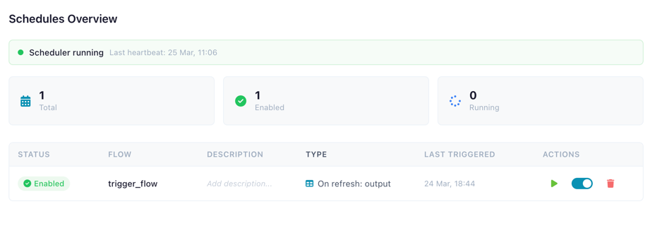
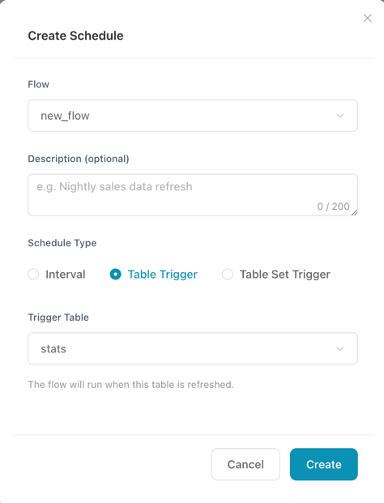
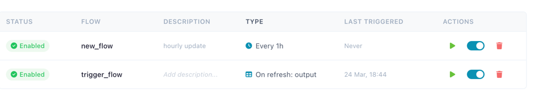
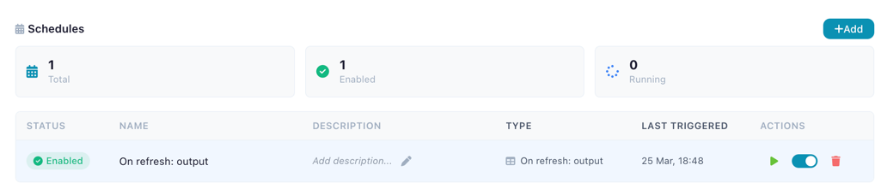

# Schedules

Automate flow execution with schedules — run flows on a timer or trigger them when catalog tables are refreshed.

<!-- PLACEHOLDER: Screenshot of the Schedules tab showing the overview with summary cards and schedule list -->


*The Schedules tab with scheduler status, summary cards, and schedule list*

---

## Overview

The scheduling system allows you to automate registered flows without manual intervention. Schedules are managed from the **Schedules** tab in the Catalog, or from individual flow detail panels.

Three schedule types are supported:

| Type | Description |
|------|-------------|
| **Interval** | Run a flow every N minutes (minimum 1 minute) |
| **Table Trigger** | Run a flow when a specific catalog table is refreshed |
| **Table Set Trigger** | Run a flow when **all** tables in a set have been refreshed |

!!! info "Scheduler must be running"
    Schedules are only active while the scheduler process is running. See [Scheduler Status](#scheduler-status) for details on how the scheduler operates.

---

## Schedules Tab

Click the **Schedules** tab in the Catalog to see the schedule overview. The tab shows:

- **Scheduler status bar** — indicates whether the scheduler is running
- **Summary cards** — total schedules, enabled count, and currently running count
- **Schedule list** — all configured schedules with status, flow name, type, last triggered time, and actions

---

## Creating a Schedule

1. Click **Create Schedule** from the Schedules tab, or click **Add** in a flow's Schedules section
2. Select a **flow** from the dropdown (only flows with existing files are shown)
3. Optionally add a **description** (e.g., "Nightly sales data refresh")
4. Choose a **schedule type**:

<!-- PLACEHOLDER: Screenshot of the Create Schedule modal showing flow selector, type options, and interval configuration -->


*The Create Schedule modal with flow selection and schedule type configuration*

### Interval Schedule

Set how often the flow should run:

- Enter the interval in **minutes** (minimum 1 minute)
- The scheduler checks for due interval schedules every polling cycle (default: 30 seconds)
- A flow will not be triggered again if it already has an active run

### Table Trigger

Run a flow automatically when a catalog table is updated:

- Select a **trigger table** from the dropdown
- Tables read by the selected flow are shown first for convenience
- The flow runs each time the trigger table's data is overwritten via a Catalog Writer node

### Table Set Trigger

Run a flow when **all** tables in a set have been refreshed:

- Select **at least 2 tables** from the dropdown
- The flow only runs once all selected tables have been updated since the last trigger
- Useful for flows that depend on multiple upstream data sources

---

## Managing Schedules

Each schedule in the list provides inline actions:

<!-- PLACEHOLDER: Screenshot of schedule row actions showing run now button, enable/disable toggle, and delete button -->


*Schedule actions: run now, enable/disable toggle, and delete*

| Action | Description |
|--------|-------------|
| **Run Now** | Trigger the flow immediately, regardless of the schedule timer |
| **Enable / Disable** | Toggle the schedule on or off without deleting it |
| **Edit Description** | Click the description text to edit it inline |
| **Delete** | Remove the schedule (with confirmation dialog) |
| **Cancel Run** | Stop a currently running flow (sends SIGTERM to the process) |

!!! warning "One active run per flow"
    A flow can only have one active run at a time. If a flow is already running, new triggers (both scheduled and manual) are skipped until the current run completes.

---

## Flow Detail Panel

Schedules for a specific flow are also shown in the flow detail panel within the Catalog:

<!-- PLACEHOLDER: Screenshot of the Flow Detail Panel showing the Schedules section with summary cards and schedule list -->


*Schedules section in the flow detail panel*

The flow detail panel includes:

- **Run Flow** button — trigger the flow immediately without needing a schedule
- **Cancel Run** button — stop a running flow
- **Schedules section** with summary cards (total, enabled, running) and the same management actions

---

## Active Runs

When flows are running (either from schedules or manual triggers), an **active runs banner** appears showing:

- The name of each running flow
- When the run started
- A **Cancel** button to stop the run

<!-- PLACEHOLDER: Screenshot of the active runs banner showing running flows with cancel buttons -->


*Active runs banner with running flow information and cancel buttons*

Active runs are automatically polled every 20 seconds. When all runs complete, the run history and schedule data refresh automatically.

---

## Run History Integration

Scheduled and manual runs appear in the Run History with additional context:

<!-- PLACEHOLDER: Screenshot of the Run History tab showing the Triggered By column with scheduled/manual/full run indicators -->


*Run history showing run types and trigger information*

| Column | Description |
|--------|-------------|
| **Triggered By** | Shows how the run was started: Scheduled, Manual, or Full Run |
| **Run Type Icon** | Calendar icon for scheduled, hand icon for manual, play icon for full run |

### Run Logs

Scheduled and manual runs write their output to log files. When viewing a run's detail panel, click **View log** to see the full execution log. Logs are stored at `~/.flowfile/logs/scheduled_run_{run_id}.log`.

---

## Scheduler Status

The scheduler status bar at the top of the Schedules tab shows whether the scheduler is active:

<!-- PLACEHOLDER: Screenshot of the scheduler status bar showing green dot (running) and orange dot (not running) states -->


*Scheduler status bar — green when running, orange when stopped*

| State | Indicator | Description |
|-------|-----------|-------------|
| **Running** | Green dot | The scheduler is actively polling for due schedules |
| **Not running** | Orange dot | No scheduler is active; schedules will not fire |

### Embedded Mode (Desktop / Python)

When running Flowfile as a desktop app or via `pip install flowfile`, the scheduler runs **inside the Flowfile process**:

- Start/stop the scheduler from the Schedules tab using the **Start** / **Stop** buttons
- Schedules are only active while Flowfile is running

### Standalone Mode

Run the scheduler as an independent background service:

```bash
pip install flowfile
flowfile run flowfile_scheduler
```

In standalone mode:

- The scheduler runs independently and survives UI restarts
- The Schedules tab shows "running as a standalone service" with no start/stop controls
- Only one scheduler instance can be active at a time (enforced via an advisory database lock)
- If a scheduler stops unexpectedly, another instance can take over after 90 seconds

### Docker Mode

In Docker deployments, set the `FLOWFILE_SCHEDULER_ENABLED` environment variable to auto-start the scheduler:

```yaml
environment:
  - FLOWFILE_SCHEDULER_ENABLED=true
```

See [Docker Reference](../deployment/docker.md) for full configuration.

---

## Related Documentation

- [Catalog](catalog.md) — Managing flows, tables, and run history
- [Output Nodes](nodes/output.md#catalog-writer) — Writing data to catalog tables (triggers table-based schedules)
- [Docker Reference](../deployment/docker.md) — Docker deployment with scheduler enabled
