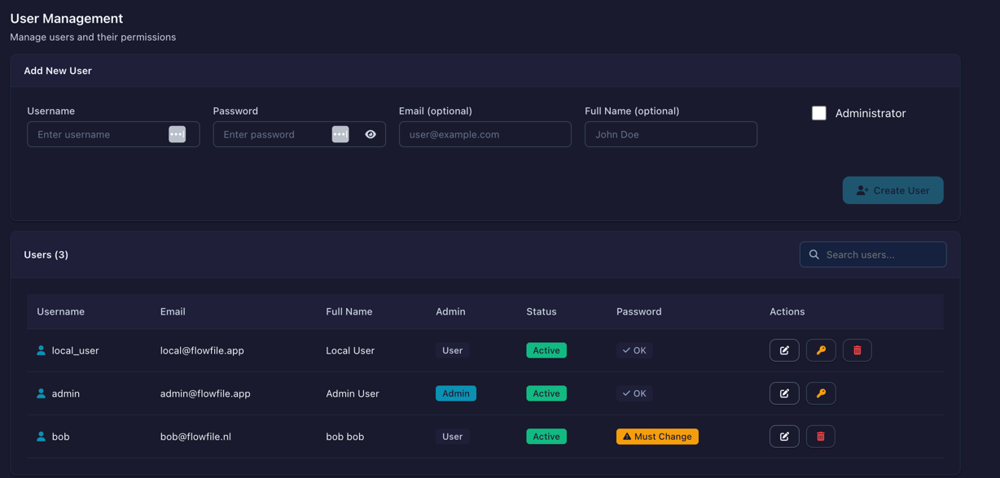

# Settings

Configure Flowfile's appearance and behavior.

## The Settings menu

The **Settings** gear icon in the left sidebar opens the Settings menu, grouped by purpose.

| Group | Items | Notes |
|-------|-------|-------|
| **Connections** | **All connections**: Overview, Database, Cloud Storage, Kafka, Google Analytics, Secrets | Opens the [Connections](connections.md) page on **Overview**; the other names are its in-page tabs. [Secrets](catalog/secrets.md) covers encrypted credential storage. |
| **AI** | Providers; Assistant | Providers holds the API keys per LLM provider and the optional on-device model; Assistant holds the default model and agent behaviour — see [Provider Setup](../../ai/providers.md) and [AI Assistant](../../ai/index.md). |
| **Execution** | Python Kernels; Performance | Python Kernels manages the containers described in [Kernel Execution](kernels.md). **Performance** is admin-only in Docker. |
| **Preferences** | Privacy; Backups | Privacy holds the telemetry consent described in [Privacy & Telemetry](../telemetry.md). **Backups** is admin-only in Docker — see [Database backups](../deployment/backups.md). |
| **Extensions** | Node Designer, Custom Nodes, Community Nodes | [Node Designer](node-designer.md) authors and publishes nodes; [Community Nodes](community-nodes.md) browses and installs shared ones. |
| **Workspace** | Project; File Manager, User Groups, User Management | Project is [project tracking](../projects.md). File Manager, User Groups and User Management are Docker only; User Management is also admin-only. [Sharing](../deployment/sharing.md) covers groups and grants. |

## Theme

Open the **Help & more** menu (the **?** button at the bottom of the sidebar) and click **Dark mode** / **Light mode** to switch between:

| Mode | Description |
|------|-------------|
| **Light** | White backgrounds |
| **Dark** | Reduced brightness for low-light |

Until you choose, Flowfile follows the operating-system theme. Your preference persists across sessions.

## User Management

*Available in Docker mode only.*

Manage team access from the User Management page. In the sidebar, click **Settings** (gear icon), then **Workspace → User Management**.

### Creating Users

1. Click **Add User**
2. Enter username, email, full name
3. Set temporary password
4. Optionally grant admin privileges
5. Click **Create**

New users must change their password on first login.

### Password Requirements

- Minimum 8 characters
- At least one number
- At least one special character (`!@#$%^&*()_+-=[]{}|;:,.<>?`)

### Admin Privileges

Admins can:

- Create, modify, and delete users
- View all users in the system
- Grant/revoke admin status

### Deleting Users

Deleting a user removes their:

- Account and login access
- Stored secrets
- Saved connections

Flow definitions are preserved.

## Usage telemetry

Flowfile can send anonymous usage statistics so we can see how the platform is used and what to improve. It is off by default. A one-time dialog asks for consent, and you can change your answer under **Settings → Preferences → Privacy**. [Privacy & Telemetry](../telemetry.md) lists what is sent.

## Related

- [Secrets](catalog/secrets.md) - Encrypted credential storage
- [Docker](../deployment/docker.md) - Docker deployment
- [Privacy & Telemetry](../telemetry.md) - What usage statistics are sent, and how to turn them off
