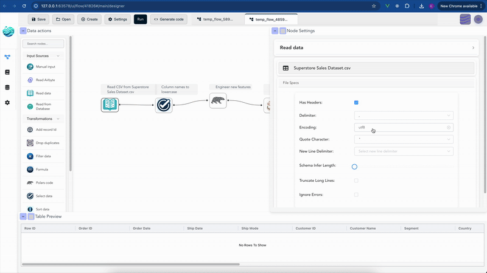

# Building code with flows

Flowfile's Code Generator allows you to export your visually designed data pipelines as clean, executable Python code. This feature is designed to empower users who wish to inspect the underlying data transformation logic, integrate Flowfile pipelines into existing Python projects, or extend their workflows with custom scripts.

The generated code is entirely self-contained and relies mostly on the Polars library, ensuring it can run independently of Flowfile.


## Key Characteristics of the Generated Code

When you generate code from your Flowfile graph, you can expect the output to be:

* **Standalone**: The code functions independently, requiring only Polars and common Python libraries.
* **Readable**: The structure mirrors your visual flow, making it easy to understand the sequence of operations.
* **Direct Translation**: Each Flowfile node and its configured settings are directly translated into equivalent Polars operations.
* **Ready for Integration**: You can copy, modify, and embed this code into other Python applications or scripts.

## Examples of Generated Code

Here are some simplified examples illustrating what the generated Polars code looks like for common Flowfile operations. These examples highlight how your visual workflow seamlessly translates into Python.

### Example 1: Reading a CSV and Selecting Columns

This example shows how a pipeline that reads a CSV file and then selects/renames specific columns translates into Polars code.

**Flowfile Pipeline:**

1.  **Read CSV** (e.g., `customers.csv`)
2.  **Select** (e.g., keep `name` as `customer_name`, `age`)

<details markdown="1">
<summary>Generated Polars Code</summary>

```python
# Example 1: Reading a CSV and Selecting Columns
import polars as pl

def run_etl_pipeline():
    """
    ETL Pipeline: Example CSV Read and Select
    Generated from Flowfile
    """
    df_1 = pl.scan_csv("/path/to/your/customers.csv")
    df_2 = df_1.select(
        pl.col("name").alias("customer_name"),
        pl.col("age")
    )
    return df_2

if __name__ == "__main__":
    pipeline_output = run_etl_pipeline()
```

</details>

### Example 2: Grouping and Aggregating Data

This example demonstrates the code generated for a pipeline that processes a dataset and performs a group by operation with aggregations.

**Flowfile Pipeline:**

1.  **Manual Input** (sample sales data with `product` and `revenue`)
2.  **Group By** (e.g., group by `product`, sum `revenue` as `total_revenue`)

<details markdown="1">
<summary>Generated Polars Code</summary>

```python
# Example 2: Grouping and Aggregating Data
import polars as pl

def run_etl_pipeline():
    """
    ETL Pipeline: Example Grouping and Aggregating
    Generated from Flowfile
    """
    # Simplified manual input example
    df_1 = pl.LazyFrame(
        {
            "product": ["A", "B", "A", "B", "C"],
            "revenue": [100.0, 200.0, 100.0, 200.0, 150.0],
        }
    )
    df_2 = df_1.group_by(["product"]).agg([
        pl.col("revenue").sum().alias("total_revenue"),
    ])
    return df_2

if __name__ == "__main__":
    pipeline_output = run_etl_pipeline()
```

</details>

### Example 3: Custom Polars Code Execution

For advanced users, Flowfile offers a "Polars Code" node where you can write custom Polars expressions. Here's how that custom code is integrated into the generated script.

**Flowfile Pipeline:**

1.  **Manual Input** (a basic DataFrame)
2.  **Polars Code** (a node containing custom Polars logic, e.g., adding a new column)

<details markdown="1">
<summary>Generated Polars Code</summary>

```python
# Example 3: Custom Polars Code Execution
import polars as pl

def run_etl_pipeline():
    """
    ETL Pipeline: Custom Polars Code Example
    Generated from Flowfile
    """
    df_1 = pl.LazyFrame({"value": [1, 2, 3]})

    # Custom Polars code as defined in the Flowfile node
    def _custom_code_node_name(input_df: pl.LazyFrame):
        return input_df.with_columns((pl.col('value') * 10).alias('scaled_value'))

    df_2 = _custom_code_node_name(df_1)
    return df_2

if __name__ == "__main__":
    pipeline_output = run_etl_pipeline()
```

</details>

These examples provide a clear overview of the type of high-quality, executable Python code produced by Flowfile's Code Generator.