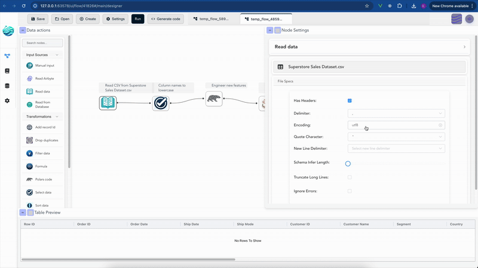

# Export to Python

The Code Generator exports a visually designed flow as executable Python. Use it to inspect the transformation logic behind a flow, integrate a Flowfile pipeline into an existing Python project, or extend a workflow with custom scripts.

The Code panel offers four modes. **FlowFrame**, **Polars** and **Project** produce production code and are described below. **Plain Python** is different in kind: it rewrites the flow using nothing but lists, dicts and `for` loops, to show how you would implement each step by hand. See [Plain Python](#plain-python).

For pure transformation flows (filter, join, group by, etc.), the generated code is Polars — usually just `import polars as pl`, and never an `import flowfile`. A few nodes add a small standalone helper package instead of native Polars: formula and advanced-filter expressions that can't be lowered to native Polars pull in `polars_expr_transformer`, fuzzy match pulls in `pl_fuzzy_frame_match`, and the graph solver pulls in `polars_grouper` — each a lightweight PyPI package, not Flowfile. Flows that include I/O nodes (database, catalog, cloud storage, Kafka) additionally use `import flowfile as ff` for connection-aware operations. The transformation logic is Polars in every case.



## Key Characteristics of the Generated Code

* Transformation nodes translate to Polars operations; I/O nodes (database, catalog, cloud storage, Kafka) translate to FlowFrame API calls (`ff.read_database()`, `ff.read_catalog_table()`, etc.).
* The structure mirrors your visual flow. Pure transformation flows depend only on Polars (plus a small `polars_*` helper package for formula, fuzzy-match, or graph-solver nodes); flows with I/O nodes require `pip install flowfile`.

## Examples of Generated Code

These simplified examples show what the generated Polars code looks like for common Flowfile operations, and how a visual flow maps to Python.

### Example 1: Reading a CSV and Selecting Columns

This example shows how a pipeline that reads a CSV file and then selects/renames specific columns translates into Polars code.

**Flowfile Pipeline:**

1.  **Read CSV** (e.g., `customers.csv`)
2.  **Select** (e.g., keep `name` as `customer_name`, `age`)

<details markdown="1">
<summary>Generated Polars Code</summary>

```python
# Example 1: Reading a CSV and Selecting Columns
import polars as pl

def run_etl_pipeline():
    """
    ETL Pipeline: Example CSV Read and Select
    Generated from Flowfile
    """
    df_1 = pl.scan_csv("/path/to/your/customers.csv")
    df_2 = df_1.select(
        pl.col("name").alias("customer_name"),
        pl.col("age")
    )
    return df_2

if __name__ == "__main__":
    pipeline_output = run_etl_pipeline()
```

</details>

### Example 2: Grouping and Aggregating Data

This example demonstrates the code generated for a pipeline that processes a dataset and performs a group by operation with aggregations.

**Flowfile Pipeline:**

1.  **Manual Input** (sample sales data with `product` and `revenue`)
2.  **Group By** (e.g., group by `product`, sum `revenue` as `total_revenue`)

<details markdown="1">
<summary>Generated Polars Code</summary>

```python
# Example 2: Grouping and Aggregating Data
import polars as pl

def run_etl_pipeline():
    """
    ETL Pipeline: Example Grouping and Aggregating
    Generated from Flowfile
    """
    # Simplified manual input example
    df_1 = pl.LazyFrame(
        {
            "product": ["A", "B", "A", "B", "C"],
            "revenue": [100.0, 200.0, 100.0, 200.0, 150.0],
        }
    )
    df_2 = df_1.group_by(["product"]).agg([
        pl.col("revenue").sum().alias("total_revenue"),
    ])
    return df_2

if __name__ == "__main__":
    pipeline_output = run_etl_pipeline()
```

</details>

### Example 3: Custom Polars Code Execution

For advanced users, Flowfile offers a "Polars Code" node where you can write custom Polars expressions. Here's how that custom code is integrated into the generated script.

**Flowfile Pipeline:**

1.  **Manual Input** (a basic DataFrame)
2.  **Polars Code** (a node containing custom Polars logic, e.g., adding a new column)

<details markdown="1">
<summary>Generated Polars Code</summary>

```python
# Example 3: Custom Polars Code Execution
import polars as pl

def run_etl_pipeline():
    """
    ETL Pipeline: Custom Polars Code Example
    Generated from Flowfile
    """
    df_1 = pl.LazyFrame({"value": [1, 2, 3]})

    # Custom Polars code as defined in the Flowfile node.
    # The wrapper name is derived from the node id — e.g. _polars_code_2 for node 2.
    def _polars_code_2(input_df: pl.LazyFrame):
        return input_df.with_columns((pl.col('value') * 10).alias('scaled_value'))

    df_2 = _polars_code_2(df_1)
    return df_2

if __name__ == "__main__":
    pipeline_output = run_etl_pipeline()
```

</details>

### Example 4: Reading from the Catalog

When a flow includes I/O nodes like a catalog reader, the generated code imports `flowfile` and uses the FlowFrame API for connection-aware operations.

**Flowfile Pipeline:**

1.  **Catalog Reader** (e.g., `sales_data` table from namespace 3)
2.  **Filter** (e.g., keep rows where `amount > 100`)

<details markdown="1">
<summary>Generated Code</summary>

```python
# Example 4: Catalog Read with Filter
import flowfile as ff
import polars as pl

def run_etl_pipeline():
    """
    ETL Pipeline: Catalog Read and Filter
    Generated from Flowfile
    """
    df_1 = ff.read_catalog_table("sales_data", namespace_id=3).data
    df_2 = df_1.filter(pl.col("amount") > 100)
    return df_2

if __name__ == "__main__":
    pipeline_output = run_etl_pipeline()
```

</details>

!!! note "`.data` accessor"
    The generated code calls `.data` on FlowFrame results to extract the underlying Polars `LazyFrame`. This keeps the rest of the pipeline as standard Polars operations.

## Plain Python

The **Plain Python** mode answers a different question from the other three: not "how do I run this in production", but "how would I write this myself?". It rewrites the flow with no dataframe library at all — every table becomes a `list[dict]` (one dict per row, keyed by column name) and every node becomes an explicit loop.

It exists to make the transferable patterns visible. A group by becomes the accumulator-dict pattern, a join becomes a hash index, a duplicate-drop becomes a `seen` set, a sort becomes a key function. Those are the shapes you would write in any language, and they are exactly what a dataframe library hides.

**Flowfile Pipeline:** Manual Input → Group By (sum `revenue` per `product`)

<details markdown="1">
<summary>Generated Plain Python</summary>

```python
def run_etl_pipeline():
    """
    Sales by product
    Generated from Flowfile — plain Python, no dataframe library.

    Every table here is a list of dicts: one dict per row, keyed by column
    name. Read it top to bottom; each block is one node on the canvas.
    """

    # --- Manual input --------------------------------------------------
    # A table is a list of dicts: one dict per row, keyed by column name.
    # That is the only data structure this whole script uses.
    source = [
        {'product': 'Widget', 'revenue': 100.0},
        {'product': 'Gadget', 'revenue': 200.0},
        {'product': 'Widget', 'revenue': 150.0},
    ]

    # --- Group by ------------------------------------------------------
    # The accumulator-dict pattern: walk the rows once and file each one
    # under its key. Then walk the groups and summarise each one.
    groups = {}
    for row in source:
        key = (row["product"],)
        if key not in groups:
            groups[key] = []
        groups[key].append(row)

    grouped = []
    for key, rows_in_group in groups.items():
        grouped.append({
            "product": key[0],
            "total_revenue": sum(r["revenue"] for r in rows_in_group if r["revenue"] is not None),
        })

    return grouped


if __name__ == "__main__":
    pipeline_output = run_etl_pipeline()
    for row in pipeline_output:
        print(row)
```

</details>

### What it covers

Nodes with a plain-Python form: manual input, CSV read, filter (basic mode), select, sort, unique, group by, join (inner, left, semi and anti), union, record count, and subflow input/output.

Anything driven by the formula expression language — the formula node, a filter in advanced mode, and the Polars-code, SQL and Python-script nodes — has no loop equivalent, because reproducing it in general means writing an expression evaluator. A right, full or outer join is also left out, on the grounds that "a right join is a left join with the tables swapped" is the lesson and a subtly wrong replay of the engine's column bookkeeping is not. Those nodes become **exercise stubs** instead:

```python
# --- formula (node 4) — over to you --------------------------------
# Flowfile evaluates this with its expression engine.
# The rule it applies is:
#     [total_revenue] * 1.21
# Writing this one by hand is the exercise. Replace the raise below with
# a loop that returns the new list of rows, and the rest of the script runs.
def formula_4(rows_0):
    raise NotImplementedError("Flowfile evaluates this with its expression engine")

computed = formula_4(grouped)
```

!!! info "One unsupported node does not fail the export"
    Unlike the Polars and FlowFrame modes, Plain Python never refuses a whole flow. It generates everything it can and leaves a stub where it cannot, so a single formula node still leaves you a readable script.

!!! warning "It is a teaching output, not a production one"
    The generated script runs and produces the same rows as the canvas, but it is deliberately not optimised, does not stream, and does not round-trip back into the visual editor. It holds the whole table in memory as a list, so it is unsuitable for data that does not comfortably fit there.

!!! info "Where the loops look fussier than you'd write by hand"
    Some of the generated code carries guards a first draft would omit, because matching the engine requires them. Missing values sort first in both directions and are never equal to each other in a join key; an aggregate over an all-empty group is empty rather than an error (except `sum`, which is `0`); and a value read from a CSV is text until something converts it. Each of those is a place where a dataframe library quietly makes a decision on your behalf, so seeing the decision written out is the point.

### Per-node explainer

The same machinery powers the **"How would I write this myself?"** panel in every node's settings drawer. It shows a plain-English description of what the node does plus the plain-Python form of *that node's actual settings* — your columns, your operators — rather than a generic example. The panel is collapsed by default and remembers whether you left it open.

!!! tip "In Flowfile Lite the script also runs where you read it"
    [Flowfile Lite](../../deployment/lite.md#learning-mode-plain-python) has the same Plain Python mode, plus a ▶ button: because the browser already has a Python runtime, the generated script executes right there against the same files and prints its rows underneath. That turns an exercise stub into something you can fill in and immediately re-run.

## Project Export

For more complex flows — especially flows that contain **notebook (Python script) nodes** or **custom user-defined nodes** — a single generated script becomes hard to read. The third export mode, **Project**, exports the flow as a structured multi-file Python project instead:

```
my_flow/
├── pyproject.toml          # project metadata, pinned flowfile/polars dependencies
├── README.md               # flow description, node overview, how to run
├── main.py                 # entry point: python main.py
├── pipeline.py             # the FlowFrame pipeline (run_etl_pipeline())
├── flowfile_ctx.py         # local stand-in for the kernel flowfile_ctx API
├── notebooks/
│   └── node_05_clean_data.py   # one module per notebook node, code kept verbatim
└── custom_nodes/
    └── my_custom_node.py       # user-defined node classes, source kept verbatim
```

Key points:

* **Notebook nodes are exported** (they are not supported by the single-file modes). Each one becomes its own module exposing a `run()` function that the pipeline calls with the node's input frames; the notebook code is preserved verbatim inside it (cell structure kept via `# %%` markers), and the bundled `flowfile_ctx.py` shim makes `read_input()` / `publish_output()` / artifacts / logging work standalone — inputs and outputs are exchanged in memory as Polars LazyFrames.
* **Custom nodes get their own modules** under `custom_nodes/` instead of being inlined into the script.
* The pipeline itself uses the **FlowFrame API** (`import flowfile as ff`).
* Server-backed `flowfile_ctx` APIs (global artifacts, catalog access) raise `NotImplementedError` in the exported project; the export panel and the generated README list these limitations per node.

From the Code panel you can either **download the project as a .zip** or **save it directly into a folder** using the built-in file browser.

!!! info "Editing exported code"
    Exported code runs standalone; it does not round-trip back into the visual canvas. To keep editing a flow visually, work in the Designer and re-export.