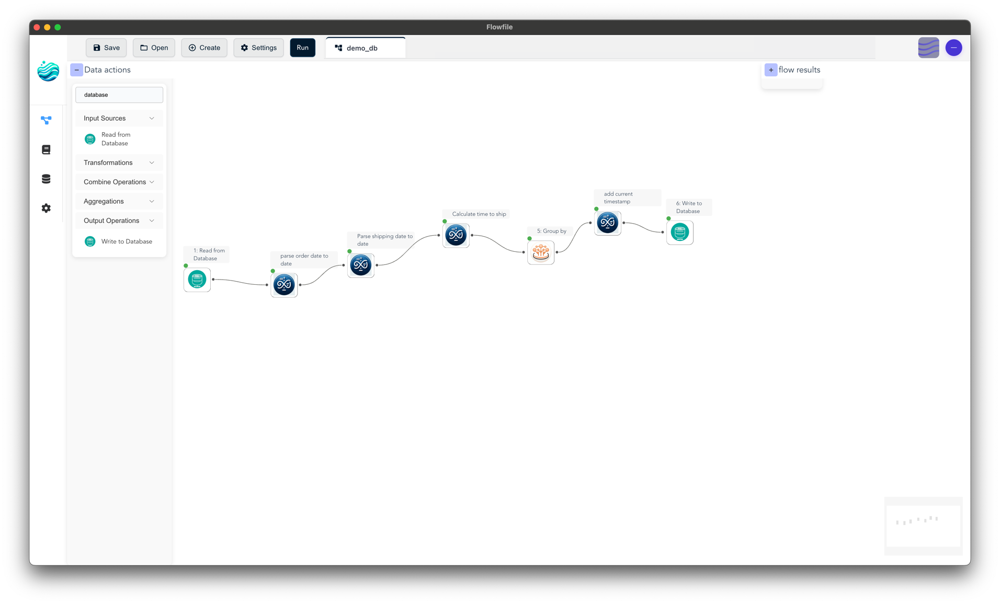
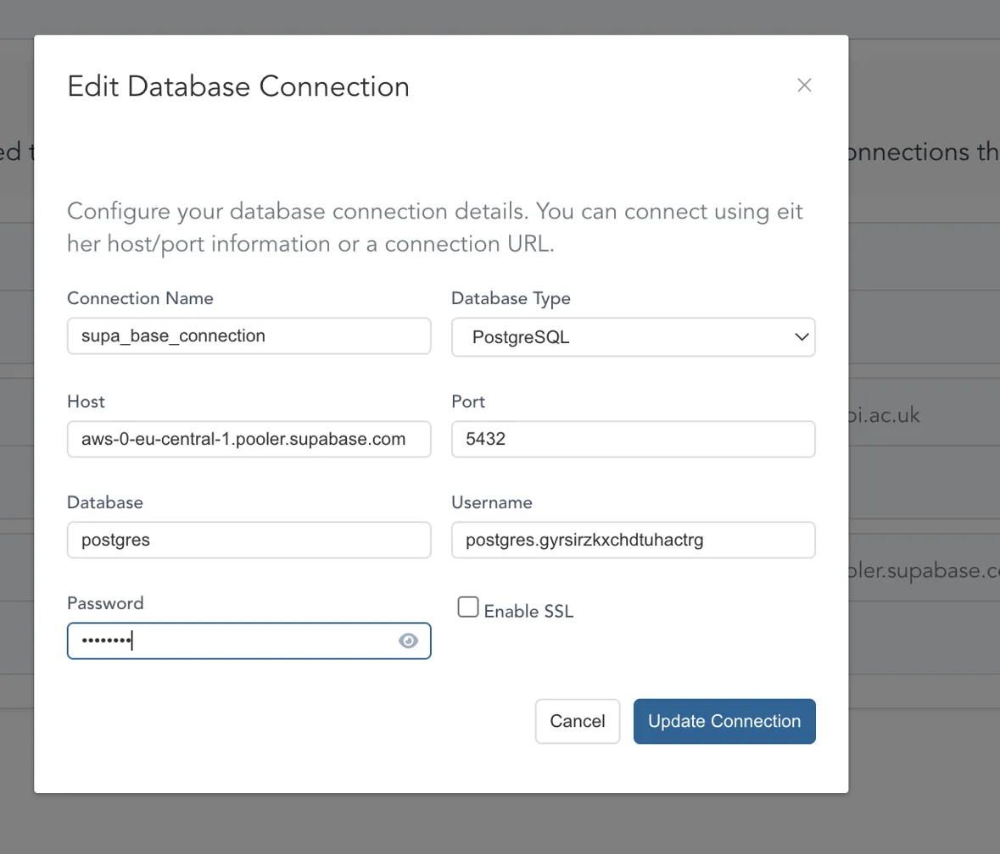
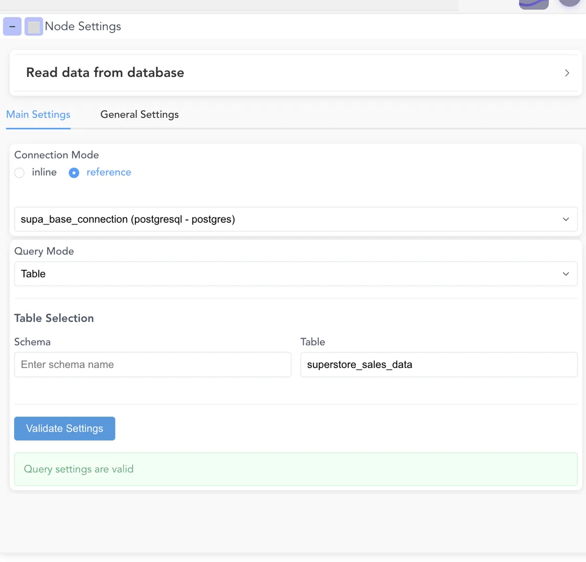
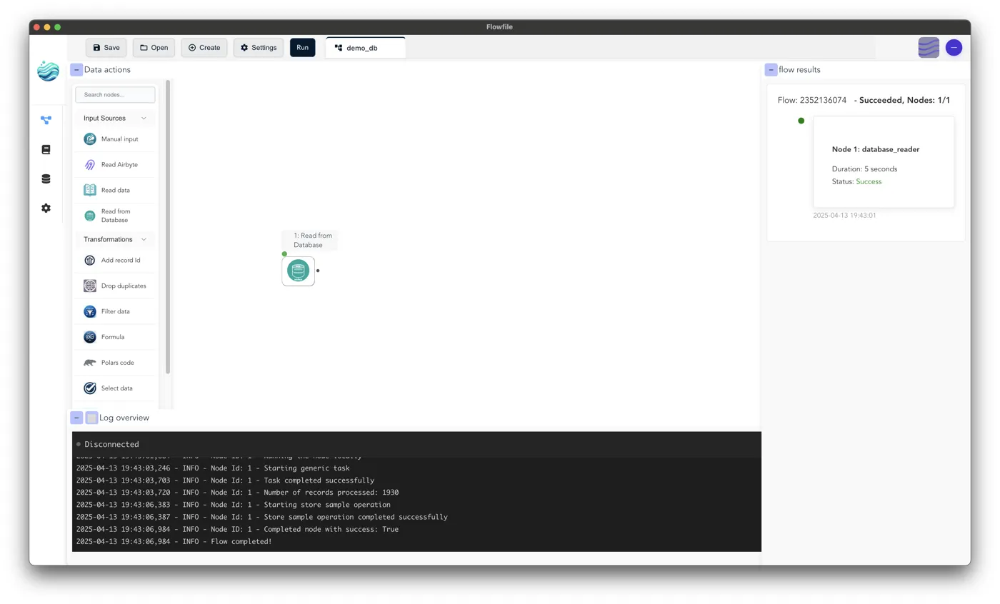
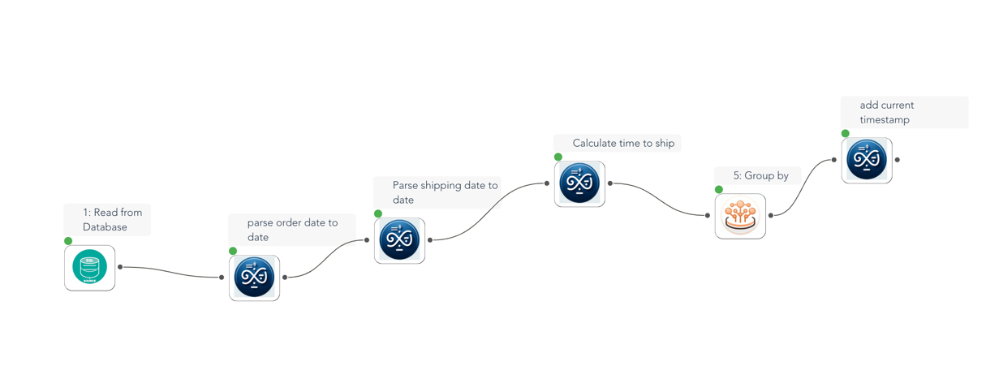
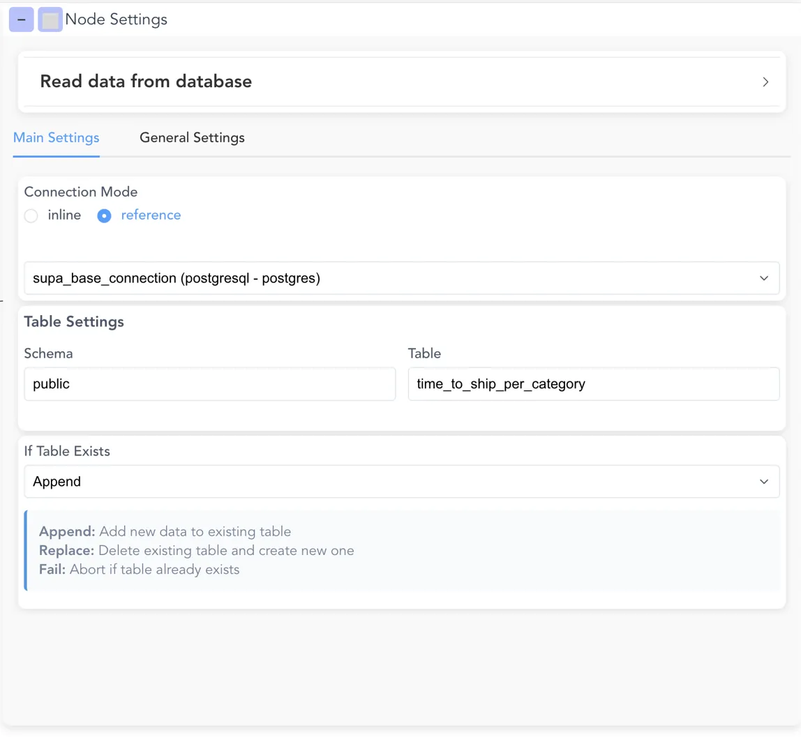
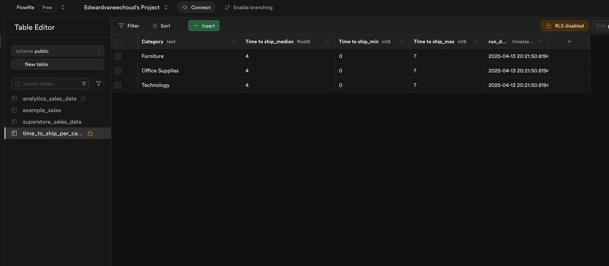

# Connect to a PostgreSQL database

This tutorial connects Flowfile to a PostgreSQL database (the example uses Supabase, but any PostgreSQL server works), reads a table, transforms it, and writes the result back to a new table.

!!! info "Not in Flowfile Lite"
    Database connectivity requires the full desktop/server build. This tutorial does not apply to the browser-only [Flowfile Lite](../../deployment/lite.md) edition, which has no backend.

*The finished flow: read from a database, transform, and write back.*

## Prerequisites

- A running Flowfile install (desktop, `pip install flowfile`, or Docker)
- A PostgreSQL database you can reach, with credentials (host, port, database, username, password). This example uses [Supabase](https://supabase.com); any PostgreSQL server works.
- A table of data to read. This example uses the [Sales Forecasting dataset](https://www.kaggle.com/datasets/rohitsahoo/sales-forecasting) from Kaggle so the transformation steps line up.

## Step 1: Load sample data into your database

If you already have a table to read, skip to Step 2. Otherwise, load the sample dataset:

1. Create a database (or a Supabase project).
2. Download the sample dataset from Kaggle.
3. Create a table (e.g. `superstore_sales_data`).
4. Import the CSV into the table. Supabase offers a CSV import in the Table Editor; other tools have equivalents.
5. Note the connection details — host, port, username, and password.

## Step 2: Create a database connection in Flowfile

Save the credentials once so you can reference them by name in any flow.

1. Open the **Connections** page from the left sidebar and select the **Database** tab.
2. Click **Create New Connection**.
3. Fill in the fields:
    - **Connection Name**: `supabase_connection` (any name)
    - **Database Type**: PostgreSQL
    - **Host**: your database host (e.g. `aws-0-eu-central-1.pooler.supabase.com`)
    - **Port**: `5432`
    - **Database**: `postgres`
    - **Username** / **Password**: your credentials
    - **Enable SSL**: check if your database requires it (Supabase typically does)
4. Click **Update Connection** to save.

<!-- IMAGE-PLACEHOLDER-TO-CHANGE: the Connections page, Database tab, with a saved PostgreSQL connection -->

*A saved database connection on the Connections page.*

See [Connections](../connections.md#database-connections) for a full field reference.

## Step 3: Read from the database

1. Create a new flow (**Create** or **New Flow**).
2. From the node palette, drag a **Read from Database** node onto the canvas.
3. Click the node to open its settings panel.
4. Set **Connection Mode** to **reference**, then select `supabase_connection` from the dropdown.
5. Set the table:
    - **Schema**: `public` (or your schema)
    - **Table**: `superstore_sales_data`
6. Click **Validate Settings**. A green confirmation appears when the query settings are valid.

*The Read from Database node configured in reference mode.*

## Step 4: Run and preview

1. Click **Run** in the toolbar.
2. Watch progress in the log panel at the bottom.
3. On success, click the node's output to preview the rows read from the database.

<!-- IMAGE-PLACEHOLDER-TO-CHANGE: the log panel showing a successful database read run -->

*A successful run of the read step.*

## Step 5: Add transformations

With data flowing in, add transformation nodes. For example, to compute shipping time per product category:

1. Add a **Formula** node to derive `shipping_time_days` from the ship and delivery dates (e.g. `[delivery_date] - [shipping_date]`). Add a preceding Formula node to cast those columns to a date type first if they arrive as text.
2. Add a **Group by** node keyed on the product category, aggregating `min`, `max`, and `median` of `shipping_time_days`.
3. Connect the nodes in sequence by dragging from one node's output dot to the next node's input dot.

For per-node settings, see the [node reference](../nodes/transform.md).

*Read → Formula → Group by.*

## Step 6: Write the result back

1. Drag a **Write to Database** node onto the canvas and connect it to the last transformation node.
2. In its settings panel:
    - **Connection Mode**: **reference**
    - **Connection**: `supabase_connection`
    - **Schema**: `public`
    - **Table**: a new table name (e.g. `time_to_ship_per_category`)
    - **If Table Exists**: choose how to handle an existing table —
        - **Append**: add rows to the existing table
        - **Replace**: drop the existing table and recreate it with the new data
        - **Fail**: abort the run if the table already exists

*The Write to Database node in reference mode.*

## Step 7: Run the full flow

1. Click **Run** to execute the whole flow.
2. Flowfile reads the source table, applies the transformations, and writes the aggregated result to your destination table.
3. Check the logs for records read and written.
4. Open your database and query the destination table to confirm the output.

<!-- IMAGE-PLACEHOLDER-TO-CHANGE: the destination table populated in the database -->

*The destination table populated with the aggregated result.*

## Next steps

- Reference the same connection in other flows — no need to re-enter credentials.
- Export the flow to Python with the [Code Generator](code-generator.md); reference-mode database nodes translate to `ff.read_database()` / `ff.write_database()` calls.
- Schedule the flow to refresh on a timer — see [Schedules](../catalog/schedules.md).

## Related documentation

- [Connections](../connections.md) — saved database, cloud, and Kafka connections
- [Input Nodes: Database Reader](../nodes/input.md#database-reader)
- [Output Nodes: Database Writer](../nodes/output.md#database-writer)
- [Secrets](../catalog/secrets.md) — how credentials are encrypted
