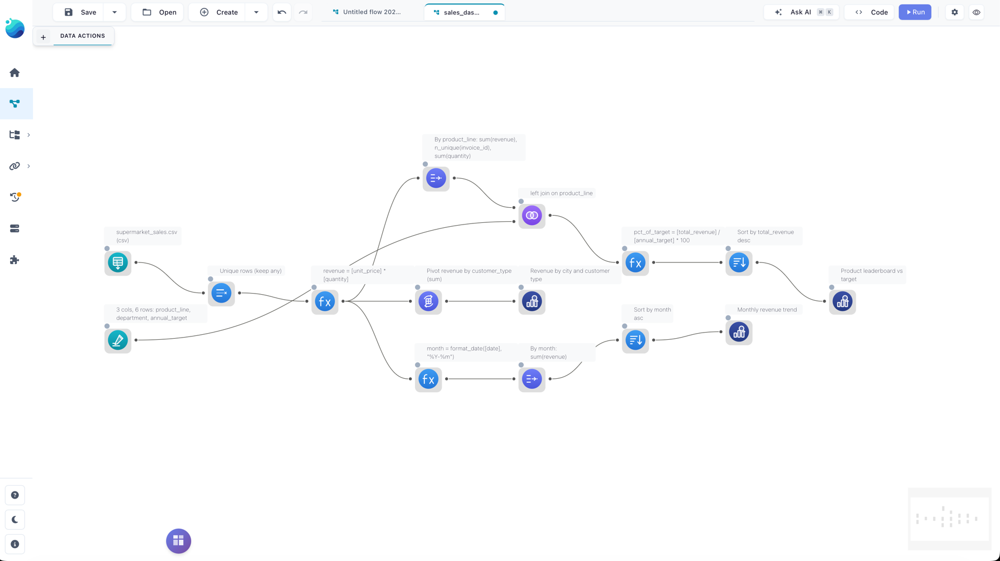
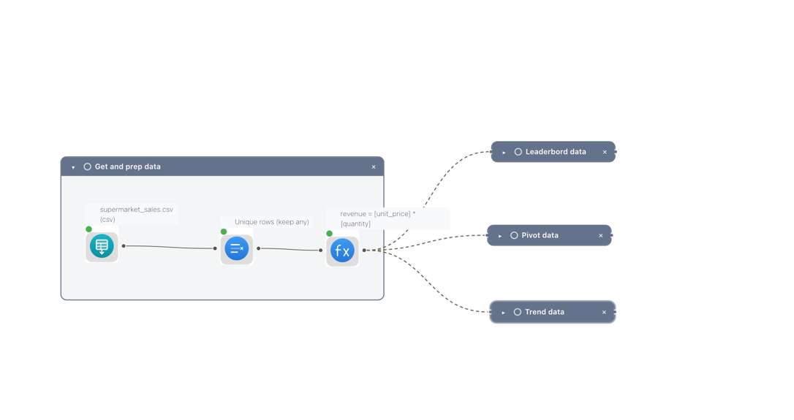
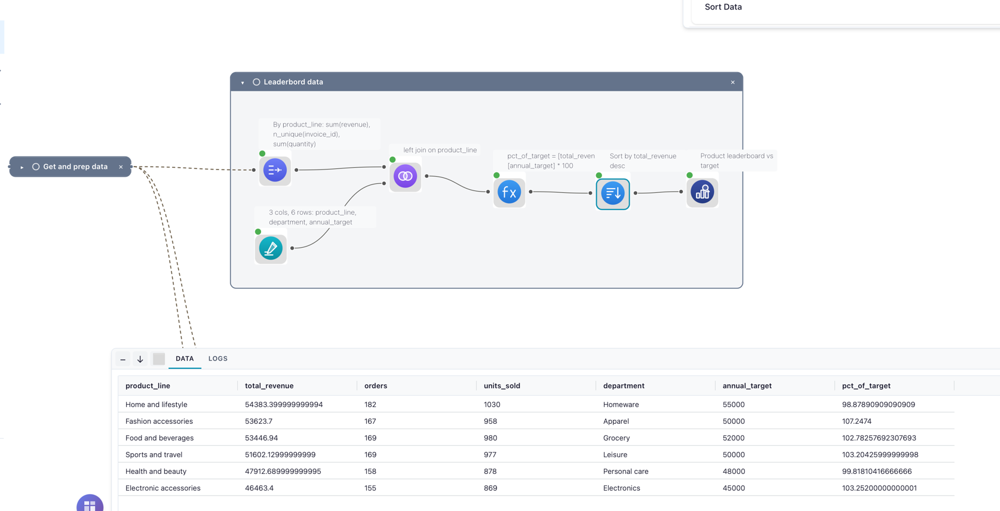
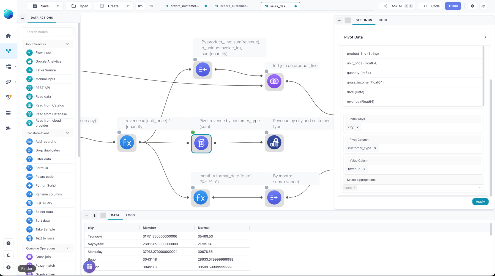
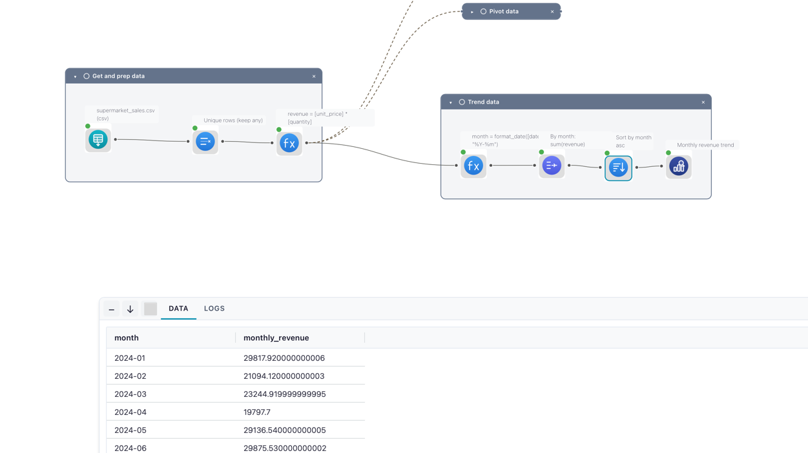
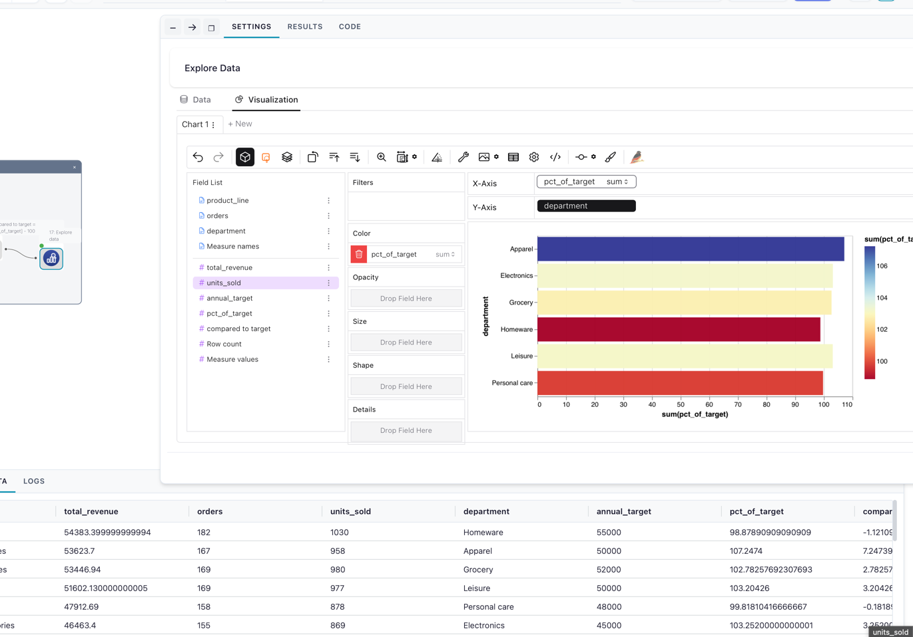
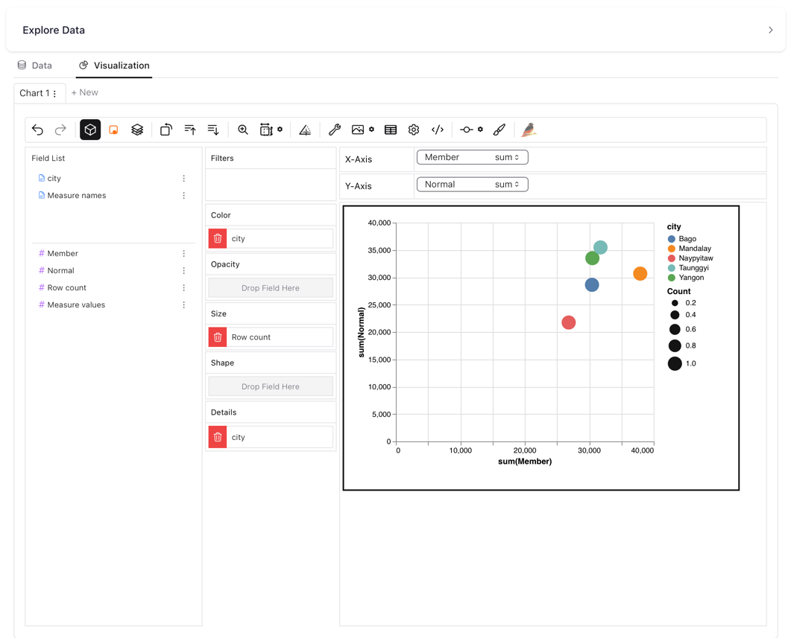
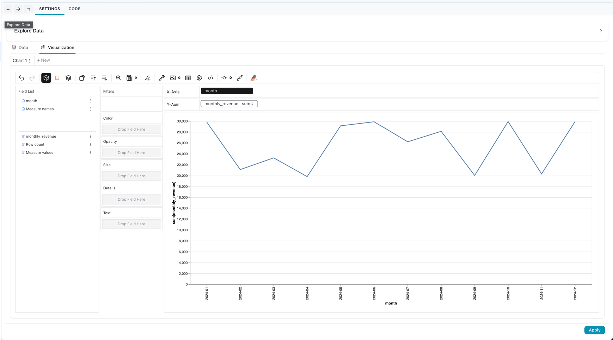

# Build a sales dashboard from one cleaned table

This example cleans a raw sales export once, then forks into three views: a product leaderboard measured against per-line revenue targets, a revenue matrix by city and customer type, and a monthly revenue trend. It's for analysts who have outgrown a single summary and want several angles on the same data without repeating the cleaning each time. It builds on the [five-node sales pipeline](sales-pipeline.md); read that one first if branching flows are new to you.

**Flow:** [`sales_dashboard.yaml`](https://github.com/edwardvaneechoud/Flowfile/blob/main/data/templates/flows/sales_dashboard.yaml) ·
In-app: Create → From template → "Sales dashboard: rank, pivot, and trend" · Data: `data/templates/supermarket_sales.csv`

<details markdown="1" open>
<summary>See it: the finished dashboard on the canvas</summary>



</details>

## The data

`supermarket_sales.csv` holds 1030 transaction rows for the 2024 calendar year — including 30 exact duplicate rows to clean up.

| Column | Meaning |
|--------|---------|
| `invoice_id` | Transaction identifier |
| `city` | Store city (Bago, Mandalay, Naypyitaw, Taunggyi, Yangon) |
| `customer_type` | Member or Normal |
| `product_line` | Product category (six of them) |
| `unit_price` | Price per unit |
| `quantity` | Units sold |
| `gross_income` | Income for the line |
| `date` | Transaction date |

## The flow

The flow shares one cleaned, enriched stream and branches it three ways.

**Prepare the data** (the trunk):

1. **Read data** — reads `supermarket_sales.csv` (file type CSV). The `date` column is parsed as a real date.
2. **Drop duplicates** — Unique with strategy `any` and no key columns, removing the 30 fully-identical rows.
3. **Formula** — adds `revenue` = `[unit_price] * [quantity]`. This node has three outgoing connections; each branch below reads from it.

<details markdown="1">
<summary>See it: the enriched trunk and its three-way fork</summary>



</details>

**Branch 1 — product leaderboard vs target:**

4. **Group by** — groups by `product_line`, aggregating `revenue` (sum → `total_revenue`), `invoice_id` (n-unique → `orders`), and `quantity` (sum → `units_sold`).
5. **Manual input** — a six-row lookup giving each `product_line` a `department` and an `annual_target`.
6. **Join** — a left join of the leaderboard (main input) to the lookup (right input) on `product_line`, carrying `department` and `annual_target` onto each row.
7. **Formula** — adds `pct_of_target` = `[total_revenue] / [annual_target] * 100`.
8. **Sort** — `total_revenue` descending, so the best-selling line is on top.
9. **Explore data** — opens the ranking in the Graphic Walker explorer.

<details markdown="1">
<summary>See it: the leaderboard joined to its targets</summary>



</details>

**Branch 2 — revenue by city and customer type:**

10. **Pivot** — index `city`, pivot column `customer_type`, values `revenue`, aggregation `sum`. This reshapes the data into one row per city with a `Member` and a `Normal` column.
11. **Explore data** — opens the matrix.

<details markdown="1">
<summary>See it: the city × customer-type pivot</summary>



</details>

**Branch 3 — monthly trend:**

12. **Formula** — adds `month` = `format_date([date], "%Y-%m")`, turning each date into a `2024-01`-style label.
13. **Group by** — groups by `month`, summing `revenue` → `monthly_revenue`.
14. **Sort** — `month` ascending, so the months read in order.
15. **Explore data** — opens the trend.

<details markdown="1">
<summary>See it: the monthly trend branch</summary>



</details>

## Run it

- **In your browser** — [open it in Flowfile Lite](../../../assets/try-sales-dashboard.html): the flow travels in the link and reads the sample CSV from its public URL. Click **Run** when it loads.
- **From the template browser** — Create → From template → "Sales dashboard: rank, pivot, and trend". The sample data is wired in; click **Run**.
- **Download and open** — grab [`sales_dashboard.yaml`](../../../assets/flows/sales_dashboard.yaml) and open it in the designer. Its Read node points at the sample CSV's public URL, so it runs as-is with an internet connection — or repoint it at a local copy.
- **Headless** — once saved with a real data path, run it from the command line:

```bash
flowfile run flow path/to/your_flow.yaml
```

## The result

**Product leaderboard vs target** (Branch 1), over the deduplicated rows:

| `product_line` | `total_revenue` | `orders` | `units_sold` | `department` | `annual_target` | `pct_of_target` |
|----------------|----------------|----------|--------------|--------------|-----------------|-----------------|
| Home and lifestyle | 54383.40 | 182 | 1030 | Homeware | 55000 | 98.88 |
| Fashion accessories | 53623.70 | 167 | 958 | Apparel | 50000 | 107.25 |
| Food and beverages | 53446.94 | 169 | 980 | Grocery | 52000 | 102.78 |
| Sports and travel | 51602.13 | 169 | 977 | Leisure | 50000 | 103.20 |
| Health and beauty | 47912.69 | 158 | 878 | Personal care | 48000 | 99.82 |
| Electronic accessories | 46463.40 | 155 | 869 | Electronics | 45000 | 103.25 |

<details markdown="1">
<summary>See it: the leaderboard charted in Graphic Walker</summary>



</details>

**Revenue by city and customer type** (Branch 2):

| `city` | `Member` | `Normal` |
|--------|----------|----------|
| Bago | 30431.18 | 28633.08 |
| Mandalay | 37913.27 | 30676.55 |
| Naypyitaw | 26816.89 | 21739.14 |
| Taunggyi | 31751.35 | 35469.53 |
| Yangon | 30491.67 | 33509.60 |

<details markdown="1">
<summary>See it: the revenue matrix charted</summary>



</details>

**Monthly trend** (Branch 3) runs from `2024-01` at 29817.92 to `2024-12` at 29917.37, one row per month.

<details markdown="1">
<summary>See it: the monthly trend line</summary>



</details>

## In Python

The same three views with the [FlowFrame API](../../python-api/index.md) — clean once into `base`, then derive each view from it. Every source is built into one `graph` (note `flow_graph=graph` on the read and the lookup), so `ff.open_graph_in_editor(graph)` opens all three branches back in the visual editor:

```python
--8<-- "docs/examples/sales_dashboard.py:example"
```

## Variations

- **Pull targets from elsewhere** — the targets live inline in a Manual Input here; replace it with a Read node (a spreadsheet, or a [database](database-connectivity.md) table) to keep the Join wired to real, maintained targets.
- **Change the pivot axes** — swap `customer_type` for `product_line` on the Pivot node to see each product's revenue per city.
- **Trend a different measure** — point Branch 3's Group by at `gross_income` or `quantity` instead of `revenue`.
- **Persist a view** — replace any Explore data node with a [Catalog Writer](../nodes/output.md#catalog-writer) to save that view as a catalog table, then chart it with a [visualization](../catalog/visualizations.md).
