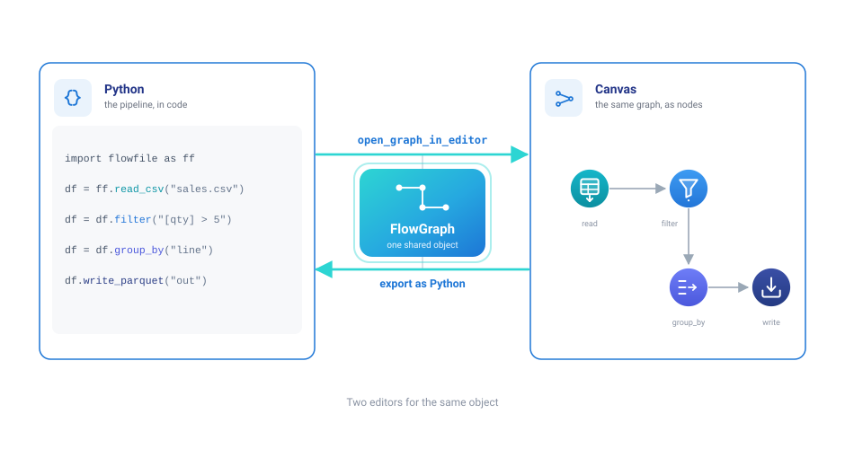
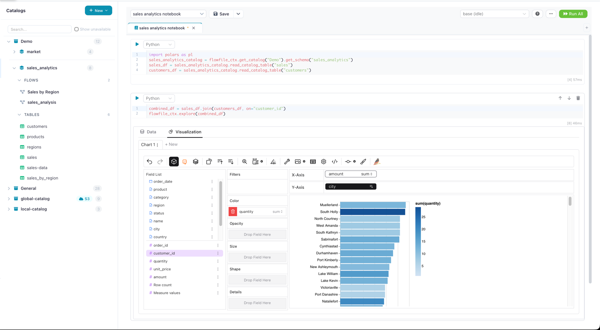

# Write Python

Flowfile's Python API builds pipelines in code, on a Polars-shaped surface. What it adds over writing Polars directly: connection and I/O boilerplate collapses into one-liners, Polars performance and idioms stay intact, and every pipeline is *also* a diagram a non-developer colleague can open, inspect, and take over.

**Every method call adds a node to a graph instead of executing.** The graph is the pipeline — Python and the canvas are two editors for the same object.



## 1. First pipeline

`pip install flowfile`, then — this snippet is a repository file executed by CI on every commit, so it cannot drift from the real API:

```python
--8<-- "docs/examples/first_pipeline.py:example"
```

Nothing runs until `.collect()`: each call appends a node, and collection hands the whole plan to the Polars optimizer at once. That means a pipeline can be built conditionally, passed between functions, or branched — all before any data is read. [FlowFrame and FlowGraph](python-api/concepts/design-concepts.md) covers the model, including how branches share one graph and why schemas resolve without executing anything.

## 2. Your code has a canvas

```python
ff.open_graph_in_editor(result.flow_graph)
```

The pipeline opens in the visual editor as nodes — your colleague walks it step by step, inspects the data between operations, and continues editing visually if that's their medium. Pass `description=` on operations and those become the node labels, which is what makes a code-built graph *legible* rather than merely visible. Details in [Visual UI Integration](python-api/reference/visual-ui.md).

## 3. Connections instead of boilerplate

Credential plumbing, retry-prone connection setup, and path handling are replaced by [named connections](python-api/reference/cloud-connections.md): create one once (in code or in the UI; both share a single encrypted store) and reference it by name in reads and writes against Postgres/MySQL/SQLite/DuckDB/SQL Server, S3/ADLS/GCS, Kafka, and REST endpoints. The [reading](python-api/reference/reading-data.md) and [writing](python-api/reference/writing-data.md) references cover every entry point, and the database and cloud examples execute against real services in CI.

## 4. The catalog from code

The [catalog](visual-editor/catalog/index.md) is where scripts and visual flows meet: `ff.write_catalog_table` publishes a frame as a versioned Delta table anyone can query or chart, and reads come back into any script or notebook. This example round-trips an aggregate through the catalog and back out via SQL — note `read_catalog_sql` imports from `flowfile_frame` rather than the `ff` namespace:

```python
--8<-- "docs/examples/catalog_analysis.py:example"
```

[Catalog References](python-api/reference/catalog-references.md) documents the name-based handle API on top of this.

## 5. Notebooks, next to the data

Flowfile's [notebooks live **in the catalog**](visual-editor/catalog/notebooks.md), next to the tables they analyze, and their Python cells execute on [Docker-isolated kernels](visual-editor/kernels.md) — any pip library, pinned per kernel, identical for everyone who opens the notebook. The data is not copied out to run them.

Cells talk to the catalog directly — the last expression auto-renders, with richer options a call away:

```python
lf = flowfile_ctx.read_catalog_table("sales_by_city")
flowfile_ctx.explore(lf)   # interactive explorer; .display(lf) for the table view
```

The editor has code completions, and the same kernel machinery powers the [Python Script node](visual-editor/kernels.md) when notebook logic graduates into a flow. (Cell code runs inside a kernel — the `flowfile_ctx` API above is the kernel's, available in notebook cells and the Python Script node but not importable from an ordinary script; a plain script reaches the catalog with the `ff.*` functions from [step 4](#4-the-catalog-from-code) instead. Documented in full on [The flowfile_ctx API](visual-editor/kernel-api.md).)



## 6. Know the two dialects

Two ways to express logic, differing in what the canvas can do with them later:

- **Polars-style expressions** — `ff.col`, `when/then`, the `str`/`dt`/`list` namespaces — feel native and mostly are ([Expressions](python-api/concepts/expressions.md)); renames and gaps are listed in the [operations reference](python-api/reference/flowframe-operations.md). Each expression also carries a Flowfile-formula rendering: `ff.col("amount") > 100` becomes `[amount] > 100`, `&`/`|` become `and`/`or`, and casts plus the `str`/`dt` methods map to formula functions. That rendering is why a `with_columns` built from such expressions lands on the canvas as **editable native Formula nodes** — the same nodes a canvas user configures by hand. An expression with no formula equivalent becomes a generic code node instead, and `filter()` given an expression (rather than a formula string) is always a code node.
- **[Flowfile formula strings](python-api/concepts/formulas.md)** — `filter(flowfile_formula="[quantity] > 7")` — always render as editable native nodes. For `filter`, the string form is the only one that yields a native Filter node.

## 7. Ship and test it

Flows serialize to plain `.yaml`: version them in Git, run them headlessly in CI or cron —

```bash
flowfile run flow pipeline.yaml --param run_date=2026-07-04
```

— with exit code 0/1 and no UI or services required. Going the other direction, visual flows [export as Python](visual-editor/tutorials/code-generator.md): pure-transformation flows as Polars with no `flowfile` import (a few formula, fuzzy-match, or graph nodes pull a small `polars_*` helper), I/O-bearing flows with an `ff` import for their connections — either way, readable code when a pipeline graduates into a codebase.

---

**Start here:** the tested pipeline in step 1 — paste it into any session after `pip install flowfile`. Then the [Python API quickstart](python-api/quickstart.md) for the guided tour, and the [reference](python-api/reference/index.md) for the full surface.
