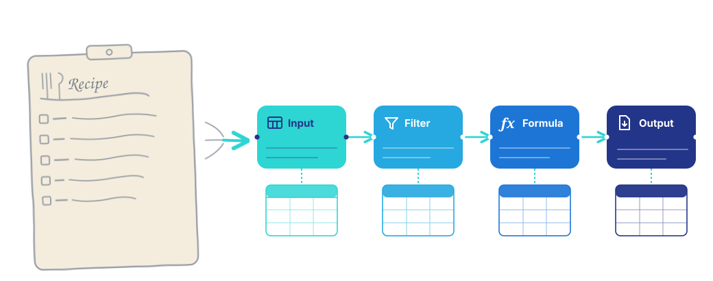
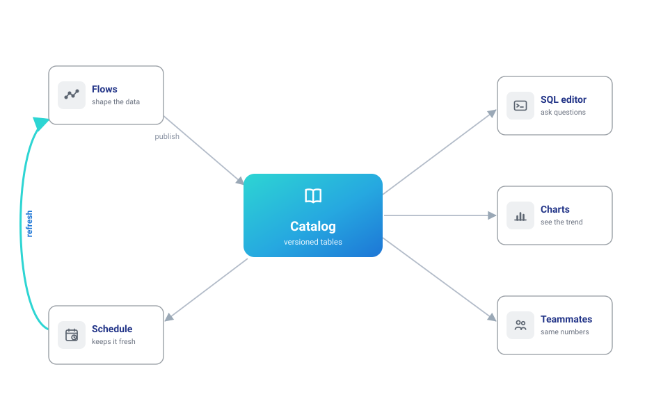

# Flowfile, in plain terms

*The non-technical lens on [What is Flowfile](what-is-flowfile.md). The [technical lens](what-is-flowfile-technical.md) covers the same ground with the mechanisms behind each part.*

A week after a number is produced — a monthly total, a cleaned-up customer list, a chart in a deck — someone asks: *"can you run that again with the new data?"* Answering that means retracing the steps: which file, which filter, which fix was made by hand somewhere along the way. That is the problem Flowfile exists to solve.

**Flowfile is a data platform where the work itself is saved as a visible recipe** — so what you did a week ago runs again with one click, without anyone having to remember how.

## The recipe idea

In Flowfile, you don't transform data by editing it — you build a **flow**: a chain of steps on a canvas, each one a labeled block. *Read this file. Remove the duplicates. Keep the big orders. Total them per city.* After every step, you can see the data, so you always know exactly what each step did.

That picture *is* the work. Next month's file arrives: run the flow again. A colleague asks how the number was made: show them the flow — it reads like a recipe card, not like code. Something looks off: click the step where it went wrong and look at the data right there.

None of this requires programming. Each step is a form you fill in — pick a column, choose a condition, name the result — the way you'd set up a formula in a spreadsheet, not the way you'd write code.

## Where it compounds: the catalog

Building a flow solves one week's problem. The **catalog** is what makes the weeks add up.

Instead of exporting results to files, a flow can publish its result into the catalog — Flowfile's built-in home for your **data products**. A table in the catalog is alive in ways a file never is:

- It keeps its **history** — you can see, and go back to, what it contained in March.
- It knows its **origin** — the flow that produced it is one click away, always.
- It can be **queried and charted** right there — SQL and interactive visualizations, no export.
- It can **refresh itself** — schedule the flow, and the table (and every chart on it) stays current with nobody pressing Run.
- It can be **shared** — teammates get access to the table itself, not a copy of it.

The shift: you stop producing *files* and start maintaining *a small library of living results*.

## Never more complicated than your problem

You can use a tenth of Flowfile and never touch the rest:

- **You see everything.** Every step previews its data, so a mistake is visible at the step that made it.
- **You start where you are.** If you know Excel, [the concepts transfer directly](users/coming-from-excel.md). If you've never touched a formula, the steps are forms with dropdowns.
- **Nothing is in the way.** The canvas doesn't ask about scheduling; the catalog doesn't ask about Python. Each part appears when you need it.
- **One install.** `pip install flowfile` — or the desktop app, or [a browser tab with nothing installed at all](https://demo.flowfile.org) — brings the whole platform: canvas, catalog, everything.

## It grows in whatever direction you do

The same platform keeps up as the work gets more ambitious — without ever demanding it:

- **More data than a spreadsheet survives?** Flowfile runs on [Polars](https://pola.rs), a fast data engine, so large files stay workable where a spreadsheet would stall.
- **Data living in company systems?** Databases, cloud storage, Kafka streams, APIs — [connect once, read live](users/data-elsewhere.md), stop hand-carrying copies.
- **Colleagues who code?** Every flow is equally real as Python: [write pipelines in code](users/write-python.md) that appear on the canvas, or take any visual flow and [export it as a plain Python script](users/visual-editor/tutorials/code-generator.md) that runs on its own. Nobody is locked in — in either direction.
- **A team?** [Run it as a shared server](users/deploy-for-a-team.md) with accounts, access control, and shared data products.

The through-line never changes: whatever you build, at whatever level, is reproducible by construction.

## See it in ninety seconds

The [Quickstart](quickstart.md) builds a real flow — deduplicate a sales file, filter it, total income per city, publish it to the catalog — and it's the same example you can [open in your browser right now](assets/try-sales-pipeline.html), no install, already assembled.

Then pick [the route written for how you work](users/index.md).
