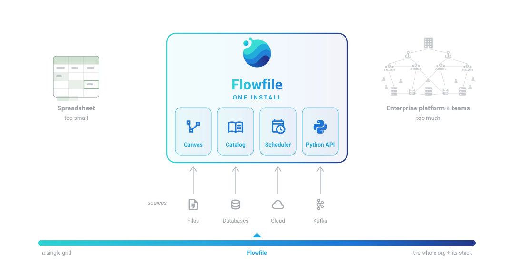

# What is Flowfile?

Flowfile is an open-source data platform that bundles what is usually bought and wired together separately: a **visual pipeline builder**, a **data catalog**, a **scheduler**, and a **Polars-based Python API** — one `pip install`, running on a laptop or as a team server.

It lives in a specific gap: **after the spreadsheet stops scaling, before a data-engineering team becomes the only option.** The work in that gap is always the same shape — pull data from files, databases, cloud storage, or Kafka streams; clean and combine it; keep the results current; let people query, chart, and build on them. Flowfile's founding bet is that all of it should be *reproducible by construction*: the work is saved as re-runnable flows, the results live as versioned tables in the catalog, and schedules keep both fresh without anyone pressing Run.

The same platform reads as two different products depending on who's looking — so this page forks:

<a class="ff-path ff-path-teal" href="what-is-flowfile-plain.html">
<strong>For non-technical readers</strong>
Why "can you run that again?" stops being a scary question, and what working this way feels like.
</a>
<a class="ff-path ff-path-purple" href="what-is-flowfile-technical.html">
<strong>For technical readers</strong>
What you no longer build or maintain — secrets, environments, connections, scheduling, lineage — with the mechanism behind each.
</a>

Already convinced and just want your route? [Pick the guide written for how you work](users/index.md).
